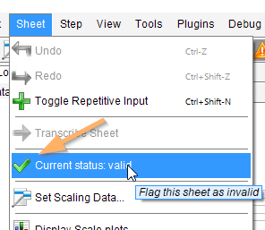
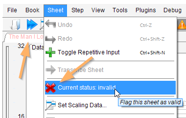
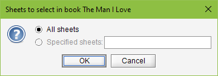
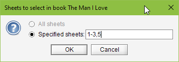
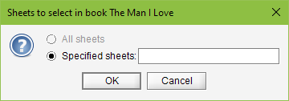

## Book portions
{: .no_toc }

Handling one score image is just a matter of a book with one sheet in it.   
But an input file of dozens or hundreds of score images requires a more incremental approach.

Table of contents
{: .no_toc .text-delta }

1. TOC
{:toc}

---

### Sheet validity

All images in an input file are not score images: we can find illustration pages, blank pages, etc.
Generally, the SCALE step is smart enough to detect that there is not enough "staff material" in
a sheet and thus detect an invalid sheet from the OMR point of view.

When running in batch, the engine sets the _invalid_ flag to the sheet.
When in interactive mode, you are prompted to confirm whether the sheet is really invalid.

How to know if a given sheet has been set to valid or invalid?
Use the menu item `Sheet | Current status` which tells you the current status
and proposes to switch status by pressing on the menu item.

| Valid sheet | Invalid sheet|
| ----------- | ------------ |
|   |   |

Also, the tab for an invalid sheet is displayed in red.

You can decide to display or not the tabs for invalid sheets,
via menu item `View | Display invalid sheets`.

A sheet declared as `invalid` is no longer processed:
no transcription, no export, no printing, nothing!
Unless of course if you detect you've made a mistake and decide to set it back to `valid`
after all!

But validity is supposed to represent the real status of the sheet from OMR perspective,
don't use it to include or exclude this sheet for some processing.
A side effect of modifying the validity status of a sheet is to nullify all its OMR data!
Instead, use the new sheet selection mechanism brought by release 5.2.

### Sheets selection

An action launched at sheet level processes only that sheet.    
An action launched at book level, processes by default all the (valid) sheets of the book.
And this may be too much when what you want is to work only on a portion of the book
(for example to print or listen to just a movement or a few selected sheets).

You can specify a sheets selection, via pull-down menu `Book | Select sheets` which opens the
selection dialog shown below:

|  Selection  |   Meaning    |
| ----------- | ------------ |
|| No specification: **All** sheets are selected|
|| Specification says: 1 through 3, then 5|
|| Empty specification: **No** sheets!|

Remarks:

- This is only a _specification_.
  To be really selected, each corresponding sheet must also be _valid_.
- A sheets specification must be written in strictly increasing order.
- Specifications "1-3,5" and "1,2,3,5" are equivalent.    
  Since there is a gap (sheet 4 is not selected), exporting the book to disk or plugin
  will result in at least two separate movements, one for 1-3 and one for 5.
- The _empty_ specification is provided for sake of completion,
  it will prevent any export in fact.
- A sheets specification can also be provided in batch via the `-sheets` argument on command line.
- The latest sheets specification is persisted in book `.omr` project file
  when specified via the GUI dialog but not when specified via the CLI in batch.
