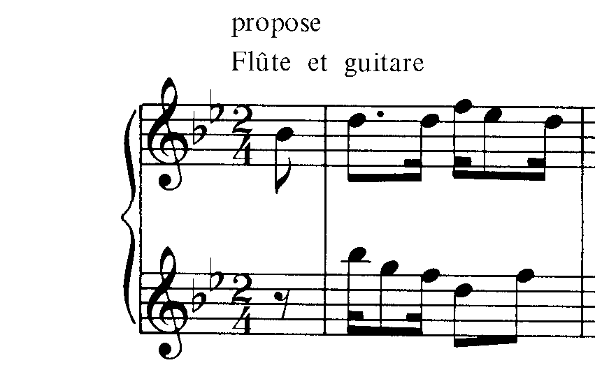
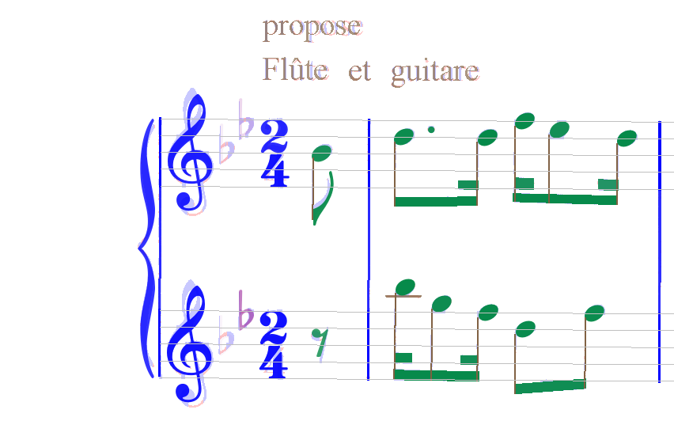
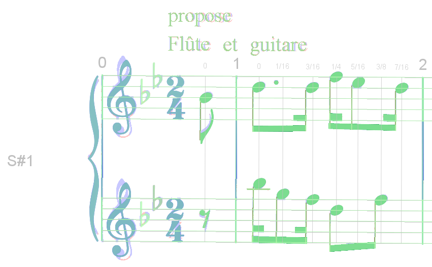
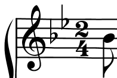
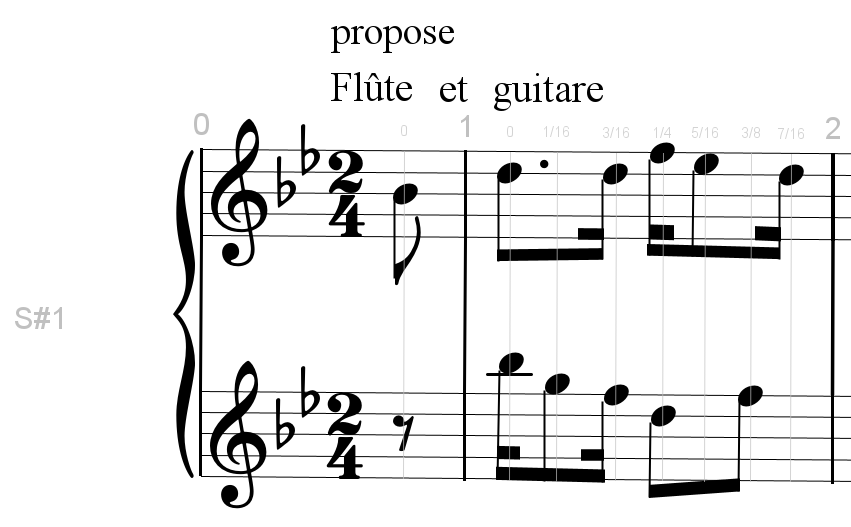

### Sheet display modes

|  | Binary tab | Data tab |
| --- | --- | --- |
|  Physical mode |  |  |
|  Combined mode |  |  |
|  Logical mode |  |  |

For the sheet panel you can choose between 3 display modes:

*  The _physical_ mode displays the sheet sections of pixels
(pale blue for vertical sections, pale pink for horizontal sections) and the detected inters
colorized according to their recognized shape.
*  The _combined_ mode is a combination of the physical and logical
layers.
It displays the logical interpretations in a translucent manner on top of the physical pixels,
to ease the visual detection of any discrepancies.
*  The _logical_ mode displays only the logical score entities (inters).
  It represents the whole transcription of the original image.

Using menu `Views | Switch layers` or **F12** function key or the dedicated toolbar icon,
you can cycle through these 3 different modes: Physical / Combined / Logical.
