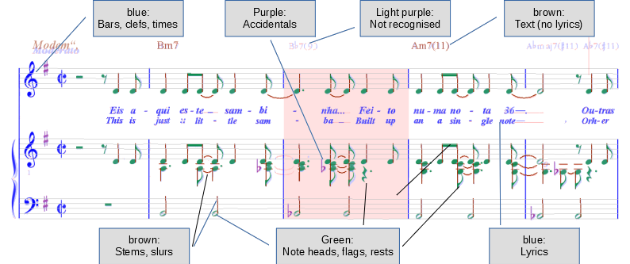

### Entity Colors

The sheet window uses different colors to display the entities and the kind of entity that was
recognized:

In this example the _background_ of the third measure stack is colored in pink because the rhythm
check has failed for this measure (the first note of the upper voice was mistaken for a quarter
instead of a half note).

The following _foreground_ colors are used for interpretation items in this window:

* blue: bars, clefs, times, lyrics
* purple: accidentals, articulations
* pale blue / pale rose: non recognized elements (vertical sections / horizontal sections)
* brown: stems, slurs, normal text (no lyrics)
* green: note heads (also small heads and augmentation points), flags, rests
* red: elements in some abnormal status, typically some needed connection is missing
(e.g. black note head without stem)

The colors help the user for a first glance verification that the transcription was successful
or where some corrections will be needed later on.
