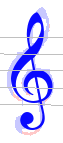

### Glyph vs Inter

#### Glyph

A **Glyph** is nothing more than an immutable set of foreground (black) pixels, precisely located
in a sheet binary image.

It carries no shape.

It is not related to a staff.
It does not even belong to a system.
The reason is there is no reliable way to assign a glyph located in the "gutter" between two systems
or two staves: does it belong to the upper or the lower system/staff?

These restrictions on Glyph don't apply to glyph interpretations (Inter).

#### Inter

An interpretation, or **Inter** for short, is precisely meant to formalize any reasonable
interpretation of a glyph.

There may be several reasonable interpretations for a given glyph and, in many cases, OMR cannot
immediately decide on the right interpretation among these mutually exclusive interpretations.
This decision will then be postponed until later down in the OMR process,
when additional information (such as other Inter instances located nearby) gets available
and helps clarify the configuration.

As opposed to a Glyph, an Inter belongs to a system and is often related to a staff.

It carries a shape and a grade in [0..1] range, which can be considered as the probability for the
interpretation to be a true positive.
This grade is an interpretation _intrinsic_ grade, only based on the glyph at hand in isolation
(this grade is often provided by the glyph classifier).

Later, the Inter will generally be assigned a _contextual_ grade, based on the Inter grade
and the supporting relations with other Inter instances nearby.

#### Typical display example

|   View  |  Inter over Glyph   |
| --- | --- |
| | A Treble Clef **inter** appears in dark blue   Its related **glyph** is mostly hidden behind|
