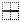

### Pan and Zoom {#pan-and-zoom}

#### Moving {#moving}

The sheet image is usually larger than the window where the sheet is displayed.
You can move the display over the sheet using different means:

* By moving the scroll bars,
* By keeping the mouse left button pressed, and moving the selection point close to a border
  of the display,
* By keeping both mouse buttons pressed, and dragging the image with the selection point,
* By pressing down the mouse wheel and dragging the image with the selection point,
* By rolling the mouse wheet to move the display up or down,
* By pressing on one of the 4 arrow keys to move the display in related direction,
* By pressing on one of the 4 arrow keys, while `SHIFT` is kept down, to move pixel by pixel.

#### Zoom {#zoom}

It can be adjusted in the range [1:8 to 32:1] by several means:

* By using the vertical slider located on the left side of the sheet window.
* By using the mouse wheel while keeping the `CTRL` key pressed.
* By using a rectangular "lasso" while keeping both the keys `CTRL` and `SHIFT` pressed.
When releasing the mouse, the zoom will be adjusted so that both rectangle sides get fully visible.
* By using the predefined buttons and ,
you can adjust the zoom according to the sheet's width or height, respectively.

When zooming in or out, the display remains focused on its current selection, if any.
