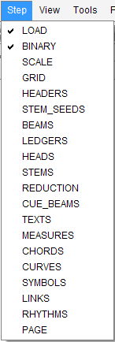

## Pipeline
{: .no_toc }

## Table of contents
{: .no_toc .text-delta }

1. TOC
{:toc}

---

### Global Book Workflow
When working on a book, Audiveris V5 OMR engine can process any sheet of the book independently of
the others.
Only the final gathering of sheets results, which comparatively is a very fast action,
is performed at book level.

The diagram above presents the typical workflow for an example input file, named `foo.pdf`:
1. When opening the `foo.pdf` input, Audiveris creates a Book instance.
2. It then detects how many images the input file contains, and allocates one sheet
(just a sheet stub actually) for each contained image.
3. When actually processing a given sheet, the corresponding image is loaded from the input file,
and the OMR pipeline is applied on the sheet.
4. At any time, when saving the project, all the book and sheets OMR materials are saved in the
`foo.omr` project file.

**TIP**: Audiveris V5 can accommodate a book of hundreds of sheets.
To save on memory, especially on long interactive sessions, the user can ask Audiveris to
transparently swap all book sheets to disk (except the current one).
This is done via the pulldown menu `Book | Swap Book Sheets`.

### Sheet Pipeline

The processing of a given sheet by the OMR engine is done via a pipeline of some 20 steps
applied progressively on the sheet OMR data.

Here below is the sheet pipeline sequence, with the main inputs and outputs of every step:

### Driving the Pipeline

A sheet step is like a mini-batch applied on the sheet data, and this is the smallest increment
that the OMR engine can perform.

In the selected sheet, the interactive user can decide to move the pipeline forward until a target
step.
To do so, he selects the target step in the pulldown `Step` menu:

Note that selecting the pulldown menu `Sheet | Transcribe Sheet` is just another way of selecting
the pulldown menu `Step | PAGE`.

Beware the fact that, in Audiveris V5.1, the user cannot directly move the pipeline backward.
There are two workarounds:
* Selecting a target step already performed will, after user confirmation, reset the sheet data to
its BINARY step and then perform all the steps needed until the target step.
* The user can abandon the book and reload it from a previously saved version.
