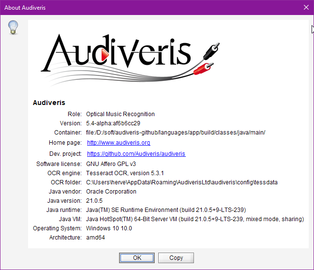

## Help menu
{: .no_toc }

---
Table of contents
{: .no_toc .text-delta }

1. TOC
{:toc}
---

### Handbook

Open this documentation (user-oriented handbook) from Audiveris program.

### Wiki

Open Audiveris Wiki.

### Web Site

Open Audiveris organization and contained repositories.

### About

Open an "à propos" dialog with information about Audiveris program and main external components
it depends upon (Tesseract OCR, Java, OS, machine architecture).

