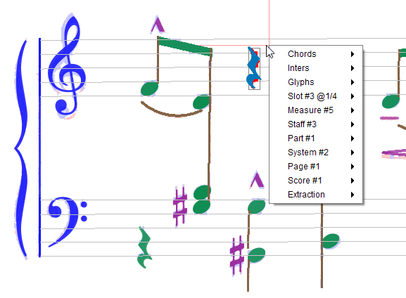

## Popup menu
{: .no_toc }



This menu appears via a right-click in sheet view.

It displays _contextual_ information and actions that depend on the sheet latest processing step,
the current location in sheet view and the selected items if any.

Some of its content also depends on user-selected [Advanced Topics](../advanced/topics.md).

---
Table of contents
{: .no_toc .text-delta }

1. TOC
{:toc}
---

### Inters
If at least one Inter instance has been selected, this sub-menu lists the selected Inters,
ordered by decreasing grade.

It allows to delete Inter instance(s) or relation.

### Glyphs
If at least one Glyph instance has been selected, the _compound_ glyph
(dynamically built by merging all selected glyphs) appears in this sub-menu.

It allows to assign a specific shape (via a created Inter) to the selected glyph.

### Measure #n
If current location lies within a measure, this sub-menu provides actions upon the selected measure.

A measure is delimited horizontally by left and right bar-lines and vertically by top and bottom
staves of the containing part.

Depending on which steps have already been performed, the user can:
* **Dump voices**: display a kind of strip with time slots in abscissa and voices in ordinate.
* **Reprocess rhythm**: force re-computation of rhythm data (slots and voices) in current measure.
* **Merge on right**: merge current measure with the next measure on right.

Example of voices dump:
```
MeasureStack#2
    |0       |1/16    |3/16    |1/4     |3/8     |7/16    |1/2
--- P1
V 1 |Ch#2325 ==================|Ch#2326 |Ch#2828 |Ch#2327 |1/2
V 5 |Ch#2347 |Ch#2348 |Ch#2349 |Ch#2350 |Ch#2351 =========|1/2
```
### Slot #n
If `RHYTHMS` step has been reached, this sub-menu relates to the closest time-slot in containing
measure stack.

For this time slot, the user can:
* **Dump chords**: list all chords starting on this slot.
* **Dump voices**: list all voices with chords starting on this slot.

### Staff #n
If located within a staff (even beyond staff horizontal limits) this sub-menu displays
vertical projections of whole staff and of staff header.

### Extraction
Extracts a rectangular portion (or whole) of the underlying binary image and save it to disk.
This is meant for sharing or further analysis.

Limitation: The rectangular area selection is effective only from the `Binary` tab,
not from the `Data` tab.
