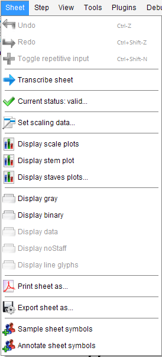

## Sheet menu
{: .no_toc }

This menu operates on the current sheet (of the current book).

---
Table of contents
{: .no_toc .text-delta }

1. TOC
{:toc}
---

### Undo

Undo last manual edit step, one at a time.

### Redo

Redo last undone manual edit step, one at a time.

### Reset Sheet

Reset the active sheet to its initial state, as if it were just loaded as a plain image

### Reset Sheet to Binary

Reset the active sheet to its BINARY state, that is the binarized (black and white) image.

### Transcribe Sheet

Start the transcription of just the active sheet.

### Invalidate Sheet

Flag the selected sheet as containing no music information.

The sheet will be ignored during transcription of the book.

### Set Sheet Parameters

Display and potentially modify parameters of current sheet (mainly scaling data).

### Display Scale plots

Display plots of two histograms used for sheet scale retrieval:
* The "black" plot deals with vertical black runs, leading to staff line thickness
and possibly beam thickness.
* The "combo" plot deals with combined length of vertical black run followed by vertical white run,
leading to staff interline(s).

(needs PLOTS topic)

### Display Stem plot

Display plot of histogram of stem thickness.

(needs PLOTS topic)

### Display Staves plots

Display the projection to x-axis of black pixels contained between staff first and last lines,
leading to barlines extraction.

(needs PLOTS topic)

### Display Binary

Open if needed, then select the binary view tab.

### Display Data

Select the data view tab.
This central sheet view exists from GRID step onwards and is the only one which cannot be manually
closed.

### Display NoStaff

Open if needed, then select the "NoStaff" view tab that shows the transcribed score with
"logically erased" staff lines.

It's helpful to see the quality of the image that is used for the internal score processing,
because staff line removal can lead to collateral damages in some cases.

### Display line Glyphs

Open the "StaffLineGlyphs" view tab that shows just the "removed" pixels of staff lines.

### Print Sheet as

Write the transcribed sheet in PDF format, so that it can be printed or saved for further purposes.

The name of the output file is derived from the book name, followed by "\#" and the sheet number if
the book contains more than one sheet.

The file is saved in a (newly created) book subdirectory of the basic output directory path.

### Export Sheet as

Same as above except that the user can define the file name and the folder where the file is saved.

### Sample sheet Symbols

Populate the book sample repository with samples derived from relevant inters of this sheet only.

(needs SAMPLES topic, see [Samples section](../advanced/samples.md))  

### Annotate sheet Symbols

Populate a Zip archive with images and symbol annotations derived from inters of this sheet only.

(needs ANNOTATIONS topic)
