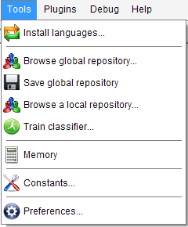
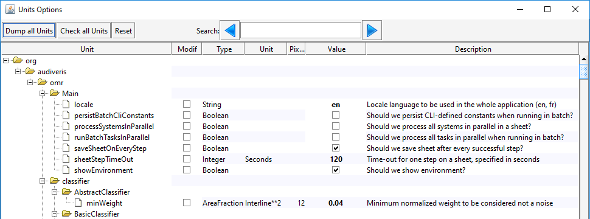

## Tools menu
{: .no_toc }

---
Table of contents
{: .no_toc .text-delta }

1. TOC
{:toc}
---

### Browse Global repository

Open a dialog to verify and edit the content of the Global sample repository
(this is _the_ only repository which is used for classifier training).

(needs `SAMPLES` topic)

### Save Global repository

Saves the Global sample repository to disk.

(needs `SAMPLES` topic)

### Browse a local repository

Open a dialog to verify and edit a local (book) sample repository
(generally before merging it into the Global repository).

(needs `SAMPLES` topic)

### Train Classifier

Open a dialog to launch, monitor and evaluate the training of the glyph classifier.

See [Training](../advanced/training.md) section.

(needs `SAMPLES` topic)

### Memory

Displays the used memory in the output window

### Options

Opens the options window.

All available options are listed.
Most of them concern development options only.

A search window allows to search for a string part in the option name or its description.

For more details, refer to [Options](../advanced/options.md) section.

### Advanced Topics

Opens a dialog with a couple of options concerning the program development only.

See [Advanced Topics](../advanced/topics.md) section.
