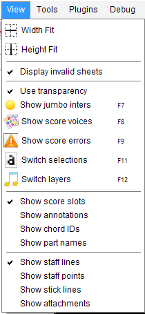

## View menu
{: .no_toc }

---
Table of contents
{: .no_toc .text-delta }

1. TOC
{:toc}
---

### Width Fit

Zoom image to window width

### Height Fit

Zoom image to window height

### Display invalid sheets

Display all sheets, even invalid ones (on/off)

### Use transparency

Display interpretations in transparency according to the calculated probability value

### Show score Voice (F8)

Toggle the display of notes and lyrics in colors according to the calculated voices
(only in output and mixed layer view)

### Show score Errors (F9)

Toggle the display of erroneous measures in rose background color.

### Switch Selections (F11)

Toggles the selection modes between glyph, inter and section.

(needs SPECIFIC_VIEWS topic)

### Switch Layers (F12)

Toggle between the 3 different layer views (see [Sheet display modes](../main/display_modes.md))

### Show Score Slots

Display the detected rhythm analysis (only in output and mixed view) (on/off)

### Show Annotations

Toggle the display of all system, measure and rhythm related annotations
(system ID, measure ID, time slot offset) (on/off)

### Show staff Lines

Toggle the display of staff lines (on/off).

(needs SPECIFIC_ITEMS topic)

### Show stick Lines

Toggle the display of the average line of the selected glyph (on/off).

(needs SPECIFIC_ITEMS topic)

### Show Attachments

Toggle the display of specific attachments (on/off).

These attachments are drawings related to the processing of some entities
(such as arc lookup areas to connect candidate slur portions).
They are helpful only for visual checking of specific steps and thus are not persisted on disk.

(needs SPECIFIC_ITEMS topic)

### Display boards window

Toggle the display of boards column (on/off).

(needs WINDOW_LAYOUT topic)
