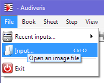
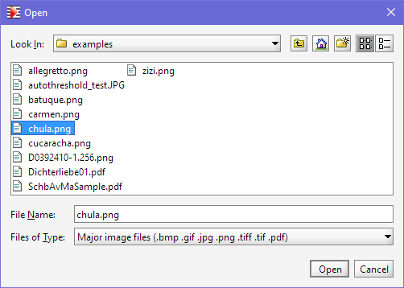
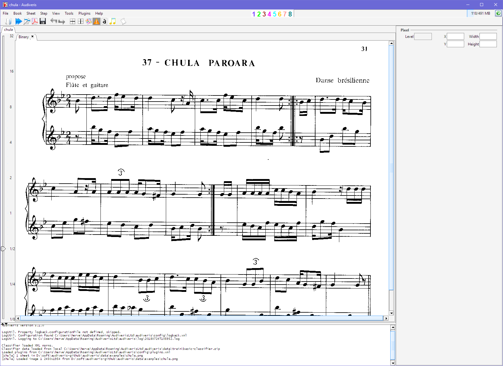

## Load

To load an image from disk, use the pulldown menu `File | Input`:

An `Open` dialog will show up, allowing you to navigate between folders and finally select an image
input file:

Another way to load an input file is to drag this file from the file explorer and to drop it onto
the Audiveris application window.

Audiveris accepts a variety of image formats as input, notably PDF, TIFF, JPG, PNG, BMP.

Here, we have selected the file `chula.png`, and the application window displays the contained image
(actually, it's a binarized version of the image):

