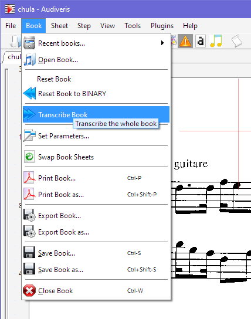
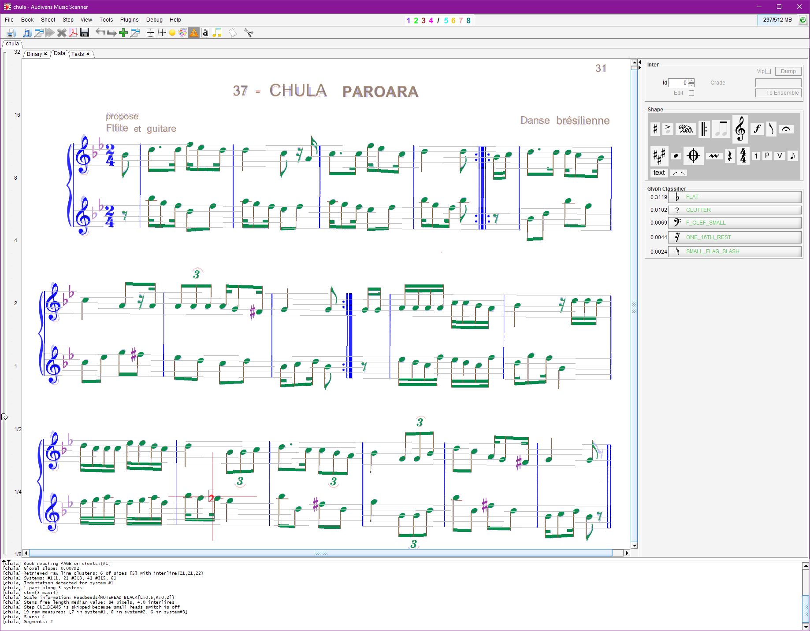

## Transcribe

Transcription is the heart of OMR, the difficult process to infer high-level music information
from low-level graphical data.

This process can be launched directly from the toolbar icon:

It can also be launched via the pulldown menu `Book | Transcribe Book`:

Note this command applies to all images (sheets) in the input file (book).

There is also the pulldown menu `Sheet | Transcribe Sheet` which applies only to the current sheet.
In the simple case at hand, since we have just one image in the input file, book-level and
sheet-level commands are equivalent.

After some time, we get the following image of transcribed music:

Looking carefully at this result, we might detect a couple of mistakes near the bottom of the image:
a flat sign not recognized, and an 8th note mistaken for a quarter because of overlapping flag
and 8th-rest chunks.

This could easily be corrected by manual actions, but let us simply ignore them to keep this
example short.
