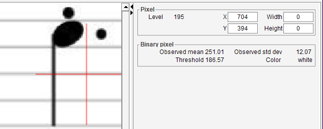
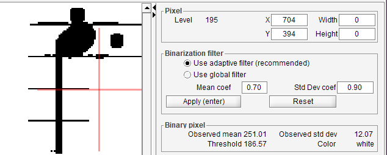
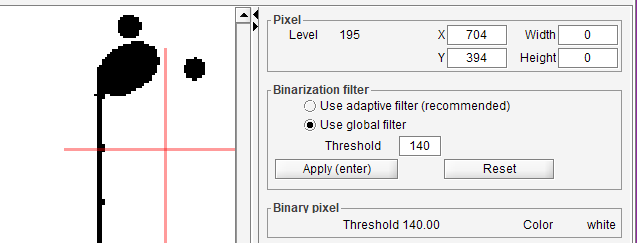
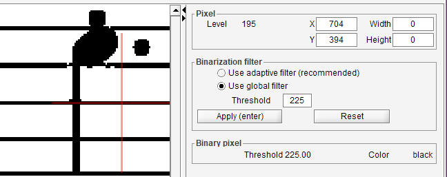
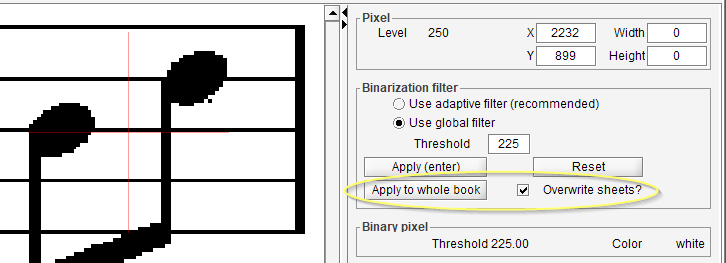

# Binarization board
{: .no_toc :}

In release 5.4, the new binarization board provides the tools to manually
select the binarization filter (either global or adaptive), adjust its settings
and immediately see their impact on the sheet image.

This new board is available only in the Binary tab, and is selected by default.

---
Table of contents
{: .text-epsilon }
1. TOC
{:toc}
---

## Board in action

Let us take a gray image as input, here seen from the Gray tab:

### Default adaptive filter

In the Binary tab on the same image, we can see both the Binarization board and the Binary board.

The sheet view displays the result of applying the default binarization filter.  
In this specific example, we can observe that many lines portions are missing:

In the Binarization board, we can:
1. Select the filtering mode -- either adaptive (the default) or global
2. Modify the settings of the filter
    - The threshold value for the global filter
    - The coefficients for mean and standard deviation values for the adaptive filter,
    from which the local threshold values will be computed

For the vast majority of input images, the adaptive filter gives the best results.

But for the image used in this example, we can try to modify the settings of the adaptive filter,
the results will never be OK.
The reason is the staff lines in this particular image use a pale gray color.  
A global filter might better work.

### Default global filter

Here, we have switched to the global filter, using its default threshold value (140).

The results are even worse, all the staff lines have disappeared:

### Tuned global filter

Here, we have raised the threshold of the global filter from 140 to 225.

The binarized image is now OK for the next processing steps:

## Case of a multi-sheet book

As we adjust the binarization filter and settings, we can observe the results on the current sheet.

If the sheet is part of a book containing several sheets, we have the ability to extend the
binarization parameters to the entire book.

In such multi-sheet book, the binarization board displays an additional line,
meant for the book level:

The button `Apply to whole book` extends the scope of the binarization parameters to the whole book.
- By default, this applies to all sheets is the book,
**except** for the sheets which have specific binarization parameters.
- However, if the option `Overwrite sheets?` is ticked, this extension will remove
any specific binarization parameter defined at a sheet level,
thus making **all** sheets inherit from the same (book) parameters.
