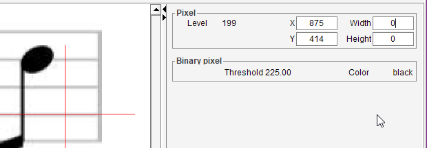
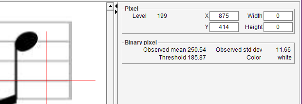

# Binary board
{: .no_toc :}

This board, together with the [Pixel board](./pixel.md), is meant to visualize the results
of the binarization algorithm documented in the [BINARY step](../../explanation/steps/binary.md).

The board is displayed by default in the Gray tab and in the Binary tab.

- The *pixel* board displays the selected _location_ (x, y).
It can also display the _gray level_ at this location when this information is available.
- The *binary pixel* board always displays the _threshold_ value and the resulting _binary color_.

## Threshold
This field displays the threshold value to be compared with the gray level at the selected location.

## Color
This field displays the resulting color of binarization at the selected location:
- *Black* if the pixel value is less than, or equal to, the threshold value,
- *White* otherwise.

## Board for the Global filter

For the global filter, the threshold value is constant for all pixels in the image.  
Nota: this example uses a global value (225) much higher than the default global value (140).

## Board for the Adaptive filter

For the adaptive filter, the threshold value is computed for each location,
based on the mean and the standard deviation of all gray values read around the selected location.

### Observed mean
This field displays the average value observed in location vicinity.

### Observed std dev
This field displays the standard deviation value observed in location vicinity.