# Shape board
{: .no_toc :}
{: .d-inline-block }
updated for 5.11
{: .label .label-green}

This board allows to handle about 200 different shapes.  
To this end, the shapes are organized into some 20 shape-sets,
and each shape-set is presented in a dedicated palette.

Since the 5.11 release, in addition to these predefined shape-sets, 
we can populate a *custom* shape-set to ease and speed up the frequent
selection of a few shapes.

---
Table of contents
{: .no_toc .text-epsilon }
1. TOC
{:toc}
---

## Catalog of all shape-sets

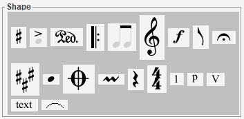

In the picture above, we can see:
- Accidentals, Articulations, Attributes, Barlines, BeamsAndTuplets,
  Clefs, Dynamics, Flags, Holds,
- Keys, HeadsAndDot, Markers, Ornaments, Rests, Times, Digits,
  Pluckings, Romans,
- Texts, Physicals.

From this catalog, displayed with a dark background, no action like a drag n' drop can be launched.
The purpose of the catalog is only to choose one of the predefined shape-sets.

Changes brought by the 5.11 release:
- Before: we had to frequently switch between the catalog of shape-sets and the selected shape-set.
- After: the catalog is always displayed to allow direct selection of any predefined shape-set.

## A predefined shape-set palette

Clicking on a shape-set button in the catalog displays the content of the selected shape-set.  
For example, clicking on the ``HeadsAndDot`` button will display the ``HeadsAndDot`` palette,
whose content adapts to the book at hand:

Here is a simple configuration

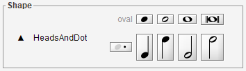

And here is a more complex configuration for drums notation.   
See the [Drums](../../guides/specific/drums.md) chapter for further details.

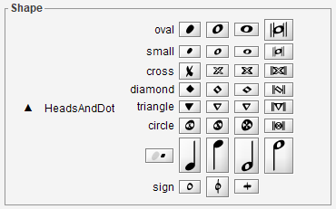

From any shape palette we can:
* Assign a shape to the current glyph, via a double-click on the proper shape button;
* Initiate a drag & drop action, by pressing the proper shape button and dragging it
to the desired location in sheet -- or even to the new custom palette (see next section)

To close the current pre-defined palette,
we press the `ESCAPE` key or click on the ``up`` (&#x25B2;) button.

## The custom shape-set
{: .d-inline-block }
New in 5.11
{: .label .label-yellow }

In addition to the predefined shape-sets, we now have the ability to define a custom shape-set,
gathering the shapes we are most interested in.

We can dynamically add, remove, reorder shapes in this set.
It does not depend on the current book or sheet and it persists between the application runs.  
We thus can speak of a *personal* shape-set. 

The handling of the custom shape-set depends on the new `CUSTOM_SHAPE_SET` advanced topic
available in the [Preferences](../../guides/main/preferences.md) dialog.
This topic is enabled by default.

### Shape addition

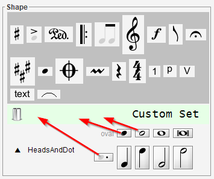

To add a shape into the custom set, we simply drag a shape button from a predefined palette
and drop it on the custom palette
(the palette with a pale green background, with a trash can on its upper left corner).

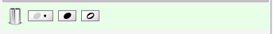

If we drop precisely on some "old" button, the "new" button will be inserted just before the "old" one.
Otherwise, the "new" button will be inserted at the end of the set.

In both cases, any existing button with the same shape will first be removed,
so there can't remain any duplicate.  
Thus, dragging and dropping *from and to* the custom palette is an easy way to reorder the buttons in the custom set.

### Shape removal

Dropping a shape on the "Trash Can" will remove that shape from the custom set
-- whether the drag was initiated from the custom set or from a predefined set.

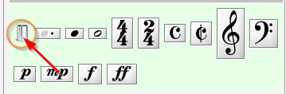

To empty the whole custom set, we use a right-click on the "Trash Can" button,
and press the "Clear" item in the popup menu.

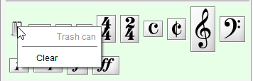

## Recently used shapes

The shapes most recently used (by whatever means) always appear at the top of the shape board,
displayed in reverse chronological order,
making them easily available for a direct reuse.

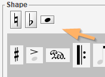

## Predefined palettes

| Palette name      | Palette content |
| :---              | :---       |
| Accidentals       | 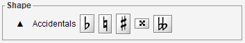 |
| Articulations     | 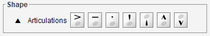 |
| Attributes        | 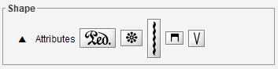 |
| Barlines          | 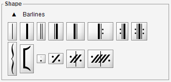 |
| BeamsEtc          | 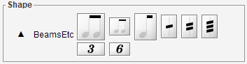 |
| ClefsAndShifts    | 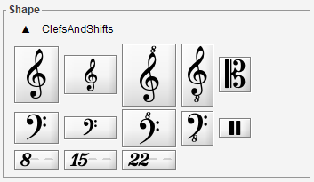 |
| Dynamics          | 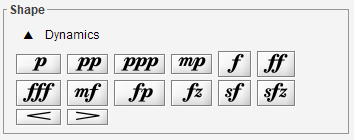 |
| Flags             | 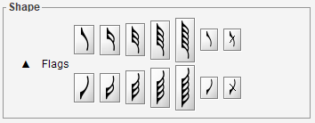 |
| Holds             | 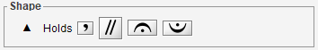 |
| Keys              | 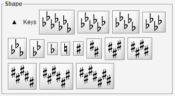 |
| HeadsAndDot       |  |
| Markers           | 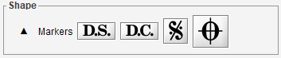 |
| GraceAndOrnaments | 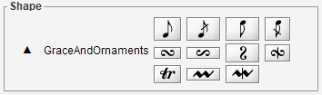 |
| Rests             | 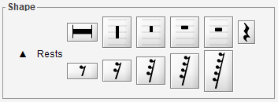 |
| Times             | 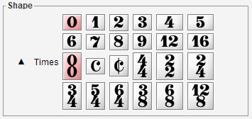 |
| Digits            | 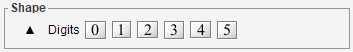 |
| Pluckings         | 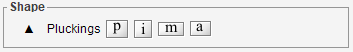 |
| Romans            | 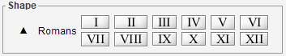 |
| Texts             | 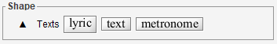 |
| Physicals         | 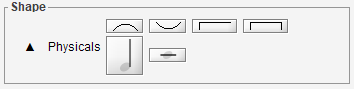 |
