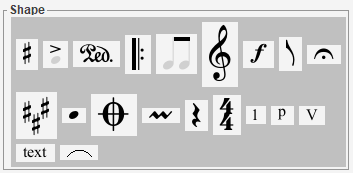
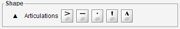
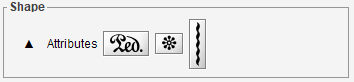
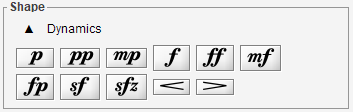

# Shape board
{: .no_toc :}

This board allows to handle about 200 different shapes.  
To this end, the shapes are organized into some 20 shape-sets,
and each shape-set is presented in a dedicated palette.

---
Table of contents
{: .no_toc .text-epsilon }
1. TOC
{:toc}
---

## Catalog of all shape-sets

The shape board initially displays the catalog of all shape-sets.

In the picture above, we can see:
- Accidentals, Articulations, Attributes, Barlines, BeamsAndTuplets,
  Clefs, Dynamics, Flags, Holds,
- Keys, HeadsAndDot, Markers, Ornaments, Rests, Times, Digits,
  Pluckings, Romans,
- Texts, Physicals.

From this catalog, displayed with a dark background, no action like a drag n' drop can be launched.
The purpose of the catalog is only to choose a shape-set.

## One shape-set palette

Clicking on a shape-set button replaces the global catalog by the selected shape-set,
presented in a dedicated palette.  
For example, clicking on the ``HeadsAndDot`` button will display the ``HeadsAndDot`` palette,
whose content adapts to the book at hand:

Here is a simple configuration

And here is a more complex configuration for drums notation.   
See the [Drums](../../guides/specific/drums.md) chapter for further details.

From any shape palette we can:
* Assign a shape to the current glyph, via a double-click on the proper shape button;
* Initiate a drag & drop action, by pressing the proper shape button and dragging it
to the desired location in sheet.

To leave the current palette and return to the global shape-set catalog,
we press the `ESCAPE` key or click on the ``up`` (&#x25B2;) button.

## Recently used shapes
The shapes most recently used (by whatever means) always appear at the top of the shape board,
making them easily available for a direct reuse.

## Palettes contents

| Palette name      | Palette content |
| :---              | :---       |
| Accidentals       |  |
| Articulations     |  |
| Attributes        |  |
| Barlines          |  |
| BeamsEtc          |  |
| ClefsAndShifts    |  |
| Dynamics          |  |
| Flags             |  |
| Holds             |  |
| Keys              |  |
| HeadsAndDot       |  |
| Markers           |  |
| GraceAndOrnaments |  |
| Rests             |  |
| Times             |  |
| Digits            |  |
| Pluckings         |  |
| Romans            |  |
| Texts             |  |
| Physicals         |  |
