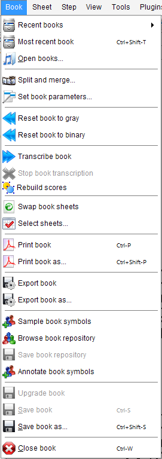

# Book menu
{: .no_toc }

A book is a collection of one or more sheets, each with its current state of transcription.
It can be saved and reloaded at any time during a processing session.

As opposed to [Loading an image ](../../tutorials/quick/load.md) which restarts from the initial image,
loading a saved book allows to resume processing from the last step saved.
This is especially useful for processing books with many sheets.

---
Table of contents
{: .no_toc .text-epsilon }
1. TOC
{:toc}
---

## Recent books

Open a list of recently saved books.
After selection, the book is opened in the state it was saved.

## Most recent book

Open the book most recently closed.

## Open books

Open a dialog box allowing to select a book that has been saved before.

## Split and merge

Open a dialog to select and combine inputs from different sources (books, image files).

See [Split and merge](../../guides/main/book_portions/split_merge.md) section.

## Set book parameters

Modify parameters for transcription, at global level, book level and sheets level.

See [Book parameters](../../guides/main/book_parameters.md).

## Reset book to gray

Reset all sheets of a book to the initial state, as if it were just loaded as a plain image.

## Reset book to binary

Same as `Reset book to bray` above, except that the initial processing of the images
from gray-scale to B&W image is kept.

## Transcribe book

Start the transcription of all sheets of the book.

Transcription is by default performed sheet by sheet.
During processing, the user may start editing sheets that have already been transcribed.

## Stop book transcription

Stop the current book transcription at the next step end.

Stop is achieved in a civilized manner, no data is corrupted.
If desired, the processing can be relaunched manually.

## Rebuild scores

Force the rebuilding of scores, out of the processed sheets.

## Swap book sheets

Swap to disk all the sheets of current book (except the current sheet).

This is useful to save memory when working on a book with numerous sheets.
When needed, a swapped sheet is transparently reloaded.

## Select sheets

Select some sheets out of the current book, and limit processing to these sheets.

See [Sheets Selection](../../guides/main/book_portions/sheet_selection.md) section.

## Print book

Save the transcribed book in PDF format, so that it can be printed or saved for further purposes.

The name of the output file is derived from the book name.
For instance, the printing of a `foo.pdf` input file will result in a `foo-print.pdf` file.

## Print book as

Same as above, except that we can define the file name and the directory where the file is saved.

## Export book

Export the transcribed score as a MusicXML `.mxl` file for exchange with a notation program.
See [Outputs Formats](../../reference/outputs/README.md#output-formats).

## Export book as

Same as above except that we can define the file name and the directory where the file is saved.

## Sample book symbols

Populate the book sample repository with samples derived from relevant inters of all book sheets.

(needs the `SAMPLES` topic, see [Samples section](../../guides/advanced/samples.md))  

## Browse book repository

Open a window to browse, check and filter the samples of book repository.

(needs the `SAMPLES` topic, see [Samples section](../../guides/advanced/samples.md))

## Save book repository

Save book sample repository to disk.

(needs the `SAMPLES` topic, see [Samples section](../../guides/advanced/samples.md))

## Annotate book symbols

Populate a Zip archive with images and symbol annotations derived from book `Inter` instances.

These annotations are meant to populate a dataset for training the coming Audiveris 6.x new
classifiers (Page and/or Patch).

(needs `ANNOTATIONS` topic)

## Save book

Save the collection of all book sheets with the current state of transcription.

## Save book as

Same as above except that we can define the file name and the directory where the file is saved.

## Close book

Close the current book and releases all its resources.

If the book has some unsaved data, the user is prompted to save it before closing.
