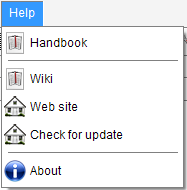

# Help menu
{: .no_toc }



---
Table of contents
{: .no_toc .text-epsilon }
1. TOC
{:toc}
---

## Handbook

Launch a browser of this handbook documentation.

## Wiki

Launch a browser on the Audiveris Wiki.

## Web site

Launch a browser on the GitHub Audiveris organization and its contained repositories.

## Check for update

Check the GitHub site for a newer release of Audiveris.

## About

Open an "a propos" dialog with information about Audiveris program and
the main external components it depends upon (Tesseract OCR, Java, OS, machine architecture).


Since 5.4, there is a `Copy` button.
It copies the textual content of this dialog to the clipboard, to ease the sharing
of this information on Audiveris forums (issues or discussions).

This gives, for example:
```
Audiveris
Role: Optical Music Recognition
Version: 5.4-alpha:af6b6cc29
Container: file:/D:/soft/audiveris-github/languages/app/build/classes/java/main/
Home page: http://www.audiveris.org
Dev. project: https://github.com/Audiveris/audiveris
Software license: GNU Affero GPL v3
OCR engine: Tesseract OCR, version 5.3.1
OCR folder: C:\Users\herve\AppData\Roaming\AudiverisLtd\audiveris\config\tessdata
Java vendor: Oracle Corporation
Java version: 21.0.5
Java runtime: Java(TM) SE Runtime Environment (build 21.0.5+9-LTS-239)
Java VM: Java HotSpot(TM) 64-Bit Server VM (build 21.0.5+9-LTS-239, mixed mode, sharing)
Operating System: Windows 10 10.0
Architecture: amd64
```