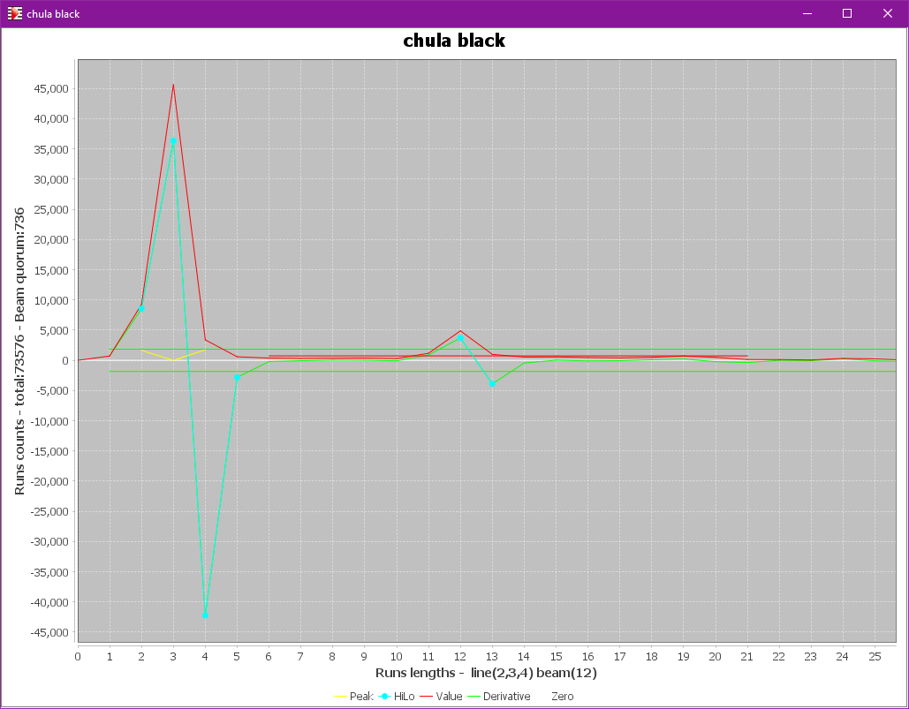
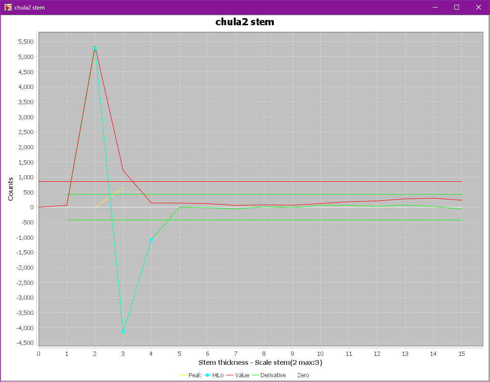

# Sheet menu
{: .no_toc }

This menu operates on the current sheet (of the current book).

---
Table of contents
{: .no_toc .text-epsilon }
1. TOC
{:toc}
---

## Undo

Undo last manual edit step, one at a time.

## Redo

Redo last undone manual edit step, one at a time.

## Toggle repetitive input

Switch on/off a mode where a simple click replicates the last inserted shape at the new mouse location.  
This mode is convenient to insert a series of identical symbols, such as heads, at different locations.

## Transcribe sheet

Start the transcription of just the active sheet.

## Current status

Flag the current sheet as either valid or invalid (containing no music information, and thus be ignored during transcription of the book).

This validity status should not be confused with sheet selection made at book level:
- An **invalid** sheet contains no music and thus will always be ignored even if selected at book level.
- A sheet can be dynamically **selected** or not, according to user's desire.

## Set scaling data

Display and potentially modify the scaling data of current sheet.

## Display scale plots

Display plots of two histograms used for sheet scale retrieval:
* The "black" plot deals with vertical black runs, leading to staff line thickness
and possibly beam thickness.
* The "combo" plot deals with combined length of vertical black run followed by vertical white run,
leading to staff interline(s).

(needs ``PLOTS`` advanced topic)

## Display stem plot

Display plot of histogram of stem thickness.

(needs ``PLOTS`` advanced topic)

## Display staves plots

Display the projection to x-axis of black pixels contained between staff first and last lines,
leading to barlines extraction.

(needs ``PLOTS`` advanced topic)

## Display gray

If still available, display the (initial) gray view tab.

## Display binary

Open if needed, then select the binary view tab.

## Display data

Select the data view tab.
This central sheet view exists from GRID step onwards and is the only one which cannot be manually
closed.

## Display noStaff

Open if needed, then select the "NoStaff" view tab that shows the transcribed score with
"logically erased" staff lines.

It's helpful to see the quality of the image that is used for the internal score processing,
because staff line removal can lead to collateral damages in some cases.

## Display line glyphs

Open the "StaffLineGlyphs" view tab that shows just the "removed" pixels of staff lines.

## Print sheet as

Write the transcribed sheet in PDF format, so that it can be printed or saved for further purposes.

The name of the output file is derived from the book name, followed by "\#" and the sheet number if
the book contains more than one sheet.

## Export sheet as

Export the content of just the current sheet, using MusicXML format.

As for print, the name of the output file is derived from the book name and the sheet number.

## Sample sheet symbols

Populate the book sample repository with samples derived from relevant inters of this sheet only.

(needs the ``SAMPLES`` advanced topic, see [Samples section](../../guides/advanced/samples.md))  

## Annotate sheet symbols

Populate a Zip archive with images and symbol annotations derived from inters of this sheet only.

(needs the ``ANNOTATIONS`` advanced topic)
