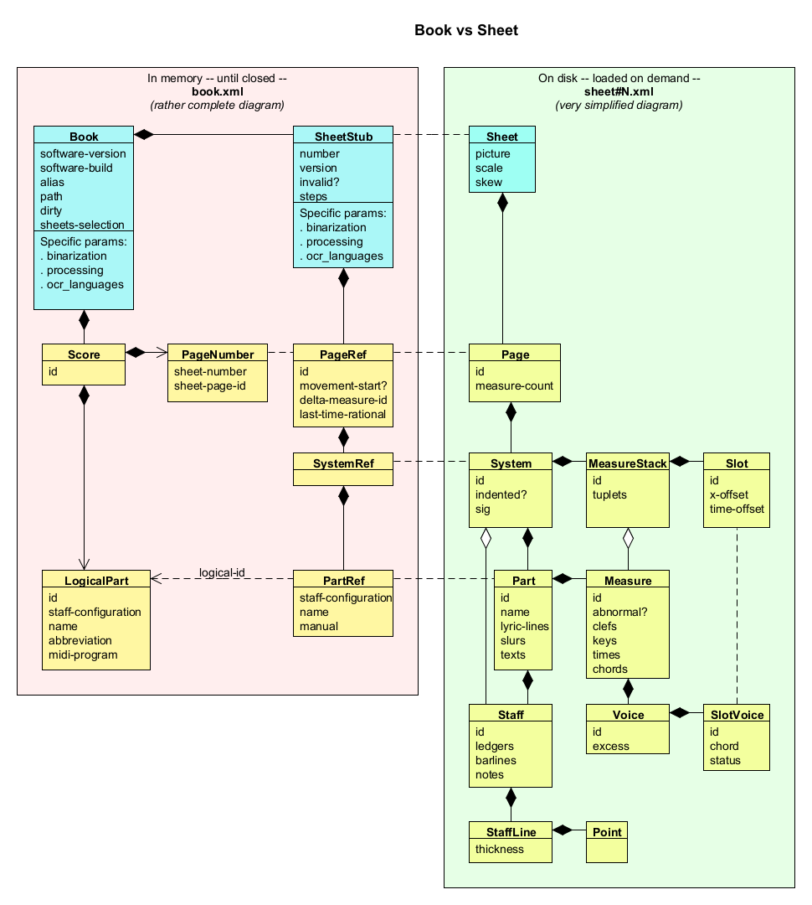
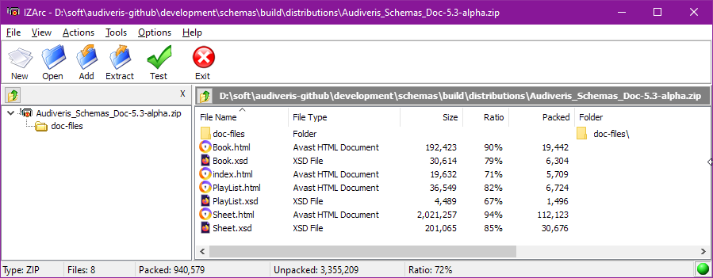

# .omr files

A `.omr` file is the Audiveris *project* file for a given input file containing one or several images.

The project gathers all OMR information related to a given *Book* (one book for an input file),
including its contained *Sheet* instances (one sheet for each image).

The project file is merely the result of the XML marshalling of a book and its sheets, so there
is no logical difference in the project structure in memory and on disk.
In memory there are a few additional transient variables, meant only for processing speedup.

This identical structuring between memory and disk allows the gradual processing of books of any size,
since data can be continuously saved to (and restored from) disk while sheets are being processed.

All other Audiveris outputs derive from this project data.

## File structure

The internal project structure is specific to Audiveris software but it is not opaque and is meant
for public access, either via the Audiveris API or by the direct extraction of XML fragments.

The file is a collection of XML files gathered into a **Zip** archive, whose content can be easily
browsed (and even modified -- *at your own risk!...*) via any Zip reader or editor.


The picture above is a Zip view on a 2-sheet book (Dichterliebe01.omr example).   
Here below is the same example, presented as a tree:

```
├── book.xml
├── sheet#1
│   ├── BINARY.png
│   └── sheet#1.xml
└── sheet#2
    ├── BINARY.png
    └── sheet#2.xml
```

As you can see, we have in this `.omr` file example:
- A single `book.xml` file
- One `sheet#N` subfolder for each sheet in the book, which here contains:
  - A `BINARY.png` file
  - A `sheet#N.xml`file

Beyond this small example, here below are all the possible file kinds:

| File Name                              | Content                                  |
| :----------------------------------    | :--------------------------------------- |
| `book.xml`                             | Skeleton of book hierarchy               |
| sheet#N/                               | Specific folder for sheet #N             |
| sheet#N/`BINARY.png`                   | Black and white image of sheet #N        |
| sheet#N/`GRAY.png`                     | Gray image of sheet #N                   |
| sheet#N/`HEAD_SPOTS.png`               | Head spots image for sheet #N            |
| sheet#N/`sheet#N.xml`                  | OMR details for sheet #N                 |

You may have noticed two files that did not appear in our small example,
namely `GRAY.png` and `HEAD_SPOTS.png`:

- `GRAY.png` image is built from the sheet original input image (which may be a colored image,
  perhaps with an alpha channel) and results in pixel gray values.  
  The `BINARY` step processes this gray image to produce the black and white `BINARY.png` image,
  which is needed by all subsequent steps.
  By default, the gray image is then discarded.   
  One case where the `GRAY.png` image would still be useful is when the user would want to modify
  the image geometry, typically by rotating or de-warping
  -- features not yet provided as of this writing.
  In that case, the quality would be better preserved when operating on gray rather than binary image.

- `HEAD_SPOTS.png` image is a temporary information carried over from the `BEAMS` step to the `HEADS` step.
It takes advantage of the image processing performed during the `BEAMS` step to provide the
image areas (spots) where black heads are likely to be recognized.  
This image is discarded at the end of the `HEADS` step.

## <a name="memory-constraint"></a>Memory constraint

To be able to handle books with more than a few sheets, Audiveris keeps book top data in memory,
while sheet "details" are loaded only when they are really needed.

In terms of project file, this means that the `book.xml` part is kept in memory until the book is
closed, while the various `sheet#N/BINARY.png` and `sheet#N/sheet#N.xml` are loaded on demand.

So, the physical and logical containments are implemented as follows:

* A `Book` does not directly contain `Sheet` instances but only a sequence of **SheetStub**
instances (or Stub for short) with a one-to-one relationship between `SheetStub` and `Sheet`.
* In a similar manner, a `Score` actually contains **PageRef** instances which refer to `Page`
instances.

In the following class diagram, physical entities are displayed in blue,
and logical entities in yellow.



On the left side, the `book.xml` artifact represents the content of the *book.xml* part within an
Audiveris project file, and is kept in memory.
Note that the `Score` and `PageRef` instances can exist only when the `GRID` step has been
reached on (some sheets of) the book.

On the right side, the `sheet#N.xml` artifact represents one sheet (perhaps among others),
pointed to from *book.xml*, and is not necessarily in memory.

{: .note }
Just to avoid endless clashes with the Java predefined `System` class,
we have chosen `SystemInfo` as the class name to represent a music *system*.

## Schemas documentation

We wanted to make `.omr` file  as open as possible to let end-users and developers use directly
this file for any purpose compliant with the Audiveris AGPL license.

To this end, we have developed a specific documentation set.   
For each of the two kinds of XML files (`book.xml` and `sheet#N.xml`) we provide:

1. The corresponding formal schema description as a `.xsd` file.  
    This `.xsd` file can be further used to automatically:
     - Generate a binding between the XML file and a coding language such as Java.
     - Validate the XML file produced by another source such as a test program.
2. The corresponding schema documentation as a `.html` file meant for a human reader.
    It documents the various elements and attributes of the XML hierarchy,
    augmented by JavaDoc annotations from Audiveris source code.

Since Audiveris 5.3, the Split & Merge feature can accept play-list definitions created via
Audiveris UI or provided as XML files created by any plain text editor.   
Consequently, we provide an additional `.xsd` + `.html` pair, this time for a `playlist.xml` file.

### Documentation distribution

We could not integrate the schemas documentation set into Audiveris HandBook on GitHub Pages.   
Please tell us if we are wrong, but we could not use GitHub Pages for two reasons:
- Putting large `.html` files under GitHub Pages source control would be an awful waste of resources
- GitHub Pages would serve these `.html` files with incorrect mime type.   
  They would be served as plain text files, preventing suitable rendering by any web browser.

So, for the time being, the Audiveris schemas documentation is packed as a ZIP archive and simply
published side by side with the most recent releases available on the [Audiveris Releases]
section at GitHub site.
The typical file name is `Audiveris_Schemas_Doc-X.Y.Z.zip`, where X.Y.Z is the precise release version.

For example, here is the content of a recent version:



You can simply download and expand this ZIP archive locally, to get an easy access to its content.

- The `.xsd` files are available for a picking.

- The HTML documentation can be browsed from the `index.html` root file.
  The various HTML pieces use links to images stored in the `doc-files` sub-folder.


### Documentation generation

If, as a developer, you want to (re-)generate this documentation set on your own, please refer to the
[Building Schemas Documentation] article in Audiveris Wiki.

---
[Audiveris Releases]: https://github.com/Audiveris/audiveris/releases
[Building Schemas Documentation]: https://github.com/Audiveris/audiveris/wiki/Schemas-Documentation