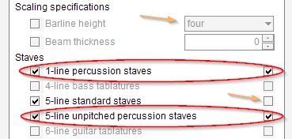
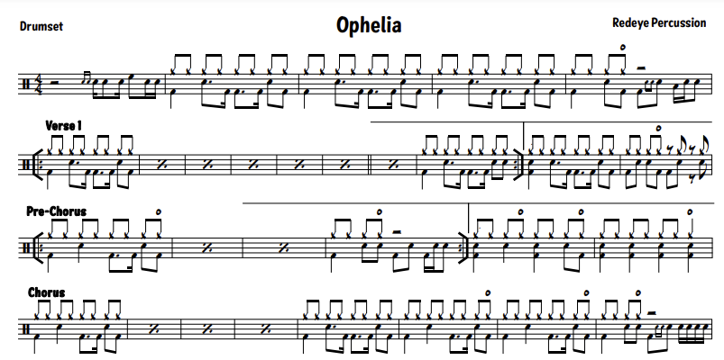
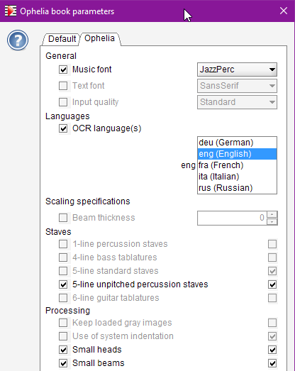
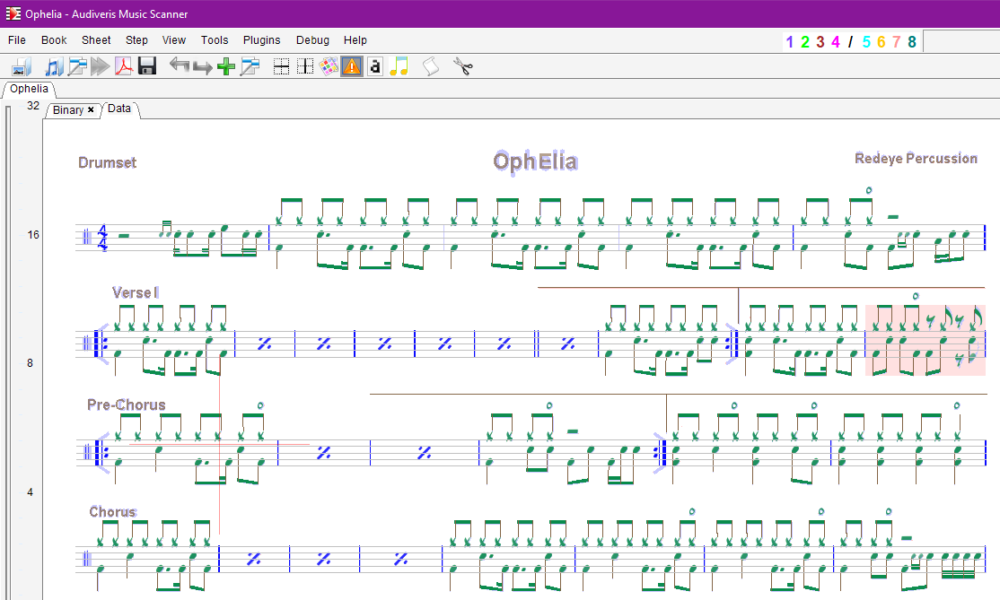

## Drums
{: .no_toc }
{: .d-inline-block }
new in 5.3
{: .label .label-yellow }

We owe many thanks to Brian Boe for his decisive contribution to this long-awaited functionality.

First requests for drums notation go back to 2017,
see Audiveris [issue #33](https://github.com/Audiveris/audiveris/issues/33). 
This delay certainly originated in my personal ignorance (Hervé speaking) about this kind of notation.

Table of contents
{: .no_toc .text-delta }
1. TOC
{:toc}
---

### Example

This [Wikipedia article](https://en.wikipedia.org/wiki/Percussion_notation) provides a good
introduction to drums notation.  

Since 5.3 release, Audiveris supports drums unpitched notation on both 5-line and 1-line staves,
as shown in the following excerpt:


1. Each staff starts with a percussion clef,
2. Each individual instrument is defined by a given head motif at a given line position  
   (drum set mapping).
3. Though not specific to drums notation, we can frequently observe
[multi-measure rests](./multi_rest.md) and [measure-repeat signs](./bar_repeat.md).

### Processing switches

To be able to transcribe the example above, we have to set two specific processing book parameters,
available in dialog ``Book | Set Book Parameters``, one for 1-line
and one for 5-line percussion stave sizes:



In batch mode, we can also set these switches at command line interface level:
> -option org.audiveris.omr.sheet.ProcessingSwitches.oneLineStaves=true

> -option org.audiveris.omr.sheet.ProcessingSwitches.drumNotation=true

### Drum set mapping

There seems to be no universal specification for drum set mapping, only some recommandations.  
This means that, depending on a score author, the mapping can be different.

Audiveris provides a default mapping via the ``drum-set.xml`` file in its ``res`` resource folder.  
Content of this XML file is listed in [appendix](#appendix).

Within the ``drum-set`` XML root element, there is one ``staff`` XML element per staff size 
(one for 1-line staves, one for 5-line staves).

The mapping definition is a list of entries within the containing ``staff`` XML element.
- It is presented by increasing line/space number, but only for ease of browsing.
- Each ``entry`` XML element contains the following XML attributes:
    - "``pitch-position``": line/space number (0 being the mid-line, values increasing top down)
    - "``motif``": general head shape (oval, small, cross, diamond, triangle, circle)
    - "``sound``": intrument name (Acoustic_Bass_Drum, etc. see appendix)
    - "``sign``": this attribute is optional, it indicates a playing technique
    (PLAYING_OPEN, PLAYING_HALF_OPEN, PLAYING_CLOSED)

This protected resource is just the *default* mapping:
- As an end-user, we can always incrementally override some or all of the default mapping entries,
by writing our own entries in a similar but certainly smaller ``drum-set.xml`` file to be located
in user ``config`` folder.
- To "nullify" an existing default entry, we simply specify a "``null``" value
for its "``sound``" attribute.

### Transcription

Among the examples used when working on drums with Brian, we can recommand the
[Redeye Percussion](https://www.redeyepercussion.com/) site.  
Its "Sheet Music" top link gives access to hundreds of percussion scores.

Here below is the example of
[Ophelia](https://www.redeyepercussion.com/music/Ophelia_TheBand_redeyepercussion.com.pdf),
a simple one-page score.

Beginning of the PDF file, downloaded from Redeye Percussion site, is as follows:



Before launching the OMR engine, we specify book parameters
using the ``Book | Set Book Parameters`` dialog:



Note the specific selections made:
- **Music font**: We do need the "JazzPerc" music font family for best efficiency on this example.
- **5-line unpitched percussion staves**: this will allow the processing of drums notation on
5-line staves
- **Small heads**: we have cue heads in this score
- **Small beams**: we have cue beams tied to the cue heads

And with no additional user action, the raw transcription gives:



There is one abnormal measure, shown in pink.  
It is due to a flag mistaken with a black head, something easy to fix.

Should we need to manually fix other transcription errors, we would certainly end up playing
with the ``HeadsAndDot`` palette in the shape board.  
For the "``Jazz Perc``" font family and the selected processing switches, this palette provides
the following symbols:


It is organized as follows:
- First, the heads part: 
    - One row per head **motif** (``oval`` through ``circle``)
    - One column per head increasing **duration** (1/4, 1/2 , 1, 2)
- The next row is dedicated to the augmentation dot and the pre-built quarter and half notes.
- The last row presents the playing **signs** [^playing_signs] (open, half-open, closed) that can
appear away from heads.

## Appendix

Here below is the content of ``drum-set.xml`` file provided in Audiveris ``res``
application folder.

Remember the end user can still override some default definitions
via a similar ``drum-set.xml`` file to be located in user ``config`` folder.

```xml
<?xml version="1.0" encoding="UTF-8" standalone="yes"?>
<!-- =========================================================================================== -->
<!--                                                                                             -->
<!--                                 d r u m - s e t . x m l                                     -->
<!--                                                                                             -->
<!-- =========================================================================================== -->

<!--
    This file, located in Audiveris 'res' folder, defines drum default mapping.
    The end-user can override part or whole of this mapping by writing a specific drum-set.xml file
    located in Audiveris user 'config' folder.

    Such file defines Audiveris entries for general midi percussion keys.
    Definitions are grouped by staff line count with one attribute:
    
    - line-count        (Mandatory)
                        count of lines in percussion staff
                        (1 or 5)

    Within a staff group, it is written as a list of entries for a sound map organized as:
    key:    a tuple (pitch-position, motif, [sign])
    value:  the corresponding sound value
                       
    - pitch-position:   (Mandatory)
                        head position relative to staff line/space
                        (0 for middle line, positive downwards)

    - motif:            (Mandatory)
                        motif of head shape, regardless of its duration
                        (oval, small, cross, diamond, triangle, circle)

    - sign:             (Optional, default value is null)
                        percussion playing technique
                        (PLAYING_OPEN, PLAYING_HALF_OPEN, PLAYING_CLOSED)

    - sound:            (Mandatory)
                        name of drum sound
                        The name must contain no space, no dash, just underscores.
                        A null sound value removes the entry at (pitch-position,motif,sign) tuple
                        For a comprehensive list of sound names, please refer to
                        https://computermusicresource.com/GM.Percussion.KeyMap.html 
                  
    -->

<drum-set>
    
  <staff line-count="1">
    <entry pitch-position="0"  motif="oval"    sound="null"/> <!-- Just a place-holder -->
  </staff>
  
  <staff line-count="5">
        
    <!-- -8 -->
    <entry pitch-position="-8" motif="cross"   sound="Splash_Cymbal"/>
    <entry pitch-position="-8" motif="circle"  sound="Chinese_Cymbal"/>
    
    <!-- -7 -->
    <entry pitch-position="-7" motif="cross"   sound="Crash_Cymbal_2"/>
    <entry pitch-position="-7" motif="circle"  sound="Crash_Cymbal_2"/>
    
    <!-- -6 -->
    <entry pitch-position="-6" motif="cross"   sound="Crash_Cymbal_1"/>
    <entry pitch-position="-6" motif="circle"  sound="Crash_Cymbal_1"/>
    <entry pitch-position="-6" motif="diamond" sound="Crash_Cymbal_1"/>
    
    <!-- -5 -->
    <entry pitch-position="-5" motif="cross"    sign="PLAYING_OPEN"   sound="Open_Hi_Hat"/>
    <entry pitch-position="-5" motif="circle"                         sound="Open_Hi_Hat"/>
    <entry pitch-position="-5" motif="cross"    sign="PLAYING_CLOSED" sound="Closed_Hi_Hat"/>   
    <entry pitch-position="-5" motif="cross"                          sound="Closed_Hi_Hat"/>

    <!-- -4 -->
    <entry pitch-position="-4" motif="oval"     sound="High_Tom"/>
    <entry pitch-position="-4" motif="cross"    sound="Ride_Cymbal_1"/>
    <entry pitch-position="-4" motif="circle"   sound="Ride_Cymbal_1"/>
    <entry pitch-position="-4" motif="diamond"  sound="Ride_Bell"/> <!-- Or Ride_Cymbal_1 or 2 -->
    
    <!-- -3 -->
    <entry pitch-position="-3" motif="oval"     sound="Hi_Mid_Tom"/>
    <entry pitch-position="-3" motif="cross"    sound="Open_Hi_Hat"/>
    <entry pitch-position="-3" motif="circle"   sound="Open_Hi_Hat"/>
    <entry pitch-position="-3" motif="triangle" sound="Cowbell"/>
    
    <!-- -2 -->
    <entry pitch-position="-2" motif="oval"     sound="Low_Mid_Tom"/>
    <entry pitch-position="-2" motif="triangle" sound="Cowbell"/>
    <entry pitch-position="-2" motif="diamond"  sound="Tambourine"/>
    <entry pitch-position="-2" motif="cross"    sound="Ride_Cymbal_2"/>
    <entry pitch-position="-2" motif="circle"   sound="Ride_Cymbal_2"/>
    
    <!-- -1 -->
    <entry pitch-position="-1" motif="oval"     sound="Acoustic_Snare"/>
    <entry pitch-position="-1" motif="small"    sound="Acoustic_Snare"/>
    <entry pitch-position="-1" motif="cross"    sound="Side_Stick"/>
    <entry pitch-position="-1" motif="circle"   sound="Side_Stick"/>
    
    <!-- 0 -->
    <entry pitch-position="0" motif="oval"      sound="Low_Tom"/>
    
    <!-- 1 -->
    <entry pitch-position="1" motif="oval"      sound="High_Floor_Tom"/>
    
    <!-- 2 -->
    <entry pitch-position="1" motif="oval"      sound="Low_Floor_Tom"/>
    <entry pitch-position="2" motif="cross"     sound="Low_Conga"/>
    <entry pitch-position="2" motif="circle"    sound="Low_Conga"/>
    
    <!-- 3 -->
    <entry pitch-position="3" motif="oval"      sound="Bass_Drum_1"/>     
    
    <!-- 4 -->
    <entry pitch-position="4" motif="oval"      sound="Acoustic_Bass_Drum"/>
    <entry pitch-position="4" motif="cross"     sound="Open_Hi_Conga"/>
    <entry pitch-position="4" motif="circle"    sound="Open_Hi_Conga"/>
    
    <!-- 5 -->
    <!-- w/ open sign -> foot splash -->
    <entry pitch-position="5" motif="cross"     sound="Pedal_Hi_Hat"/>
    <entry pitch-position="5" motif="circle"    sound="Open_Hi_Hat"/>
    
<!--
    Here below is the list of not yet assigned sounds
    To actually assign one sound, replace the "null" values by actual pitch-position and motif
    -->
    <entry pitch-position="null" motif="null" sound="Hand_Clap"/>
    <entry pitch-position="null" motif="null" sound="Vibraslap"/>
    <entry pitch-position="null" motif="null" sound="Electric_Snare"/>
    <entry pitch-position="null" motif="null" sound="Hi_Bongo"/>
    <entry pitch-position="null" motif="null" sound="Low_Bongo"/>
    <entry pitch-position="null" motif="null" sound="Mute_Hi_Conga"/>
    <entry pitch-position="null" motif="null" sound="High_Timbale"/>
    <entry pitch-position="null" motif="null" sound="Low_Timbale"/>
    <entry pitch-position="null" motif="null" sound="High_Agogo"/>
    <entry pitch-position="null" motif="null" sound="Low_Agogo"/>
    <entry pitch-position="null" motif="null" sound="Cabasa"/>
    <entry pitch-position="null" motif="null" sound="Maracas"/>
    <entry pitch-position="null" motif="null" sound="Short_Whistle"/>
    <entry pitch-position="null" motif="null" sound="Long_Whistle"/>
    <entry pitch-position="null" motif="null" sound="Short_Guiro"/>
    <entry pitch-position="null" motif="null" sound="Long_Guiro"/>
    <entry pitch-position="null" motif="null" sound="Claves"/>
    <entry pitch-position="null" motif="null" sound="Hi_Wood_Block"/>
    <entry pitch-position="null" motif="null" sound="Low_Wood_Block"/>
    <entry pitch-position="null" motif="null" sound="Mute_Cuica"/>
    <entry pitch-position="null" motif="null" sound="Open_Cuica"/>
    <entry pitch-position="null" motif="null" sound="Mute_Triangle"/>
    <entry pitch-position="null" motif="null" sound="Open_Triangle"/>
    
  </staff>

</drum-set>
```

[^playing_signs]: These playing signs are not heads *per se*, they are plain symbols recognized via the glyph classifier during the SYMBOLS step.