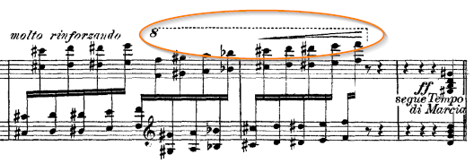
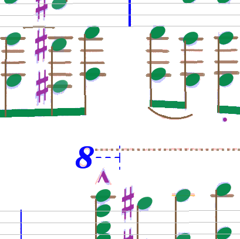
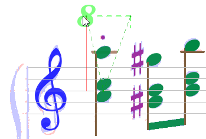
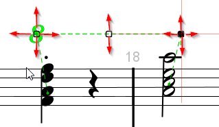

# Octave Shift
{: .no_toc }
{: .d-inline-block }
new in 5.3
{: .label .label-yellow }

An octave shift indicates that some notes of a staff should be played one or
several octaves higher or lower than actually printed.

---
Table of contents
{: .text-delta }

1. TOC
{:toc}
---

## Examples

Here is an example of a one-line shift:

And here is an example of a multi-line shift:  
We can consider we have one "logical" shift composed of three "physical" shifts.

## Recognition

Automatic recognition of octave shifts by the OMR engine is difficult for various reasons:
- The value is not always just a number to be found in {8, 17, 22} set.
There can be a suffix, such as "va" or "vb", sometimes located slightly above or below the number.  
Sometimes but not always, "va" and "vb" stand respectively for "ottava alta" and "ottava bassa".
- The line is often composed of dots or short dashes, that may have been consumed by OCR TEXT step.
- Even if they survive OCR, these long sequences of dots are difficult to recognize in the SYMBOLS
step by the current classifier, which requires identified glyphs.
- The line itself is sometimes far from being a straight line, see the image below.

## Model

In Audiveris, we have chosen to focus on a simplified model.  

An octave shift element is defined as a horizontal sequence of:
1. A number value (8, 15 or 22),
1. A horizontal dashed line,
1. An optional vertical ending hook pointing up or down to the related staff.  
The ending hook appears only at the end of the last (physical) shift of a
perhaps longer logical shift.

 
The vertical location of this octave shift element with respect to the related
staff indicates its kind (``ALTA`` if above the related staff, ``BASSA`` if below).

A multi-line (logical) shift is implemented as a vertical sequence of several (physical) shifts.

The OMR engine may recognize just the value portion of an octave shift, but it is then rather
easy for the end-user to edit the line portion. 

## Editing

### Location

First things first, we need the shift value.

- The shift can be detected by the OMR engine, or manually assigned on some underlying glyph.
The closest staff is by default the related staff.  
When the glyph is located between two systems, it can lead to two mutually exclusive Inters,
one for the system above and one for the system below, as shown by the picture below
(notice the two end hooks).  
In that case we can manually discard the Inter we don't want to keep.

- The shift can also be dragged from the shape palette and dropped at proper location.

As we hover on staves, the shift related staff changes and so does its ending hook.
At drop time, the last staff is kept as the related staff.

### Single line editing

As usual, a double-click on the shift Inter opens a dedicated editor on it.

For a one-line shift, there are 3 handles:
- Left handle can move horizontally and vertically
- Middle handle can move only vertically
- Right handle can move horizontally and vertically.

Dragging a handle horizontally allows to extend or shrink the shift line.

Dragging a handle vertically is more complex:
- When slightly dragged vertically, the whole shift is translated but constrained to stay
below the upper staff if any as well as above the lower staff if any.
- If we force the left handle way beyond the upper staff until the *corresponding* staff
in the system above, the initial shift gets separated in two shifts, one for each staff.
- A similar mechanism applies for the right handle when dragged way beyond the lower staff.

In these forced cases, the initial one-line shift has evolved to a multiple-line shift.
And it can continue its evolution.

### Multiple line editing

The picture above represents the current status of a 3-line shift being edited:
- The first line goes until the staff right side;  
  It has a left handle and a middle handle
- Any middle line spans the whole staff width;  
  It has just a middle handle
- The last line starts from staff left side;  
  It has a middle handle and a right handle

Forcing the first line downwards (or the last line upwards) allows to shrink the shift
and reduce the number of lines, potentially down to a single line shift.

### End

Clicking outside any handle completes the current editing.

Selecting and deleting any line of a multiple-line shift deletes the whole shift.

Editing can be undone and redone.