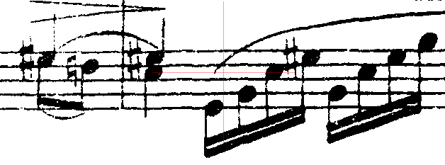
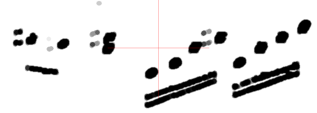
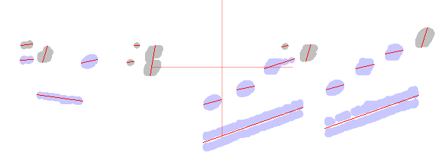
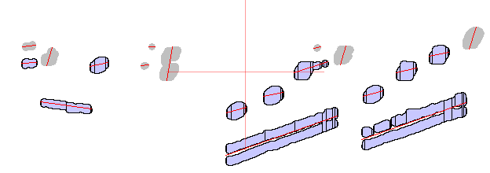
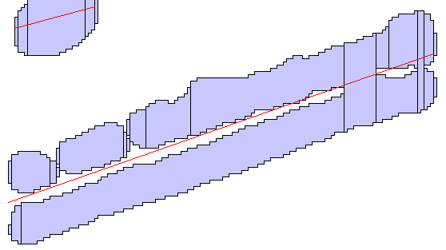
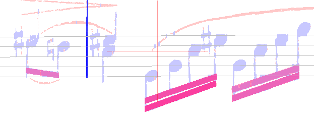

# BEAMS step
{: .no_toc }

The purpose of the ``BEAMS`` step is to detect all beams in a sheet, both standard
and small beams if any.

As a side effect, it also detects any multi-measure rest found in the sheet.

---
{: .no_toc .text-delta }
1. TOC
{:toc}
---

## Inputs

- The no-staff image

## Outputs

- The beams and beam-hooks candidates
- The multi-measure rests candidates

## Prolog: retrieval of potential beams glyphs

Geometrically, a beam is a filled parallelogram, rather horizontal, long and thick.

To focus as much as possible on all relevant beam candidates and only them,
the input data is carefully worked upon.

The engine cleaning actions are as follows:

1. Remove all the staff lines, by taking the no-staff image as input
1. Remove all stem-like items, by removing any horizontal run whose length is smaller
than the maximum stem thickness
1. Smoothen the image to get rid of noise and small holes, by applying a median filter
followed by a gaussian filter, both using a 3x3 kernel
1. Highlight the spots whose thickness is close to the beam expected thickness;  
this is the result of a morphological closing operation (a dilation followed by an erosion)
using a disk-shaped mask whose diameter is the expected beam thickness
-- the smaller value, when the sheet exhibits two beam thickness values

The resulting cleaned image uses a gray scale.  
All spots with a rather high density of black are interesting for two purposes,
beams recognition of course but also black heads recognition[^head_spots].

Regarding beam recognition, the prolog final actions are as follows:
1. Binarize the resulting gray image, using a global threshold
1. Build all glyphs (spots) from the image runs, using runs connections
1. Dispatch all spots to their containing systems
-- any spot located between two systems is dispatched to both 

As an example, the images below result from the processing of a score of rather poor-quality.  
Notice that, in the cleaned image, the tiny black or white items have disappeared.

| Legend  | Image |
| :---:   | :---: |
| Binary image |  |
| Cleaned image |  |
| Detected glyphs |  |

The ``binary`` tab is always available via the {{ site.sheet_binary }} pull-down menu.
The two other tabs require specific booleans to be set in the {{ site.tools_options}} menu,
respectively ``displayGraySpots`` and ``displayBeamSpots``.

## Beams detection

Each individual spot glyph is checked for being a good beam candidate:
- width
- mean thickness
- slope of the glyph center line (least squares approximation)

These very simple criterias help discarding some glyphs
(displayed in gray in the image above).

At this point, a glyph may represent a beam, or a portion of a beam, or several beams
stuck together, or a black note head, etc...

For each of the remaining glyphs (displayed in pale blue), the engine builds
a structure, based on the glyph vertical sections:

| Legend  | Image |
| :---:   | :---: |
| Sections  |  |

The structure focuses on the top and bottom lines of the most significant vertical sections
-- the {{ site.view_selections }} menu allows the display of sections.  

These lines are likely to represent the top and bottom borders of the underlying 
individual beams.
They are checked for straightness and consistent slope.

A thick structure is likely to represent beams stuck one upon the other,
it is thus split into thinner structures:

| Legend  | Image |
| :---:   | :---: |
| Double beam glyph  |  |

The final structures are converted to elementary beams,
which can be further merged or extended horizontally to full beams and beam hooks Inters.

| Legend  | Image |
| :---:   | :---: |
| Beams inters  |  |

At the end of this ``BEAMS`` step, all the created Inters are just candidates.
In particular, Inters for short beams and beam hooks may still coexist for the same underlying glyph!  

These beam Inters are displayed in red: they are still in an *abnormal* status
becaused they are not yet linked to any stem!
 
Only the following steps, especially the ``REDUCTION`` step, will allow the engine 
to confirm or discard these candidates.

## Multi-measure rests detection

TODO TODO TODO TODO TODO TODO TODO TODO TODO TODO TODO TODO TODO TODO TODO 

[^head_spots]: This is a forward reference to the [``HEADS`` step](./heads.md), since filled black heads are very likely to appear in these spots. A specially binarized version of the cleaned image is thus set aside to be used later by the ``HEADS`` step.