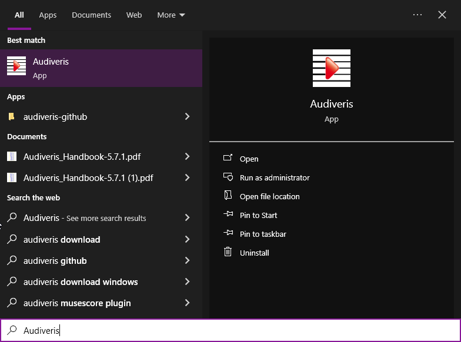
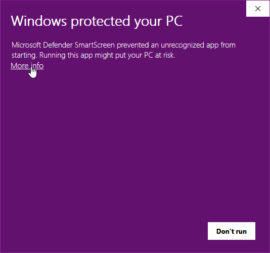
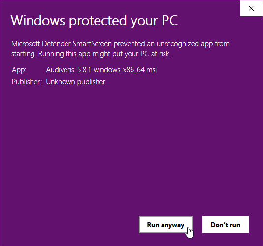

# Installing binaries
{: .no_toc }
{: .d-inline-block }
Updated in 5.9
{: .label .label-green }

---
Table of contents
{: .no_toc .text-epsilon }
1. TOC
{:toc}
---
## Installers

Since version 5.5, Audiveris provides installers for Windows, for Linux and for macOS.

These installers are based on the same structure:
1. The application comes with its own Java Runtime Environment (JRE).  
Therefore, there is no need for the user to install a specific JRE.
2. The application comes with *no* pre-installed OCR languages,
but offers a [runtime dialog box](../../guides/main/languages.md) allowing the user to install
any desired OCR language(s).  
The application is then responsible for picking up the right version of the language files
on the Tesseract site and for installing them in the user environment.

The installers files can be downloaded from the assets of a recent release 
available on the Audiveris [releases page](https://github.com/Audiveris/audiveris/releases).

The name of each installer file is formatted as:
```
 Audiveris-<version>-<OS>-<Architecture>
```

For example, the assets of the [5.7.0 release](https://github.com/Audiveris/audiveris/releases/tag/5.7.0)
contain these files:

| File name | Size | Role | Option | Architecture |
| :---      | :--- | :--- | :--- | :--- |
| **Audiveris-5.7.0-macosx-arm64.dmg** | 66.5 MB | macOS installer|     | arm64 |
| **Audiveris-5.7.0-macosx-x86_64.dmg** | 68.2 MB | macOS installer |   | x86_64 |
| **Audiveris-5.7.0-ubuntu22.04-x86_64.deb** | 62.7 MB | Linux installer | 22.04 | x86_64 |
| **Audiveris-5.7.0-ubuntu24.04-x86_64.deb** | 62.5 MB | Linux installer | 24.04 | x86_64 |
| **Audiveris-5.7.0-windows-x86_64.msi** | 66.3 MB   | Windows installer |       | x86_64 |
| **Audiveris-5.7.0-windowsConsole-x86_64.msi** | 66.3 MB   | Windows installer | Console | x86_64 |
| **Audiveris_Handbook-5.7.0.pdf** | 12.9 MB   | PDF manual |  |  |
| **Audiveris_Schemas_Doc-5.7.0.pdf** | 1 MB   | Developer doc |  |  |

Remarks:
- for **macOS**, two different installers are provided:
  - One for the `arm64` architecture
  - One for the `x86_64` architecture
- for **Linux**, installers are provided for two Ubuntu versions:
  - Old `22.04`
  - New `24.04`
- for **Windows**, two installers are provided:
  - One without console, which displays just the graphic user interface. This is the recommended variant.
  - One with console, where a Terminal window is launched together with the graphic user interface.
  This variant can be useful to display error messages.
- The **PDF** version of the Audiveris **handbook** can be useful if you don't have a permanent Internet access,
since its content is identical to the [online version](https://audiveris.github.io/audiveris/).
- The **Schemas_Doc** is meant for the developers. It documents the entities `Book`, `Sheet` and `PlayList` which compose the Audiveris `.omr` project files.

The downloaded installer file will be used to install the application in the target OS, 
as detailed in the following sections.

{: .note :}
Once the application is launched, OCR languages can be downloaded directly from within the Audiveris application.
See the [OCR languages](../../guides/main/languages.md) section.

Beside these installers, Audiveris used to provide an additional installer
-- actually a **Linux/Flatpak** package -- also with a suitable JRE included.
This package can be installed directly from the
[Flathub](https://flathub.org/apps/org.audiveris.audiveris) site.  
However, the future of this Flatpak package is not clear, for lack of skill and/or manpower. 

## Windows community repository
{: .d-inline-block }
New in 5.9
{: .label .label-yellow }

Thanks to [Matthew Watkins suggestion](https://github.com/Audiveris/audiveris/issues/868),
Audiveris is now available on the Windows community repository.

Anybody can try this command in a terminal window:
> winget show Audiveris

which gives (as of this writing):
```
Version: 5.8.1
Publisher: audiveris.org
Description: Optical Music Recognition
License: AGPLv3
Installer:
  Installer Type: wix
  Installer Locale: en-US
  Installer Url: https://github.com/Audiveris/audiveris/releases/download/5.8.1/Audiveris-5.8.1-windows
-x86_64.msi
  Installer SHA256: 0bafcdf120a7c4bece0edc95f295611493c4550a7fa3b67108f880ec25b18716
  Offline Distribution Supported: true
```

### Installation

In a terminal window, enter this command:
> winget install Audiveris

which gives (after being prompted for confirmation by the User Account Control):
```
Found Audiveris [audiveris.org.Audiveris] Version 5.8.1
This application is licensed to you by its owner.
Microsoft is not responsible for, nor does it grant any licenses to, third-party packages.
Downloading https://github.com/Audiveris/audiveris/releases/download/5.8.1/Audiveris-5.8.1-windows-x86_64.msi
  ██████████████████████████████  68.0 MB / 68.0 MB
Successfully verified installer hash
Starting package install...
Successfully installed
```
Note: The WinGet command references the Audiveris Windows installation file available in the release resources on GitHub.
However, running WinGet does not raise any additional questions regarding unrecognized app,
the license agreement, the installation folder, or shortcuts.

There is no shortcut in the start menu, just a shortcut on the desktop.

### Running

The application can be launched in different ways:

| Way  | Illustration |
| :--- | :---         |
| Double-clicking on the Audiveris icon located on Windows **desktop** |  |
| Entering Audiveris in the Windows **search area** and selecting an action |  |
| Double-clicking on a **`.omr` file**, since the `.omr` file extension (which represents a  Book) has been associated with Audiveris application |  |
| In a terminal window, entering a **command**  refering to the program location | "C:\Program Files\Audiveris\Audiveris.exe" `<potential arguments>` |
 
Again, since the application is installed by WinGet, it will not generate any alerts from the antivirus.

### Uninstallation

In a terminal window, enter this command:
> winget uninstall Audiveris

This will give (after being prompted for confirmation by the User Account Control):
```
Found Audiveris [audiveris.org.Audiveris]
Starting package uninstall...
Successfully uninstalled
```

## Windows installer

### Installation

Double-click the `Audiveris-<version>-windows-x86_64.msi` file in your `Downloads` folder (or wherever it’s saved).

| Action | Dialog |
| :--- | :--- |
| The double-click may have raised an alert from Microsoft Defender. <br> Click on "More info" (or press "Don't run" to abandon) |  |
| Press "Run anyway" to keep going (or press "Don't run" to abandon) |  |
| Now you get the `Audiveris Setup` dialog box |  |
| The license agreement is displayed. If you agree, tick the checkbox and then click on `Next`|  |
| The default installation folder can be changed |  |
| By default, the installer creates one shortcut on the desktop and one shortcut in the Windows start menu |  |
| The installation is now launched|  |
| You may get an alert from Windows user account control, since Audiveris is not from a "known" publisher. Click on `Yes` to allow.|  |
| The installation is finished|  |

### Running

The application can be launched in different ways:

| Way  | Illustration |
| :--- | :---         |
|Opening the Windows **start menu** and selecting the Audiveris item [^start_menu] |  |
| Double-clicking on the Audiveris icon located on Windows **desktop** |  |
| Entering Audiveris in the Windows **search area** and selecting an action |  |
| Double-clicking on a **`.omr` file**, since the `.omr` file extension (which represents a  Book) has been associated with Audiveris application |  |
| In a terminal window, entering a **command**  refering to the program location | "C:\Program Files\Audiveris\Audiveris.exe" `<potential arguments>` |

The very first time Audiveris is launched, the anti-virus software may get in the way:

| Event | Illustration |
| :---  | :---         |
| The anti-virus has detected a suspicious file |  |
| The file looks safe, end of the check.  |  |

### Notes

"***Failed to launch JVM***": A couple of users running on Windows 11 reported the same [issue 818](https://github.com/Audiveris/audiveris/issues/818).

This is reportedly related to something called "Assistive Technology".
It is documented in this article [https://www.papercut.com/kb/Main/AssistiveTechnologynotfound](https://www.papercut.com/kb/Main/AssistiveTechnologynotfound)
which provides a solution, copied *verbatim* below.

The best fix for this problem is to disable the Access Bridge technology in the Java configuration files. To do this, follow these steps:

1. Navigate to C:\Users\<username>
2. Open the file called .accessibility.properties using a standard text editor (Notepad is fine)
3. Find the following lines in the config:
⋅⋅⋅⋅* assistive_technologies=com.sun.java.accessibility.AccessBridge
⋅⋅⋅⋅* screen_magnifier_present=true
4. Add a hashmark (#) in front of theses lines
5. Save your changes to the file

### Uninstallation

To uninstall the program, open `Windows Settings`
(keyboard shortcut is `Windows + I`), and select the `Apps & features` section.

| Action | Illustration |
| :--- | :--- |
| In `Apps & features`, look for the Audiveris item and there press the `Uninstall` button |  |

## Linux installer

### Installation

Remark: A double-click on the `.deb` installer file would result in the opening of the `App Center`
which would choke on audiveris being potentially unsafe, etc.

Instead, in a terminal, use a command like:
```sh
$ sudo apt install /path/to/Audiveris-<version>-ubuntu<osversion>-x86_64.deb
```

This installs the application in the target folder:
> /opt/audiveris/

This `/opt/audiveris` folder is organized as follows:
<pre>
/opt/audiveris  
 ├── bin  
 │   └── Audiveris  
 ├── lib  
 │   └── ...  
 └── share  
     └── ...
</pre>

### Running

In a terminal, use a command like:
```sh
$ /opt/audiveris/bin/Audiveris <potential arguments>
```

### Uninstallation

In a terminal, use one of these commands:
```sh
# To just uninstall
$ sudo apt remove audiveris

# To remove the application, including configuration files
$ sudo apt purge audiveris
```

## Linux/Flatpak installer

### Installation

The Audiveris installer for Linux uses the Flatpak utility and is hosted on the standard Flathub repository.

On the [Flathub site](https://flathub.org/), you can enter "audiveris" in the search field.  
Or you can go directly to the [https://flathub.org/apps/org.audiveris.audiveris](https://flathub.org/apps/org.audiveris.audiveris) page.

For a manual install, you can use:
```sh
$ flatpak install flathub org.audiveris.audiveris
```
### Running 

To launch the application, run the command:
```sh
$ flatpak run org.audiveris.audiveris
```

### Uninstallation

TODO


## macOS installer

This section explains how to install and run the Audiveris application on macOS using the provided DMG installer. Since the installer is not signed with an Apple Developer certificate, you'll need to adjust your macOS privacy settings to allow it to run.

### Installation

1. **Obtain the proper DMG File for your architecture**
    - Download or receive the proper `.dmg` file, that is either  `Audiveris-<version>-macosx-arm64.dmg` or  `Audiveris-<version>-macosx-x86_64.dmg`, from the source (e.g., a contributor or repository release).

2. **Open the DMG**
    - Double-click the chosen `.dmg` file. This mounts the installer as a virtual disk on your desktop or in Finder.

3. **Install the Application**
    - Inside the mounted DMG, you’ll see `Audiveris.app`. Drag this file to your **Applications** folder to install it.
    - Once copied, you can eject the DMG by clicking the eject icon next to it in Finder or dragging it to the trash.

### Running

Since the app is not signed, macOS will block it by default. Follow these steps to allow it to run:

1. **Attempt to Open the App**
    - Go to your **Applications** folder and double-click `Audiveris.app`.
    - You’ll likely see a warning: *"“Audiveris” cannot be opened because it is from an unidentified developer."*
    - On MacOS Tahoe, you will see a screen as below.  Press "Done"
    - 

2. **Adjust Privacy Settings**
    - Open **System Preferences** (or **System Settings** on macOS Ventura and later):
        - Click the Apple menu (&#63743;) > **System Preferences** > **Security & Privacy** > **General** tab.
    - At the bottom, you’ll see a message: *“Audiveris” was blocked from use because it is not from an identified developer.*
    - Click **"Open Anyway"** to allow the app to run.
    - 

3. **Launch the App**
    - Double-click `Audiveris.app` again. You may see one final prompt asking for confirmation—click **"Open"** or **"Open Anyway"**.
    - 
    - The app should now launch successfully.

### Notes

- **Unsigned App**: The lack of a signature is due to the installer not being created with an Apple Developer account. This is a one-time adjustment; once approved, macOS will remember your choice.
- **Troubleshooting**: If the app still won’t open, ensure you’ve completed the privacy settings step. For persistent issues, contact the provider or check the Audiveris documentation.

### Uninstallation


TODO

---

[^start_menu]: It seems that the Windows installer no longer creates a shortcut in the start menu...