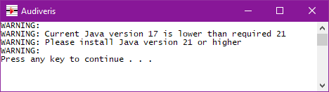

# Installing binaries
{: .no_toc }

---
Table of contents
{: .no_toc .text-epsilon }
1. TOC
{:toc}
---

## Windows

### Installation

The Audiveris installer for Windows is hosted on
[https://github.com/Audiveris/audiveris/releases](https://github.com/Audiveris/audiveris/releases).

Installer versions are named `Audiveris_Setup-X.Y.Z-windows-x86_64.exe` where X.Y.Z values
refer to the related release.

During installation, we will be prompted to associate the `.omr` file extension
(which represents an Audiveris Book) with Audiveris software.

After installation, the Windows start menu should contain a sub-menu named `Audiveris`:


### Java environment

The Windows installer ***does not install*** the needed Java environment.

To check our installed Java environment, we can use the `java -version` command
from a terminal window, to provide Java information like:
```
$ java -version
java version "21.0.5" 2024-10-15 LTS
Java(TM) SE Runtime Environment (build 21.0.5+9-LTS-239)
Java HotSpot(TM) 64-Bit Server VM (build 21.0.5+9-LTS-239, mixed mode, sharing)
```

We have to make sure to use at least **Java version {{ site.java_version }}**.  
It can be installed for instance from
[https://www.oracle.com/java/technologies/downloads/#jdk{{ site.java_version }}-windows](https://www.oracle.com/java/technologies/downloads/#jdk{{ site.java_version }}-windows)

{: .new }
> Starting with the release 5.4 of the Windows installer,
the Audiveris application pre-checks the compatibility with the installed Java version.  
> If the check fails, a warning message is displayed and remains open until it is explicitly closed:
>
> 

### OCR languages

The Windows installer comes with the `eng` OCR language pre-installed. 

Should we need additional languages, we can now download them directly from the Audiveris application. 
See the [OCR languages](../../guides/main/languages.md) section.

### Uninstallation

To uninstall the program, we can simply select `Uninstall` in the Audiveris start menu.

The uninstaller will optionally keep the configuration files of the program.
So, if we re-install this program or a new version later, we will find the same settings
that were used before uninstallation.

{: .note }
You may not always see the `Uninstall` item under Audiveris in the Windows start menu.  
This is reportedly a new Windows behavior, which now recommends to open `Windows Settings`
(keyboard shortcut is `Windows + I`), then look in `Apps & features` section for the Audiveris item
and there press the `Uninstall` button.

## Linux

### Installation

The Audiveris installer for Linux uses the Flatpak utility and is hosted on the standard Flathub repository.

On the [Flathub site](https://flathub.org/), we can enter "audiveris" in the search field.  
Or we can go directly to the [https://flathub.org/apps/org.audiveris.audiveris](https://flathub.org/apps/org.audiveris.audiveris) page.

For a manual install, we can use:
```sh
$ flatpak install flathub org.audiveris.audiveris
```

And to launch the application:
```sh
$ flatpak run org.audiveris.audiveris
```

### Java environment

The application runs in a sandbox where the appropriate Java environment is already included
so, unlike the Windows installer, there is no Java environment to install manually.

### OCR languages

The Linux installer comes with ***no OCR language*** pre-installed. 

At every launch, we will be prompted for the installation of OCR languages if none is present.
See the [OCR languages](../../guides/main/languages.md) section.

### Architecture

The installer is built for the **x86_64** architecture.

## macOS
No installer yet.
