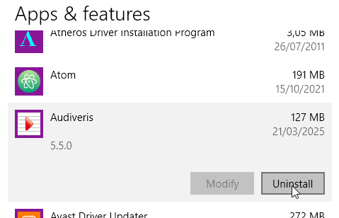

# Installing binaries
{: .no_toc }

---
Table of contents
{: .no_toc .text-epsilon }
1. TOC
{:toc}
---
## Installers
{: .d-inline-block }
new in 5.5
{: .label .label-yellow }

Since version 5.5, Audiveris provides installers for Windows, for Linux and for macOS.

These installers are based on the same structure:
1. The application comes with its own Java Runtime Environment (JRE).  
Therefore, there is no need for the user to install a specific JRE.
2. The application comes with *no* pre-installed OCR languages,
but offers a [runtime dialog box](../../guides/main/languages.md) allowing the user to install
any desired OCR language(s).  
The application is then responsible for picking up the right version of the language files
on the Tesseract site and for installing them in the user environment.

The installers files can be downloaded from the assets of a recent release 
available on the Audiveris [releases page](https://github.com/Audiveris/audiveris/releases).
For example, the assets of the [5.5.0 release](https://github.com/Audiveris/audiveris/releases/tag/5.5.0)
contain these files:

| File name | Size | Role |
| :---      | :--- | :--- |
| **Audiveris-5.5.0.dmg** | 65.7 MB | macOS installer |
| **Audiveris-5.5.0.msi** | 66 MB   | Windows installer |
| **audiveris_5.5.0_amd64.deb** | 64.6 MB | Linux installer |

The downloaded installer file will then be used to install the application in the target OS, 
as detailed in the following sections.

Beside these three installers, Audiveris provides a fourth installer
-- actually a **Linux/Flatpak** package -- also with a suitable JRE included.
This package can be installed directly from the
[Flathub](https://flathub.org/apps/org.audiveris.audiveris) site.

{: .note :}
Once the application is launched, OCR languages can be downloaded directly from within the Audiveris application.
See the [OCR languages](../../guides/main/languages.md) section.

## Windows installer

### Installation

Double-click the `Audiveris-<version>.msi` file in your `Downloads` folder (or wherever it’s saved).

| Action | Dialog |
| :--- | :--- |
| A double-click has opened the `Audiveris Setup` dialog box |  |
| The license agreement is displayed. If you agree, tick the checkbox and then click on `Next`|  |
| The default installation folder can be changed |  |
| By default, the installer creates one shortcut on the desktop and one shortcut in the Windows start menu |  |
| The installation is now launched|  |
| You may get an alert from Windows user account control, since Audiveris is not from a "known" publisher. Click on `Yes` to allow.|  |
| The installation is finished|  |

### Running

The application can be launched in different ways:

| Way  | Illustration |
| :--- | :---         |
|Opening the Windows **start menu** and selecting the Audiveris item |  |
| Double-clicking on the Audiveris icon located on Windows **desktop** |  |
| Double-clicking on a **`.omr` file**, since the `.omr` file extension (which represents a  Book) has been associated with Audiveris application |  |
| In a terminal window, entering a **command**  refering to the program location | "C:\Program Files\Audiveris\Audiveris.exe" `<potential arguments>` |

The very first time Audiveris is launched, the anti-virus software may get in the way:

| Event | Illustration |
| :---  | :---         |
| The anti-virus has detected a suspicious file |  |
| The file looks safe, end of the check.  |  |

### Uninstallation

To uninstall the program, open `Windows Settings`
(keyboard shortcut is `Windows + I`), and select the `Apps & features` section.

| Action | Illustration |
| :--- | :--- |
| In `Apps & features`, look for the Audiveris item and there press the `Uninstall` button |  |

## Linux installer

### Installation

Remark: A double-click on the `.deb` installer file would result in the opening of the `App Center`
which would choke on audiveris being potentially unsafe, etc.

Instead, in a terminal, use a command like:
```sh
$ sudo dpkg --install /path/to/audiveris_5.5.0_amd64.deb
```

This installs the application in the target folder:
> /opt/audiveris/

This `/opt/audiveris` folder is organized as follows:
<pre>
/opt/audiveris  
 ├── bin  
 │   └── Audiveris  
 ├── lib  
 │   └── ...  
 └── share  
     └── ...
</pre>

### Running

In a terminal, use a command like:
```sh
$ /opt/audiveris/bin/Audiveris <potential arguments>
```

### Uninstallation

In a terminal, use the command:
```sh
$ sudo dpkg --remove audiveris
```

## Linux/Flatpak installer

### Installation

The Audiveris installer for Linux uses the Flatpak utility and is hosted on the standard Flathub repository.

On the [Flathub site](https://flathub.org/), you can enter "audiveris" in the search field.  
Or you can go directly to the [https://flathub.org/apps/org.audiveris.audiveris](https://flathub.org/apps/org.audiveris.audiveris) page.

For a manual install, you can use:
```sh
$ flatpak install flathub org.audiveris.audiveris
```
### Running 

To launch the application, run the command:
```sh
$ flatpak run org.audiveris.audiveris
```

### Uninstallation

TODO


## macOS installer

This section explains how to install and run the Audiveris application on macOS using the provided DMG installer. Since the installer is not signed with an Apple Developer certificate, you'll need to adjust your macOS privacy settings to allow it to run.

### Installation

1. **Obtain the DMG File**
    - Download or receive the `Audiveris-<version>.dmg` file (e.g., `Audiveris-5.5.0.dmg`) from the source (e.g., a contributor or repository release).

2. **Open the DMG**
    - Double-click the `Audiveris-<version>.dmg` file in your `Downloads` folder (or wherever it’s saved). This mounts the installer as a virtual disk on your desktop or in Finder.

3. **Install the Application**
    - Inside the mounted DMG, you’ll see `Audiveris.app`. Drag this file to your **Applications** folder to install it.
    - Once copied, you can eject the DMG by clicking the eject icon next to it in Finder or dragging it to the trash.

### Running

Since the app is not signed, macOS will block it by default. Follow these steps to allow it to run:

1. **Attempt to Open the App**
    - Go to your **Applications** folder and double-click `Audiveris.app`.
    - You’ll likely see a warning: *"“Audiveris” cannot be opened because it is from an unidentified developer."*

2. **Adjust Privacy Settings**
    - Open **System Preferences** (or **System Settings** on macOS Ventura and later):
        - Click the Apple menu () > **System Preferences** > **Security & Privacy** > **General** tab.
    - At the bottom, you’ll see a message: *“Audiveris” was blocked from use because it is not from an identified developer.*
    - Click **"Open Anyway"** to allow the app to run.

3. **Launch the App**
    - Double-click `Audiveris.app` again. You may see one final prompt asking for confirmation—click **"Open"**.
    - The app should now launch successfully.

### Notes

- **Unsigned App**: The lack of a signature is due to the installer not being created with an Apple Developer account. This is a one-time adjustment; once approved, macOS will remember your choice.
- **Troubleshooting**: If the app still won’t open, ensure you’ve completed the privacy settings step. For persistent issues, contact the provider or check the Audiveris documentation.

### Uninstallation

TODO