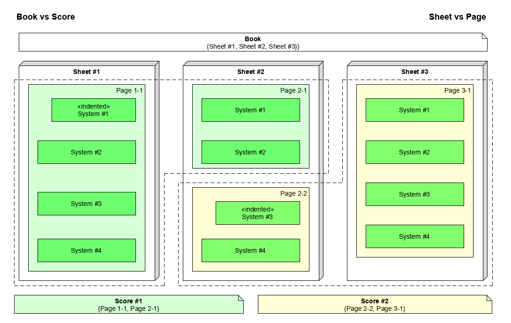

# Book vs. Score

## Book of Sheets

An image file fed into the OMR software contains one or several images.
Typically `PDF` and `TIFF` formats support the notion of multi-image files while, for example,
`JPEG` or `PNG` formats can deal only with single-image files.

For Audiveris, using the metaphor of a physical book made of several sheets of paper,
this physical containment is modeled as one **Book** instance (corresponding to the input file)
and a sequence of one or several **Sheet** instances (one sheet corresponding to one image).

Note that a sheet image may contain no music.
This happens for example for a title or illustration or simply a blank sheet.
In that case, the sheet will later be recognized as "_invalid_" (from the OMR point of view)
and flagged as such.

Since Audiveris 5.3, we can split a book into smaller ones or, conversely,
merge small books into a larger one.
This feature is documented in the [Split and merge](../../guides/main/book_portions/split_merge.md) section.

## Score of Pages

Looking at the musical content of a given sheet image, we can observe that staves are often gathered
into systems (in which staves are played in sync), and that a given sheet image generally contains
several systems (played one after the other).

A system may be left-indented with respect to the other systems in the image, to indicate
the beginning of a movement.
A non-indented system is assumed to belong to the same movement as the previous system
(located just above in the current sheet or at the end of the previous sheet).

In Audiveris, this logical containment is modeled as one instance of **Score** per movement
(since "Score" is the word used by MusicXML), the score containing a sequence of one or several
**Page** instances.

## Example

To make these concepts more concrete, let's look at the following diagram of a hypothetical book:

In this diagram, we can see a book containing 3 sheets
(certainly because the input `PDF` or `TIFF` file contained 3 images):
1. `Sheet` #1 begins with an indented system, which indicates the start of a movement
(`Score` in MusicXML parlance).
There is no other indented system, so this `Sheet` contains a single
`Page`.
2. `Sheet` #2 exhibits an indentation for its system #3.
This indented system ends the previous score and starts a new one.
We have thus 2 `Page` instances in this `Sheet`.
3. `Sheet` #3 has no indented system and is thus composed of a single
`Page`.

To summarize, in this book we have 2 scores that span over 3 sheets:
1. `Score` #1 is composed of:
     - Single `Page` #1 from `Sheet` #1, followed by
     - `Page` #1 from `Sheet` #2

2. `Score` #2 is composed of:
    - `Page` #2 from `Sheet` #2, followed by
    - Single `Page` #1 from `Sheet` #3

## Rules

In the vast majority of cases, there is exactly one page per sheet.

The exceptions are as follows:
1. When an _indented system_ appears anywhere in a sheet,
  it indicates the beginning of a new movement/score.  
  This sheet, as in the picture above, then contains two pages or more,
  if the indented system is not the first one in the sheet.
2. When a sheet is _invalid_ (i.e. containing no music), it contains no page.  
  Moreover, an invalid sheet is considered as a _score break_:
   - It ends the last score in the previous valid sheet, if any.
   - The next valid sheet, if any, will start another score,
     even if it does not start with an indented system.

