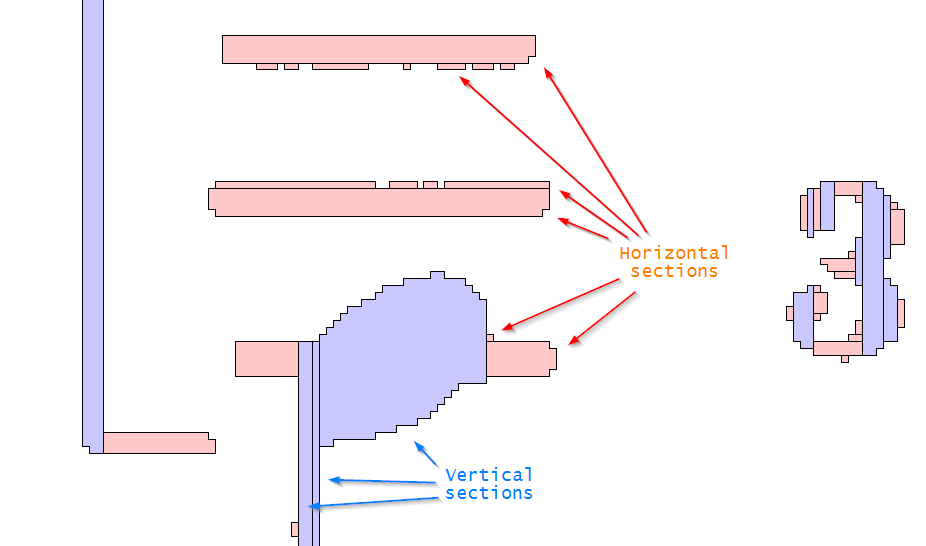

# Pixels assemblies

The `BINARY` step transforms the input image into a black and white image.
From this step on, the image will contain only black (foreground) pixels on a white background.

A (black) pixel is just a black square, of dimension 1 x 1, located at some point (x,y).

Depending on what the engine has to process (staff lines, stems, beams, etc),
the same pixels can be viewed through one structure or another.

## `Run` and `RunTable`

A horizontal (or vertical) contiguous sequence of pixels of the same color is called a
horizontal (or vertical) `Run`.   
In the same alignment, such `run` is followed by a `run` of the opposite color, and so on,
until the image border is reached.

A `RunTable` is a rectangular area, made of sequences of `run`'s, all of the same orientation.  
Typically, the whole binarized image can be considered, at the same time, as:
- a table of horizontal `run`'s
- a table of vertical `run`'s

## `Section` and `LAG`

It can be interesting to transitively join adjacent (black) `run`'s of the same orientation,
according to some compatibility rules.

Each such resulting assembly is called a `Section`.

Typical compatibility rules are:
- Maximum difference in `run` lengths
- Maximum ratio of difference in `run` lengths
- Maximum shift on each `run` end
- Void rule (no check, except adjacency)

Sections are gathered into `LAG`'s (**L**inear **A**djacency **G**raphs).

Just like a `RunTable` gathers `Run`'s of the same orientation,
a `LAG` gathers `Section`'s of the same orientation.

## Sections example

The picture above can be displayed once the `GRID` step has been performed.
We select the "section" view 
via the {{ site.view_selections }} pull-down menu or  the `F11` function key.

Based on the maximum staff line thickness (previously determined by the `SCALE` step),
this picture combines sections from two different `LAG`'s:
1. From the vertical `LAG`, all the (vertical) sections
with length greater than the maximum line thickness are displayed in pale blue.
2. From the horizontal `LAG`, the remaining pixels are organized in (horizontal) sections
and displayed in pale pink.

## Filament

A `Filament` is a dynamic assembly of sections, long and thin, likely to represent lines.

The engine uses:
- horizontal filaments to detect staff lines and ledgers alignments,
- vertical filaments to detect stems and legs of endings.

