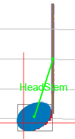

# Symbol Interpretation Graph (SIG)

## Relation

A _Relation_ instance formalizes a relationship between a source `Inter` instance and a (separate)
target `Inter` instance.

There are 3 kinds of relation:

* A _positive_ relation represents a **mutual support** between two `Inter` instances.  

Here we have a typical example: a filled head interpretation and a stem interpretation nearby with a
suitable _HeadStemRelation_ between them, shown as a "_HeadStem_"-labelled green segment
(the "_Relation_" suffix is always omitted in relation name display).  
Support relations _increase_ the contextual grade of their linked `Inter` instances.
In this way, even rather low-quality interpretations, when well combined through supporting relations,
may end up with acceptable contextual grade.

* A _negative_ relation represents a **mutual exclusion** between two `Inter` instances.
Typically, two different interpretations for the same underlying glyph will compete with one another
and will thus be linked by an _Exclusion_ relation.  
An exclusion tells the engine that the two `Inter` instances cannot coexist in the final configuration,
so at least one of them will be discarded at some point in the transcription process.

* A _neutral_ relation is neither positive nor negative, it just conveys information between two
`Inter` instances.  
For example a head-chord is an ensemble composed of one or several heads and often one stem.
There is one _Containment_ relation between the chord ensemble and each of its heads members.
If the chord has a stem, there is a _ChordStemRelation_ between chord and stem
(along with a supporting _HeadStemRelation_ between each head and the stem).

The image below shows a higher level of relation:
* We can see two `Inter` instances (a treble clef followed by a 2-flat key) linked by a supporting
_ClefKeyRelation_ instance.  
* This _ClefKeyRelation_ exists because the vertical positions (pitches) of the flat signs
configuration in this key (B then E) are compatible with a treble clef.
* If ever there was a competing bass clef candidate, there would be of course an _Exclusion_
between the two competing clef candidates, plus another _Exclusion_ between the bass
clef and this key (because the vertical positions of this key are not compatible with a bass clef).

## SIG

A **S**ymbol **I**nterpretation **G**raph (SIG), is simply a graph with `Inter` instances as vertices
and Relation instances as edges.

The SIG plays a central role in Audiveris V5.
Its main purpose is to host all candidate Interpretations and to formalize and manage the Relations
(mutual exclusions, supporting relations) within the population of candidate interpretations.

There is one SIG per system, and at precise points in the OMR engine pipeline (the REDUCTION step and
the LINKS step), each SIG is _reduced_ so that all exclusions are resolved and no `Inter` with weak
contextual grade remains in its graph.
