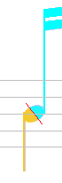

# Voice colors

By default, as described in the previous section, each score entity is displayed using a color
determined according to the entity kind:

But we can decide to focus on **voices**, rather than entity **kinds**,
and thus choose to display each entity according to its voice, if applicable.
This feature is reported to ease the detection of wrong voice assignment.

To do this, we use the pull-down menu {{ site.view_voices }}
or the related toolbar button :

This results in the following display:

Within any given part, voice numbers (and thus colors) are assigned as follows:

* The voices *starting* on the upper staff use numbers 1 through 4,
* The voices *starting* on the lower staff use numbers 5 through 8.

## Shared heads

Note that some note heads can be _shared_ between two chords.
In the example above, this is the case in the last staff, for the starting head of each measure,
except the first one.

In such canonical case, the chords involved are the chord below on the left
and the chord above on the right.

To indicate the **_shared_** aspect of such head, a small diagonal red segment is drawn
across the head, to indicate a logical split of the shared head.

Here, voices are colorized, thus each head _'half'_ appears with its own voice color.
