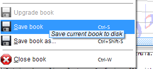

# Export

## Saving to `.omr` file

From the input image, the Audiveris OMR engine has gradually built specific information
that we collectively refer to as "_OMR data_".

The reference chapter on [`.omr` files](../../reference/outputs/omr.md)
describes thoroughly how this OMR data is organized.
For now, it is enough to know that we can save (and reload) this OMR information to/from disk
(into a `.omr` file).

Saving can be done via the pull-down menu {{ site.book_save }}
or via the `Ctrl+S` shortcut (`Command+S` for macOS):

In our "chula" example, this will result in a `chula.omr` file.

Saving the OMR job is not strictly necessary for our very small example.

It is important to know that Audiveris can always restart from a saved `.omr` file,
even from very old files, which allows to resume processing and user editing
where they were stopped.

For sizable OMR jobs, this capability is essential.

## Exporting to `.mxl` file

Right now, we are focused only on how to feed a music sequencer with music data it can easily import.
And as of this writing, this is achieved by going through the *de facto* standard of **MusicXML**-formatted data.

This can be done via the pull-down menu {{ site.book_export }}:

From our "chula" example, this command produces a file named `chula.mxl`
(the `.mxl` extension indicates a compressed MusicXML format).

## Output location

Starting with the 5.4 release, the default policy is to put any output file next to the input file.

This default policy can be changed via the [Preferences](../../guides/advanced/preferences.md) dialog.

We can also use the "`Save book as`" or the "`Export book as`" menu items to choose a specific output location and name.

## `.omr` files vs. `.mxl` files

These files are not equivalent.

The export from OMR to MusicXML  is _lossy_, since a large amount of OMR information
can't go into MusicXML.  
A `.omr` file can always be used to regenerate the `.mxl` export, but the reverse is not true.

{: .note}
A good advice is to keep these `.omr` files
-- unless we are running out of disk space! :-) --
because they represent a valuable source of OMR information,
suitable for training newer versions of Audiveris (more on this later).
