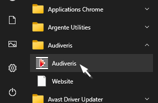

# Launch

For the sake of simplicity, let's assume that:
1. We are using Windows OS
2. We have installed Audiveris via the provided Windows Installer.  
(This installer can be downloaded from the Audiveris
[Releases area](https://github.com/Audiveris/audiveris/releases).
See [Installing binaries](../install/binaries.md)).

We get into the Windows Start Menu, by pressing the Windows logo key on our keyboard
or by clicking on the Start icon (left end of the taskbar).  
In this menu organized by alphabetical order, we move down to the Audiveris folder,
open it, and finally click on the Audiveris executable.

This opens a small terminal window which automatically:
1. Checks our installed Java environment.  
If the check fails, Audiveris is not launched.
Instead, a message appears, warning about our [Java environment](../install/binaries.md#java-environment).
2. Launches Java on the Audiveris software.

This results in the display of the Audiveris [main window](../main_window/README.md), from which we will be able to operate.

If we don't use binary installation (either the Windows installer or the Linux flatpak),
we should refer to [Building from sources](../install/sources.md)
to build and then launch the software.
