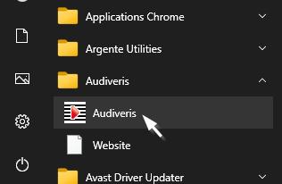

# Launch

For the sake of simplicity, let's assume that:
1. We are using Windows OS,
2. We have installed Audiveris via some Installer
(we can refer to [Installing binaries](../install/binaries.md)).

We get into the Windows Start Menu, by pressing the Windows logo key on our keyboard
or by clicking on the Start icon (left end of the taskbar).  
In this menu organized by alphabetical order, we move down to the Audiveris folder,
open it, and finally click on the Audiveris executable.

This results in the display of the Audiveris [main window](../main_window/README.md),
from which we will be able to operate.

If we don't use binary installation,
we should refer to the [Building from sources](../install/sources.md) section,
which describes how to build and then launch the software.
