# O lux beata Trinitas
{: .no_toc }

This session concerns the processing of an old office hymn available on IMSLP site:

[O lux beata Trinitas](https://imslp.org/wiki/O_lux_beata_Trinitas_(Alberti%2C_Johann_Friedrich))
{: .btn .text-center }

This case originated from [issue #481](https://github.com/Audiveris/audiveris/issues/481)
posted on Audiveris forum, which led to several discussions and engine improvements,
and finally it's integration in Audiveris handbook.

Description of user edition is very detailed in this session, in order to be usable as an
introductory example.

Main score specificities:
- Book of 3 movements over 5 sheets
- Non-standard time signature
- Whole rests that are not measure-long rests
- Voice sequences of whole note heads

Main UI actions:
- Use of "partial whole rests" option
- Common-cut (2/2) replaced by 4/2 time signature
- Missing half notes and whole notes
- Chords with no time offset
- Voice alignment

---
Table of contents
{: .text-delta }

1. TOC
{:toc}
---

## Initial processing

1. Let's load the PDF file into Audiveris 5.2.    
   A quick look at the images shows it is of rather good quality.   
   So, let's launch the whole book transcription...   
   Done in 2'30, about 30" per sheet.

2. Here are the engine results:

| Sheet#1 | Sheet#2 | Sheet#3 | Sheet#4 | Sheet#5 |
| :---: | :---: | :---: | :---: | :---: |
| 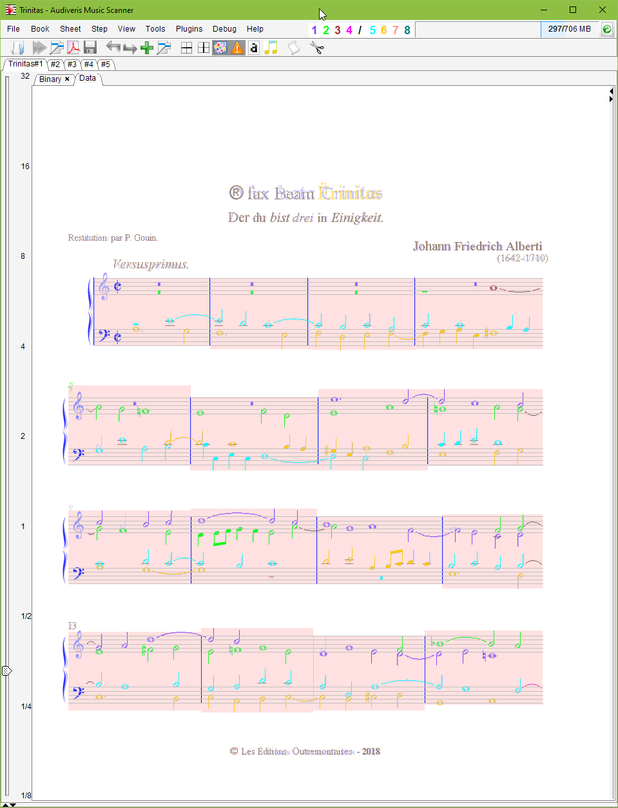 | 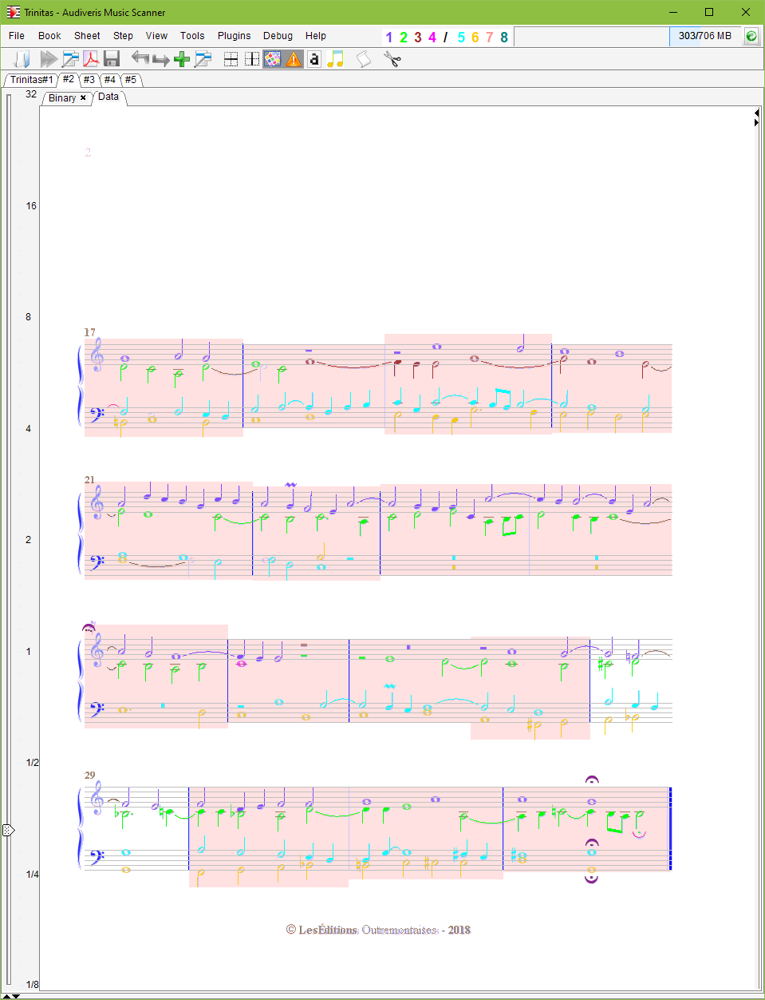 | 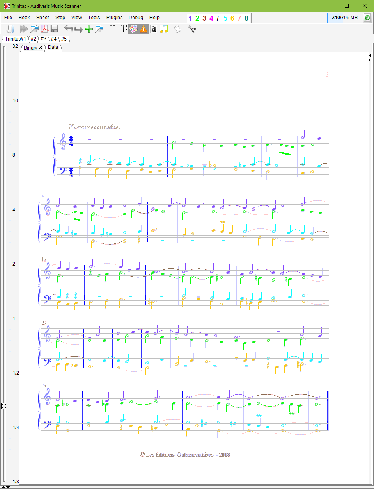 | 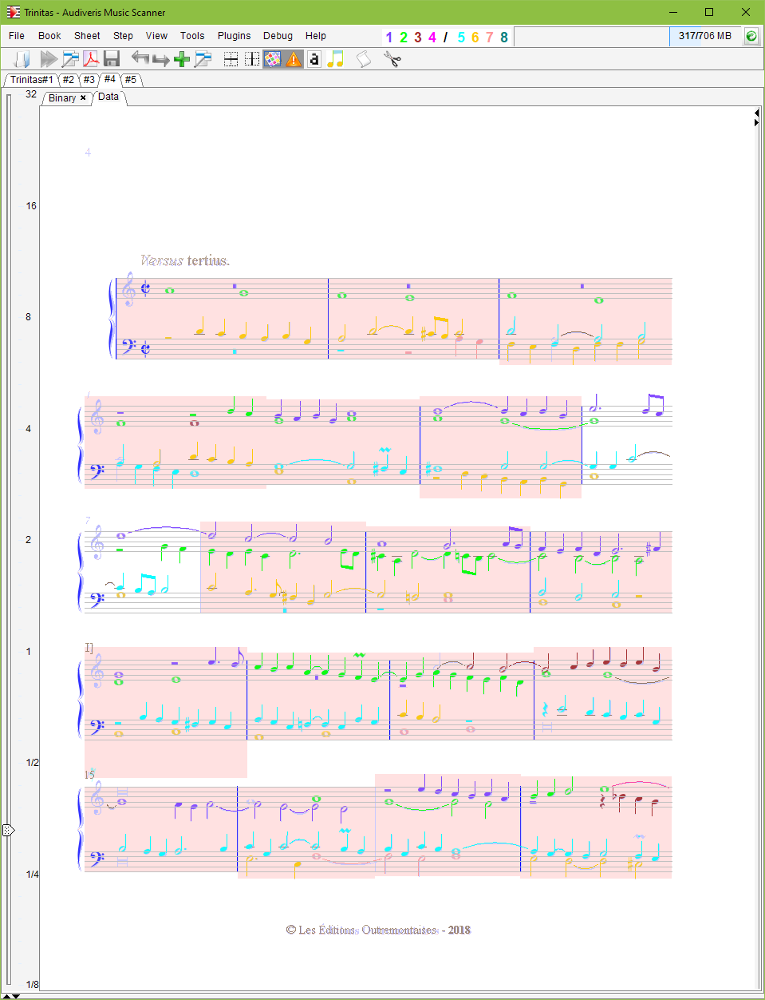 | 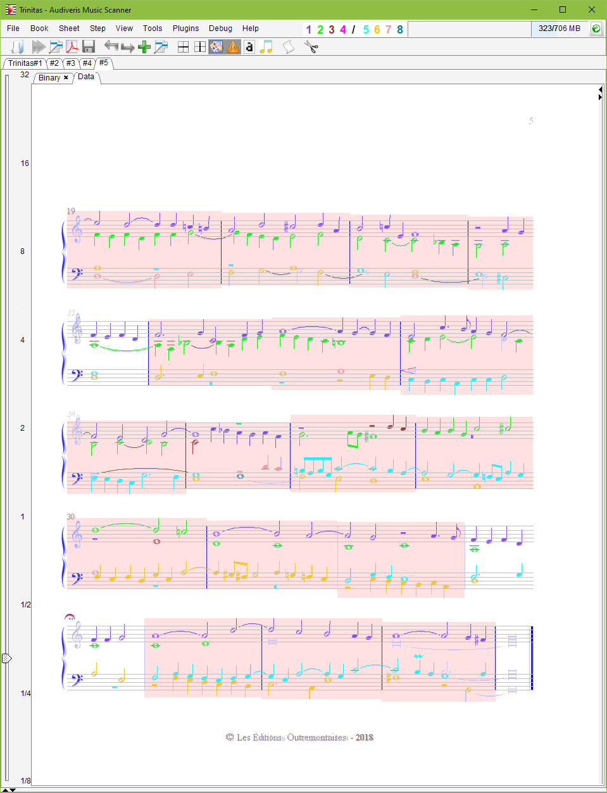 |

Almost all measures are in pink! Except for sheet #3.    
What caused such a disastrous rhythm result on a rather good input?

We can double-check the time signatures. All have been correctly recognized:
* Common-cut beginning of sheet #1
* 3/4 beginning of sheet #3 (the one with no signaled errors)
* Common-cut beginning of sheet #4

Let's have a closer look, with colorized voices (`View | Show score Voices`) and
with chord IDs displayed (`View | Show chord IDs`).

## Sheet #1

### Sheet #1, Measure #1
First measure of sheet #1 looks like:

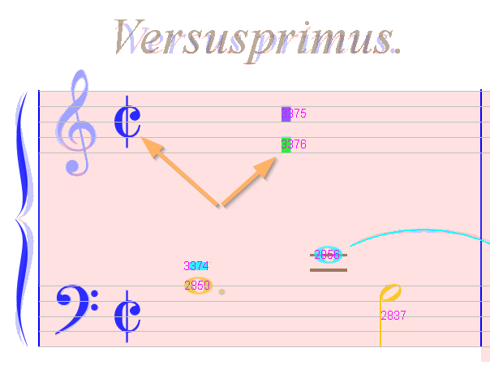

1. Note the presence of "breve rests" (chords #3375 & #3376) on upper staff.
Such multiple rest is supposed to last two bars.

2. Note also the presence in lower staff of a dotted whole head (chord #2859),
followed by a half note (chord #2837), for a total duration of 2 for voice #6.

So, there is a conflict between the actual duration of this measure
(and of almost all other measures in the same page) with the time signature:
2 for each measure vs 2/2=1 expected by the common-cut time signature.

What is the real "value" of a common-cut time signature?
This [Wikipedia Alla breve article](https://en.wikipedia.org/wiki/Alla_breve) sheds an interesting
light, especially with the (1642-1710) indication on score top right corner.
See also this
[Ultimate music theory article](https://ultimatemusictheory.com/breve-note-and-breve-rest/).
Instead of 2/2, it would be worth 4/2.

So let's replace all the common-cuts by explicit "4/2" time signatures.

To delete:
- We select the common-cut Inter and press `DEL` key.
  Or click on `Deassign` button in Inter board.
  Or use `<popup> | Inters...` contextual menu.

Inserting 4/2 signature is more complex, since this is not one of the predefined time signatures:
1. From the shape palette, we drag n' drop the custom (0/0) time signature.
2. Then in Inter board, we replace the custom 0/0 value by 4/2 value and press `Enter`.

We do this for both common-cut sigs on first measure of sheet #1.
We'll do the same thing on sheet #4 later.

NOTA: If you delete both original common-cut sigs before entering the new 4/2 values, you will
notice that all measures of sheet #1, except measure #12, will turn white.   
The reason is that at this moment we have no time sig at all, hence no length-check can be
performed on measures.  
[In measure #12 remaining pink, we'll later see that a whole note has not been recognized].
{: .nota-bg }

With 4/2 clearly stated, among the 16 measures in sheet, we now have 10 in white.
A significant improvement! :-)

### Sheet #1, Measure #4

All the 4 measures of first system look nice, with 2 voices in upper staff and 2 other voices
in lower staff, except the last one (measure #4) which exhibits 3 voices in upper staff:


Referring to voice legend ,
this upper staff contains:
1. Voice #1, chord #3382 made of a breve rest, horizontally located at measure center,
2. Voice #2, chord #3381 made of a whole rest, located at beginning of measure,
3. Voice #3, chord #2836 made of a whole note, located at 2/3 of measure.

The problem is with the whole rest (chord #3381) which, as a measure-long rest, is the only chord
in its voice but should be located at measure center.
In fact, and there are other similar cases in this book, the whole rest is never at measure center
but located as a plain chord in a time slot.

We can visualize the content of first slot,
using  combined mode and pressing left mouse
button near the first slot.
Chord #3381 is *not* part of this slot:

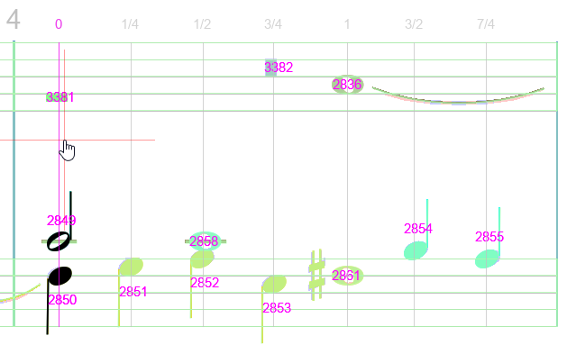


This is the purpose of a new option accessible via `Book | Set Book Parameters`,
and named "Support for partial whole rests".
When this option is on for the sheet at hand, whole rests are no longer considered as
measure-long rests, they are just plain rests with a duration of 1/1:
- They belong to a time slot,
- Their voice can contain other notes or rests.

So, we open the book parameters, and:
1. We set this option for the whole book (so that it applies to all sheets in book)
2. We explicitly unset this option for sheet #3.

| Whole Book | Except Sheet #3 |
| :---: | :---: |
| 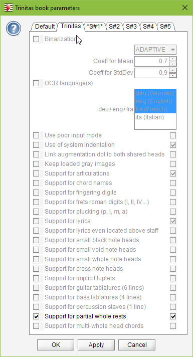 |    |

We don't forget to press the `OK` button to commit the parameters.

Then, we use contextual `<popup> | Page #1 | Reprocess page rhythm` to update the page.

Measure #4 now looks like:


And `<popup> | Measure #4 | Dump stack voices` dumps its strip as:

```
MeasureStack#4
    |0       |1/4     |1/2     |3/4     |1       |3/2     |7/4     |2
--- P1
V 1 |Ch#3382 ======================================================|M
V 2 |Ch#3381 ===========================|Ch#2836 ==================|2 (ts:2/1)
V 5 |Ch#2849 =========|Ch#2858 ==================|Ch#2854 |Ch#2855 |2
V 6 |Ch#2850 |Ch#2851 |Ch#2852 |Ch#2853 |Ch#2861 ==================|2
```

We can see that voice #1 end time is displayed as 'M' (M for Measure), meaning full measure duration,
which is OK for a measure-long rest as the breve rest.

Also, voice #2 now contains chord #3381 (whole rest, but not measure-long rest)
followed by chord #2838 (whole note), to sum up to value 2 as the following voices
in measure.

Here is the updated view on first slot content
(which now includes the whole rest in upper staff):


### Sheet #1, Measure #1 (again)

This "Support for partial whole rest" was key to fix rhythms of measures like
measure #4 we just saw.

But, before we set this option, measure #1 already appeared OK.
In fact, its whole rest of chord #3374 had been mistaken for a half rest:

| Data view | Binary view |
| :---: | :---: |
|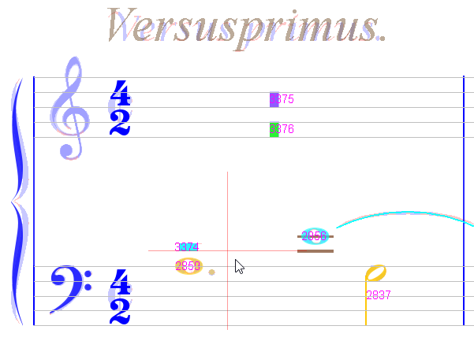|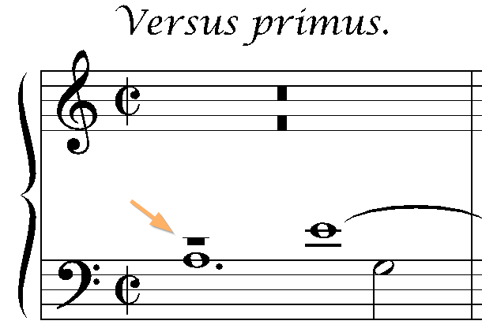|

If we click on this rest, the Pixel board gives HALF_REST shape.
But the binary view clearly indicates it should be a WHOLE_REST shape.

The measure strip confirms the fact that chord #3374 duration is only 1/2,
resulting in a voice ending at 3/2 instead of 2:
```
MeasureStack#1
    |0       |1/2     |3/2     |2
--- P1
V 1 |Ch#3375 ==================|M
V 2 |Ch#3376 ==================|M
V 5 |Ch#3374 |Ch#2856 |........|3/2
V 6 |Ch#2859 =========|Ch#2837 |2

```

In fact, this is a limitation of the current engine with its glyph classifier.    
Within staff height, with staff lines "removed", the glyph for a half rest and the glyph
for a whole rest are nearly identical -- a horizontal rectangle.   
Only the position relative to the staff line nearby allows the engine to make the
difference between:
* a whole rest -- close to the staff line above --
* and a half rest -- close to the staff line below --

In the case at hand, the rest glyph is badly located with respect to the staff
(see its base aligned with the next ledger on its right side),
it was thus mistaken for a half rest.

No big deal, we can easily delete this wrong inter and, re-using its underlying glyph,
manually create a true whole rest inter.
```
MeasureStack#1
    |0       |1       |3/2     |2
--- P1
V 1 |Ch#3375 ==================|M
V 2 |Ch#3376 ==================|M
V 5 |Ch#3420 |Ch#2856 =========|2 (ts:2/1)
V 6 |Ch#2859 =========|Ch#2837 |2
```
A new chord (#3420) has replaced the former chord #3374, and the measure is now OK.

### Sheet #1, Measure #5

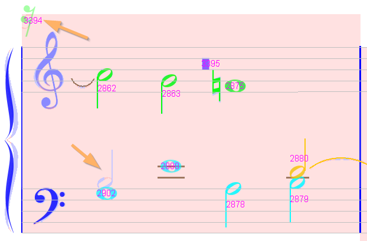

This pink measure exhibits two rather obvious problems:
- A false 16th rest on the upper left corner.   
  Hint: the measure background goes much too high with respect to the staff line,
  indicating some abnormal chord located there.
  We can simply delete it.

- A half note not recognized at beginning of lower staff.    
  We have to manually create it, first the stem, and then the note head:
  1. For the stem we can select with the left mouse a suitable underlying glyph.    
    Then in shape palette, select the Physicals family, and make a double-click on
    the stem button.  
    [Note we could also drag n' drop the stem shape from the palette to proper target
    location, but we had a helpful glyph there...]
  2. For the note head, we generally can't rely on glyphs underneath, so we directly  
     drag the half head shape from the palette, pass over the target staff and finally
     drop the head shape next to our stem.

UPDATE: Recently, Audiveris added direct support for half-notes and quarter-notes.
These are **compound notes**, made of a head and a stem (either up or down).   
So, instead of composing the note by inserting stem and head separately,
for the case at hand you can now directly drag n' drop the HALF_NOTE_UP shape.
{: .nota-bg }

These modifications automatically trigger a rhythm update for the measure at hand.
Note the measure voices have been re-arranged:


### Sheet #1, Measure #7

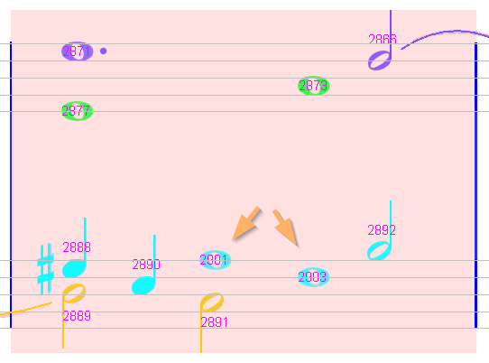

The lower staff of this pink measure exhibits a sequence of 2 whole notes,
together with additional quarter and half notes, all in the same voice!
This cannot fit within a 4/2 measure duration, and is confirmed by the measure strip:

```
MeasureStack#7
    |0       |1/4     |1/2     |1       |3/2     |5/2     |3
--- P1
V 1 |Ch#2871 ===========================|Ch#2866 |........|2
V 2 |Ch#2877 ==================|Ch#2873 =========|........|2 (ts:2/1)
V 5 |Ch#2888 |Ch#2890 |Ch#2901 =========|Ch#2903 |Ch#2892 |3
V 6 |Ch#2889 =========|Ch#2891 |........|........|........|1
```

The fix is to force these 2 whole notes (chords #2901 & #2903) to be in separate voices:

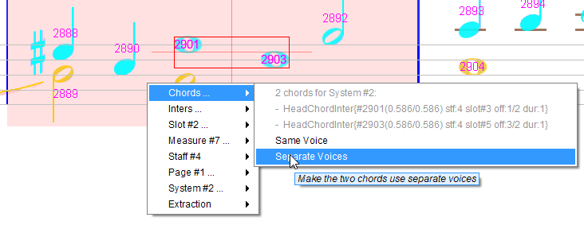

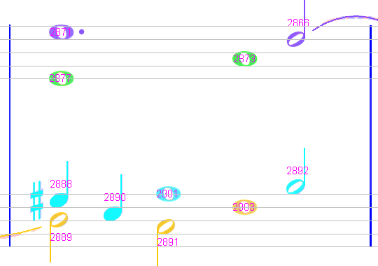

### Sheet #1, Measure #9

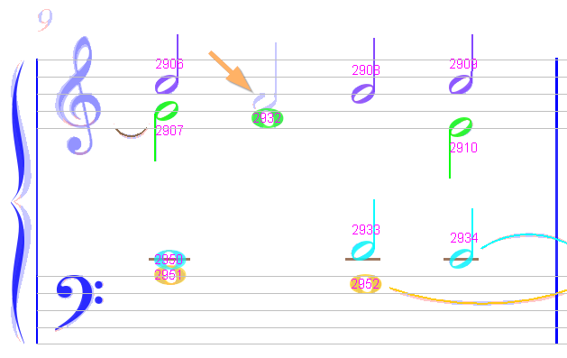

```
MeasureStack#9
    |0       |1/2     |1       |3/2     |2
--- P1
V 1 |Ch#2906 |Ch#2908 |Ch#2909 |........|3/2
V 2 |Ch#2907 |Ch#2932 =========|Ch#2910 |2
V 5 |Ch#2950 =========|Ch#2933 |Ch#2934 |2
V 6 |Ch#2951 =========|Ch#2952 =========|2 (ts:2/1)
```
This white measure exhibits a missing half note on upper staff.   
So, we manually add the "half note up" from the shape palette.

Result is now OK:
```
MeasureStack#9
    |0       |1/2     |1       |3/2     |2
--- P1
V 1 |Ch#2906 |Ch#3427 |Ch#2908 |Ch#2909 |2 (ts:4/2)
V 2 |Ch#2907 |Ch#2932 =========|Ch#2910 |2
V 5 |Ch#2950 =========|Ch#2933 |Ch#2934 |2
V 6 |Ch#2951 =========|Ch#2952 =========|2 (ts:2/1)
```

### Sheet #1, Measure #11

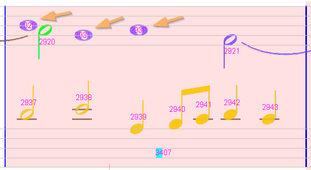

On upper staff, 3 whote notes in the same voice #1, while the half note stays alone in voice #2!

We can either separate the first 2 wholes (chords #2929 #2931)    
or force half note (chord #2920) to share the same voice as whole chord #2931.

Either action is OK.

### Sheet #1, Measure #12


A missing whole note at beginning of upper staff.

We select the glyph (which is almost intact, despite the half head on right) and assign it the
whole note shape using the shape palette.

### Sheet #1, Measure #14


Yet another example of 2 whole notes (chord #2973 & #2971) with other notes in the same voice.
Fix is to force separate voices.

In this rather simple case, we could improve the OMR engine algorithm by checking current voice
end time when deciding to append or not the second whole note to voice #2. Room for improvement!

### Sheet #1, Measure #15

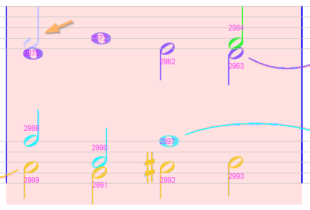

A missing half note at beginning of upper staff.    
We insert it manually.

A good side effect is that the OMR engine now assigns the two whole notes to separate voices.

This concludes our manual work on Sheet #1, with no error left.

## Sheet #2

We update rhythm on whole sheet #2, via `<popup> | Page #1 | Reprocess page rhythm`, to benefit from
the time signature fix (4/2) made on sheet #1.

Only 3 measures left in pink, but let's review all measures.

### Sheet #2, Measure #1

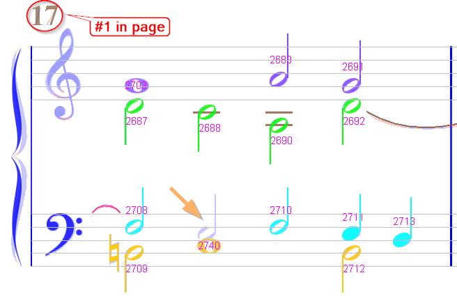

NOTA: While we work an a sheet, measure numbers are local to the sheet (to the page to be precise).
Hence, even though sheet #2 image starts with a number "17", local measure numbers start at 1.

We have a missing half note, to be created manually.

### Sheet #2, Measure #2

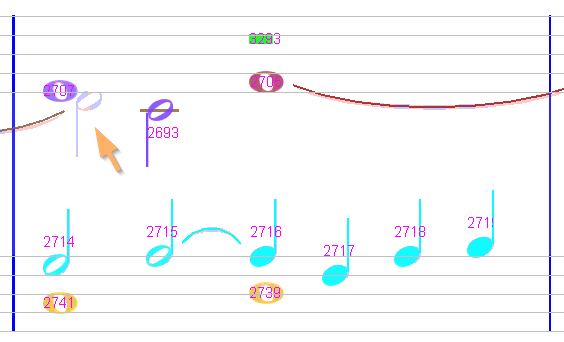

Again a missing half note.
Inserting it manually makes the whole measure OK even for voices of upper staff.

### Sheet #2, Measure #5

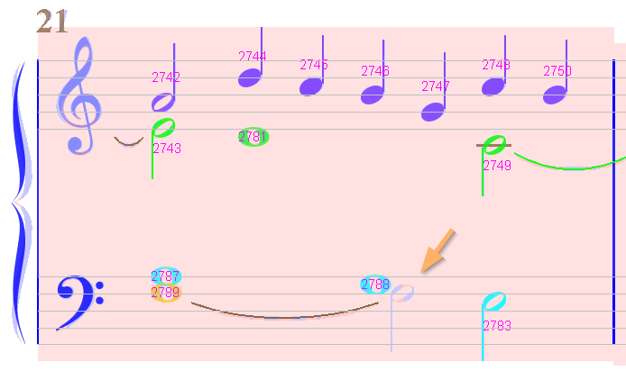

Again a missing half note.

### Sheet #2, Measure #6

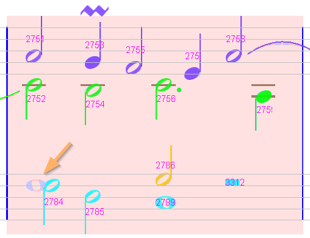

A missing whole note at beginning of lower staff.
We create it manually.

However, the measure remains in pink:

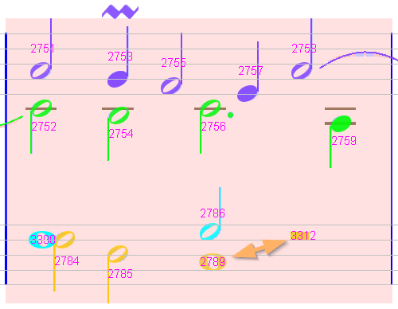

```
MeasureStack#6
    |0       |1/2     |3/4     |1       |5/4     |3/2     |7/4     |2       |5/2
--- P1
V 1 |Ch#2751 |Ch#2753 |Ch#2755 =========|Ch#2757 |Ch#2758 =========|........|2
V 2 |Ch#2752 |Ch#2754 =========|Ch#2756 ==================|Ch#2759 |........|2
V 5 |Ch#3390 ==================|Ch#2786 =========|........|........|........|3/2
V 6 |Ch#2784 |Ch#2785 =========|Ch#2789 ===========================|Ch#3312 |5/2
```

The half rest at end of lower staff (chord #3312) should not be linked to whole chord #2789
but to half chord #2786.
So we force either separate voices between #2789 and #3312 or same voice between #2786 and #3312.

### Sheet #2, Measure #9


A bunch of unwanted items on the upper left corner. To be manually deleted.

### Sheet #2, Measure #17

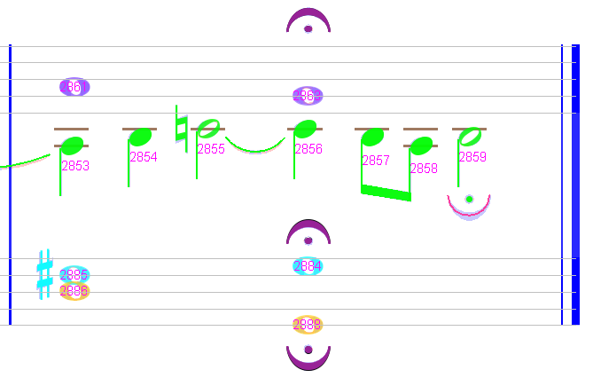

This last measure in sheet exhibits a missing fermata
(mistaken for a slur and a staccato dot).

We delete both slur and staccato.

We then select the two underlying glyphs and, using the shape palette, we assign shape FERMATA_BELOW
to the compound glyph.

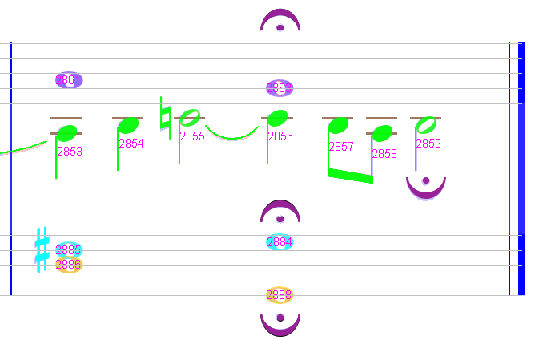

This completes our work on sheet #2.

## Sheet #3

This is a new movement, governed by a 3/4 time signature.

No pink measure in this page, but let's have a closer look...

### Sheet #3, Measure #5

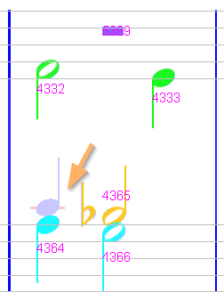

A missing quarter note.

### Sheet #3, Measure #10

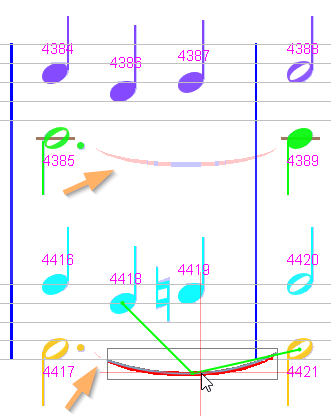

We have problems with slurs in this measure:
1. On upper staff, a slur was not recognized.
2. On lower staff, we do have a slur but it is linked to the wrong note head on its left side,
certainly because it has been truncated on the left.

For the upper slur, we use a lasso to grab all the pixels that should compose the slur:
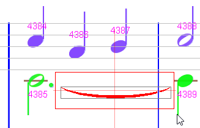

And then, using the shape palette, we assign shape "SLUR_BELOW" to the compound glyph.

This is not enough, the slur remains red, signaling that it lacks connection on some side.    
By selecting this slur, we can see it is not linked on its left sign
-- perhaps because, due to presence of an augmentation dot in between, the slur ends too short
before the correct note head.

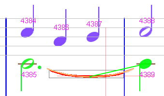

So we drag from this slur to the head of chord #4385.

For the slur on lower staff, which is linked to the wrong note head, we could also drag from the
slur to the correct note head (chord #4417).

Another solution is to edit the slur:
1. A double-click on the slur puts it in edit mode with its handles displayed.
2. We press the left-most handle and drag it to the left, closer to the target note head.
3. We release the handle when the slur displays its new connection to the target note head.

| Edition starting | Edition completed |
| :---: | :---: |
|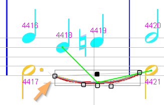|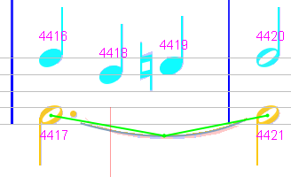|

In the rest of the sheet, there are other slurs either not recognized or too short
and/or not linked correctly.    
The manual corrections are similar to what has been shown in the measure above.

So, we complete this sheet #3 here.

## Sheet #4

As for sheet #1, we delete the common-cut time signatures and replace them with custom 4/2 sigs.

4 measures are left in pink.

### Sheet #4, Measure #1 & #2

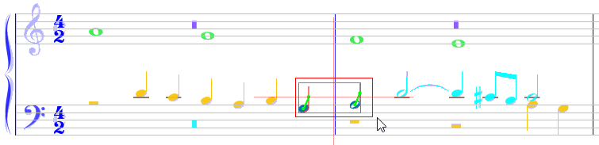

The first two measures are OK, but we would like to align their voices in the lower staff.

So, we select last chord in measure #1 and first chord in measure #2, and use
`<popup> | Chords | Same Voice` to get:


And we do the same action between measure #2 and measure #3.

### Sheet #4, Measure #3

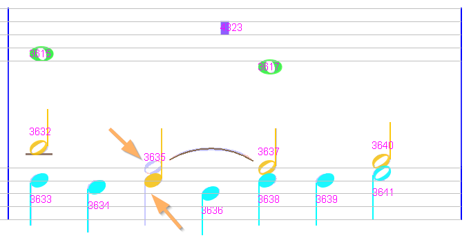

Here, we have to fix two chords in opposite directions.
1. We delete the upper stem, which is too long. The lower quarter head turns red.
2. We select the lower stem glyph and assign it the stem shape.    
   The former red quarter head gets connected to this new stem.
3. We select the glyph of the former upper stem, and assign it the stem shape.    
   It is displayed in red.
4. We drag a half head from the shape palette to the upper location.   
   It gets connected to the upper stem.
5. The slur, still connected on its left to the lower quarter head,
   has to be connected to the upper half head.   
   It turns to correct voice color, because it is recognized as a tie.

UPDATE: The fix can be easier, since we can directly insert a compound (head + stem) note:
1. We delete the upper stem,
2. We insert a half-note-up,
3. We select the lower stem glyph and assign it the stem shape
4. We connect the slur to the half note head

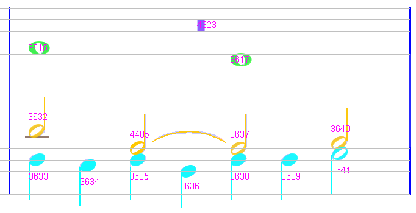

### Sheet #4, Measure #4

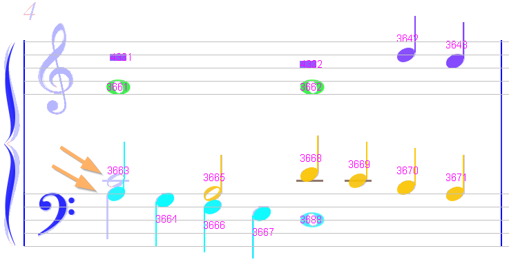

Problem is similar to measure #3 above.
So we should operate as described above.

For illustration purpose, we'll use roughly the same sequence but in a different order:

1. (Same) We delete the upper stem, which is too long. The lower quarter head turns red.
2. (Different) Instead of creating lower stem, we recreate a shorter upper stem, by selecting
   the underlying glyph and assigning the stem shape.
   Unfortunately, the new upper stem, even being shorter than the previous one, is still close
   enough to the lower quarter head, which gets (re)connected to the new stem!
3. We drag a half head from the shape palette to the upper location.   
   It gets connected to the upper stem.
4. We select the lower stem glyph and assign it the stem shape.
   It remains red, because it does *not* get connected to the lower quarter head
   which is still connected to the upper stem.
5. We force the connection by dragging lower stem to lower quarter head.   
   Notice we now have a head  *"shared"* between the upper and lower stems (and thus chords)!
6. To fix this, we select the upper right portion of this shared head ...
7. And delete it.
8. In the end, we can observe the correct result.

| Initial | 1 | 2 | 3 | 4 | 5 | 6 | 7 | 8 |
| :---: | :---: | :---: | :---: | :---: | :---: | :---: | :---: | :---: |
|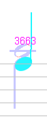||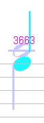|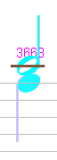|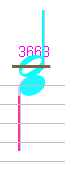|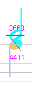|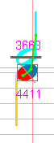|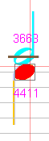|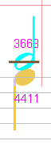|

The lesson we can draw is that we should be careful about the order of user modifications,
because of the "automatic" connections performed by the OMR engine.

We have kept this too complex case for the purpose of showing how to fix it.   
In fact, a much safer approach, which avoids the risks of "automatic" connection, is to directly
insert compound notes.
{: .nota-bg }

### Sheet #4, Measure #9

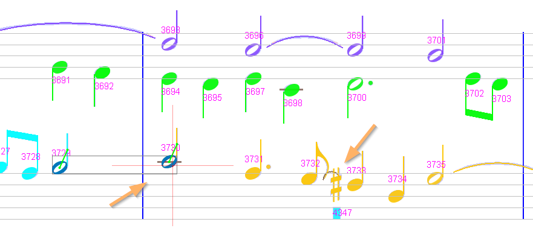

We align voices between measure #8 and this measure #9.

We delete false slur on middle of lower staff.

### Sheet #4, Measure #11

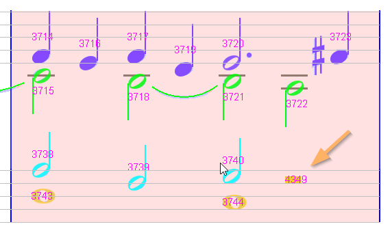

A measure in pink because of a too long voice.   
This is due to the final half rest, which should belong to the voice of the preceding half chord,
rather than the preceding whole chord.

### Sheet #4, Measure #12

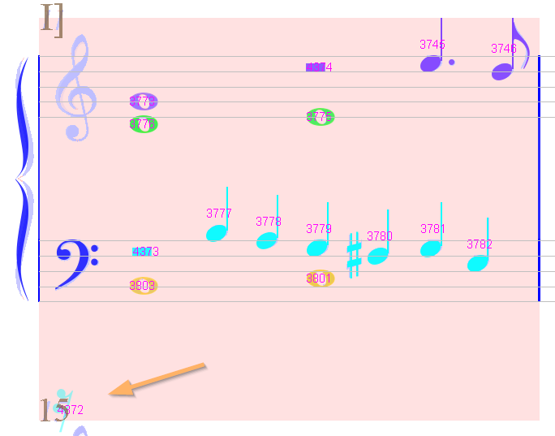

We can see the pink background going very low under the measure staves.   
This reveals the presence of an undesired 16th rest, to be deleted.

### Sheet #4, Measure #14

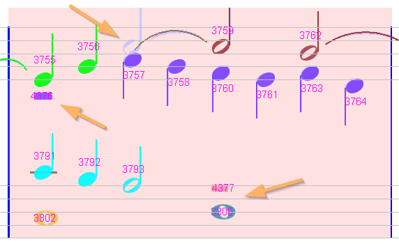

```
MeasureStack#14
    |0       |1/4     |1/2     |1       |5/4     |3/2     |7/4     |2       |9/4     |5/2
--- P1
V 1 |Ch#4376 ==================|Ch#3757 |Ch#3758 |Ch#3760 |Ch#3761 |Ch#3763 |Ch#3764 |5/2
V 2 |Ch#3755 |Ch#3756 |........|........|........|........|........|........|........|1/2
V 3 |........|........|........|........|........|Ch#3759 =========|Ch#3762 =========|5/2
V 5 |Ch#3791 |Ch#3792 |Ch#3793 |........|........|........|........|........|........|1
V 6 |Ch#3802 ==================|........|........|........|........|........|........|1
V 7 |........|........|........|........|........|Ch#4377 ===========================|5/2
V 8 |........|........|........|........|........|Ch#3800 ===========================|5/2
```
On upper staff:
- A missing half chord, to be inserted manually
- A half rest has been mistaken for a whole rest.   
  We delete it and assign the half rest to the underlying glyph.

On lower staff:
- A bad voice alignment. [It gets fixed when we correct the mistakes on upper staff]

### Sheet #4, Measure #15

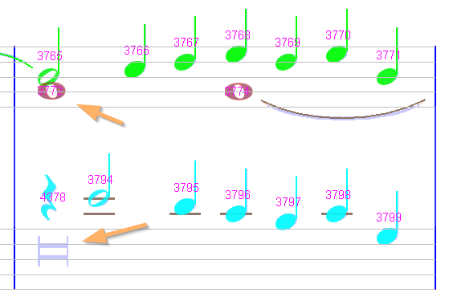

We have no voice #1 on upper staff.   
We reprocess this measure via `<popup> | Measure #15 | Reprocess  rhythm`.

The sign at beginning of lower staff is a multi-measure rest,
a kind of entity not yet handled by Audiveris.

### Sheet #4, Measure #17

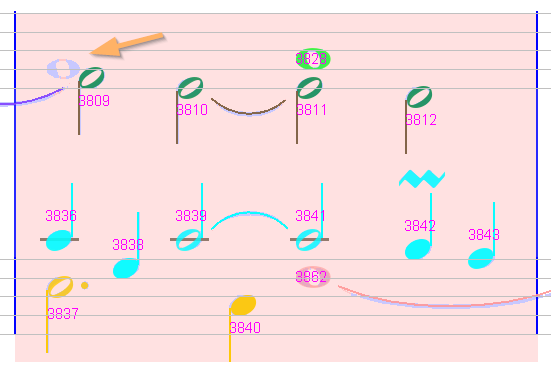

```
MeasureStack#17
    |0       |1/4     |1/2     |3/4     |1       |3/2     |7/4     |2
--- P1
V 1 |........|........|........|........|........|........|........|0
V 2 |........|........|........|........|Ch#3828 ==================|2
V 5 |Ch#3836 |Ch#3838 |Ch#3839 =========|Ch#3841 |Ch#3842 |Ch#3843 |2
V 6 |Ch#3837 ==================|Ch#3840 |........|........|........|1
V 7 |........|........|........|........|Ch#3862 ==================|2
```

There is an un-recognized whole note on upper left corner.

Notice voice #1 is void on measure strip, and there are un-colorized chords in measure display.

If we reprocess measure rhythm, via `<popup> | Measure #17 | Reprocess rhythm`, we can observe the
following messages:

```
Measure{#17P1} No timeOffset for HeadChordInter{#3809(0.815/0.815) stf:9 slot#2 dur:1/2}
Measure{#17P1} No timeOffset for HeadChordInter{#3811(0.812/0.812) stf:9 slot#6 dur:1/2}
```

We insert the missing whole note, and this fixes all the problems.

### Sheet #4, Measure #19

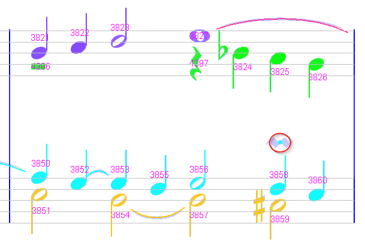

An un-recognized mordent, with a false staccato dot in it.

We delete the staccato and assign the MORDENT_INVERT shape.

This completes our work on sheet #4.

## Sheet #5

This sheet #5 continues the movement begun with sheet #4.

We update the page rhythm.
There are two measures left in pink in this sheet plus a few others to fix.

### Sheet #5, Measure #2

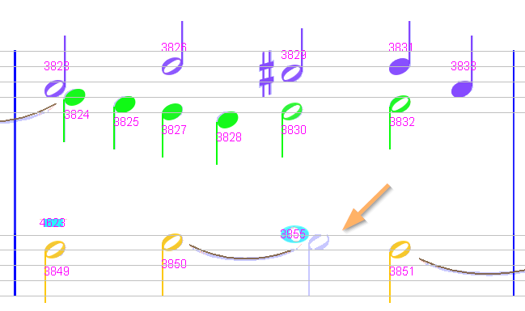

A missing half chord, and consequently a slur to reconnect to it.

### Sheet #5, Measure #3

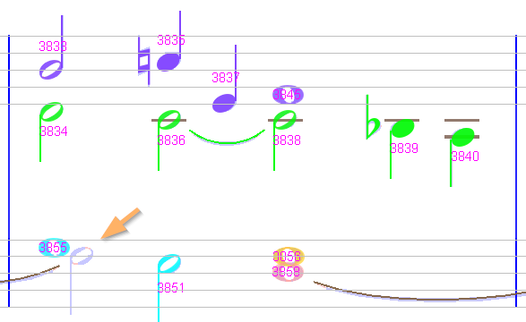

A missing half chord.

### Sheet #5, Measure #4

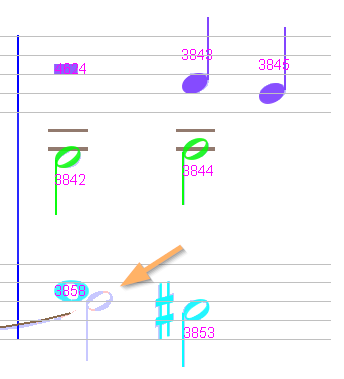

A missing half chord (in this half measure).

### Sheet #5, Measure #8

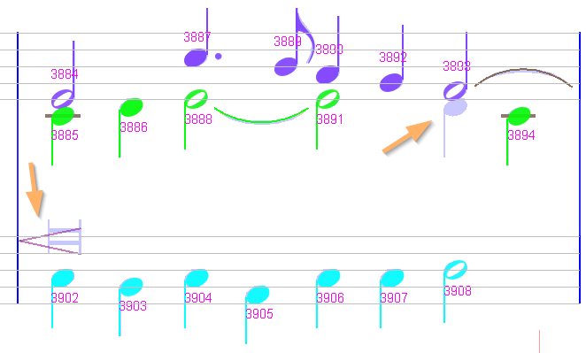

A missing quarter chord to insert and a false crescendo to delete.

### Sheet #5, Measure #10

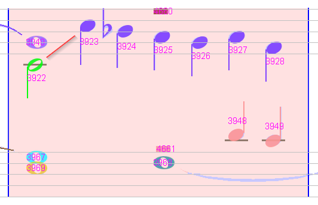

Pink measure is due to incorrect voice connection in upper staff.

Aligning voices correctly in upper staff has the side effect to align them correctly
 in lower staff as well.

### Sheet #5, Measure #17


There is a false fermata at (beginning!) of upper staff. We delete it.

```
MeasureStack#17
    |0       |1/4     |1/2     |3/2     |2
--- P1
V 1 |Ch#4020 |Ch#4021 |Ch#4022 |........|1
V 2 |Ch#4036 ==================|........|1
V 5 |Ch#4038 =========|Ch#4707 |Ch#4039 |2
```

There is also a problem with measure length.

In fact, it looks like a "half" measure which continues another "half" measure at the end of the
previous system with no ending  barline.

For Audiveris data model, these are two separate measures.
And since none of them lasts longer than 4/2, they are not flagged as abnormal pink measures.

However, the duration of voice #5 in the second half measure is 2, while we would expect 1.   
This is because of the whole rest chord #4707, which is inserted between half chords #4038 & #4039
in a single voice.

We can try to force voice separation between the whole rest chord #4707 and the surrounding
half chords.
This results in message like:
```
Measure{#17P1} No timeOffset for RestChordInter{#4707(0.796/0.796) stf:10 slot#3 dur:1}
```
In other words, the engine fails to determine the time offset of whole rest chord #4707,
alone in its voice.
This is why the measure background turns pink.

In fact, we can consider that the original score here is wrong.   
The whole rest, as it is located here in the middle of the measure, should be considered as
a measure-long rest, but this would not be consistent with the other measures in this page.

So a workaround is to actually *shift* this badly located rest to the left, at the beginning of
the measure.   
To do so, via a double-click, we put the symbol into edit mode, and drag its handle to the left.

| Shift edition | End result |
| :---: | :---: |
|   |   |

### Sheet #5, Measure #20

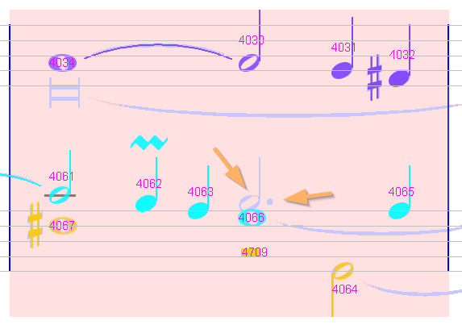

We have a pink background with a missing half chord and its augmentation dot.

We insert the half chord, the measure turns white.

But when assigning the dot augmentation it turns pink again.
This is because the dot has been linked to the whole head below rather than to the desired half head.   
This is due to the fact that the whole head is closer (in Euclidian sense) to the dot.

We could slightly shift the dot.   
Instead, we simply drag from dot to target half head.
This unlinks the dot from whole head and links it to half head.

| Wrong dot link | Fixed dot link |
| :---: | :---: |
|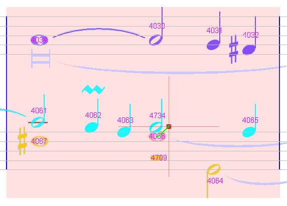   | 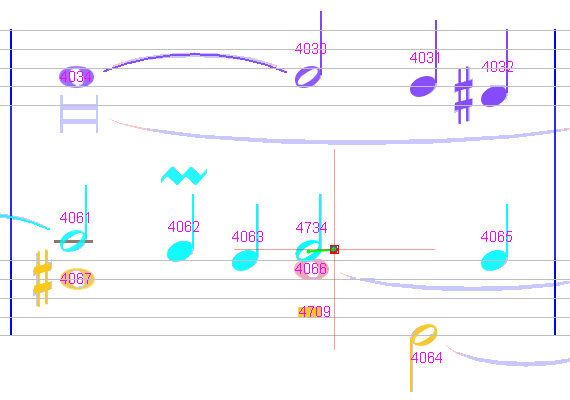  |

This completes our work on sheet #5 and concludes the whole editing session.
