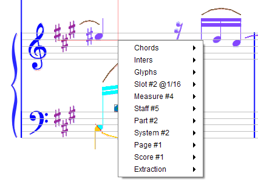

## Selection
{: .no_toc }

Table of contents
{: .no_toc .text-delta }

1. TOC
{:toc}
---

### Current location
Selection is driven by the current location you are pointing at in the score image.

The location point is displayed as a cross made of 2 red segments, one horizontal and one vertical.
The length of each segment does not vary with the zoom ratio, but the segment thickness is always
1 pixel of the original image.

| Zoom: 1 | Zoom: 8|
| --- | --- |
|||

To define the current **point**, either:
* Press down the left or the right mouse button at the desired location.
* Or, if the Pixel-Board is displayed, type numeric values in the X and Y fields.

To define a current **rectangle** -- which also defines current point at rectangle center --,
either:
* Press down the left mouse button at a desired rectangle corner location,
and keep the `SHIFT` key pressed while dragging the mouse.
* Or, if the Pixel-Board is displayed, type numeric values in the X, Y, Width and Height fields.

To precisely **shift** the current location:
* While keeping the `ALT` key pressed, use one of the 4 arrow keys to move the location (point
or rectangle) one pixel at a time.

### Entity selection

#### Selection modes

There are 3 selections modes available:
1.  _glyph+inter_ based (the default)
2.  _inter_-only based
3.  _section_-only based.

To switch from one mode to another, use the toggle menu item `View | Switch selections`,
click on the related toolbar icon or press `F11` function key.

#### Selection means

The mouse-based selection works as expected, pointing to glyph entities, inter entities,
section entities, according to the current selection mode.

*   **Pointing to an entity**:   
  A _left_-button mouse click grabs the entities that contain the
    location point.   
    If several entities are grabbed, only one is chosen to start the new selection.
    For glyphs, it's the smallest one.
    For inters, it's the member before the ensemble.  
  A _right_-button mouse click opens the popup menu:
    - with just the pointed entity if previous selection was empty,  
    - with the previous selection if previous selection was not empty.

*   **Using a lasso**: Pressing the `SHIFT` key while dragging with mouse left-button defines a
  rectangular area.
    All entities fully contained in this area start a new selection.

*   **Adding an entity**: A left click on an entity while pressing the `CTRL` key (`Option` key for MacOS)
    adds this entity to the current selection, whether the selection was done via point or lasso.

*   **Naming an entity**: Entering the integer ID of a glyph in the Glyph-Board spinner or the ID
    of an Inter in the Inter-Board spinner selects this entity.

  - **Pointing outside of any entity**:   
A left click clears both glyphs and inters selections.  
A right click opens the popup menu (with the entities selected so far)

*   **Choosing entity in selection list**: The contextual popup menu, when entities have
    been selected, offers in `Glyphs` and in `Inters` sub-menus the list of selected entities.
    Simply moving the mouse onto the entity of choice will select this entity.

*   **Choosing relation in relations list**: Via the contextual popup menu, moving to a
    selected inter displays a sub-menu with all the relations the inter is part of.
    Selecting a relation offers to dump or delete this relation.

*   **Double-click**: A double-click with left mouse button on an Inter (not a Glyph) selects that
   Inter and puts it in `Edition mode` (see [Inter edition](../ui_tools/edit_inter.md)).

A selected inter may display links to its related inter entities.
The links appear as short straight lines in light green color
-- together with relation name if zoom is high enough --.
The images below depict:

1. A tuplet glyph linked to its 3 embraced chords
2. A note head connected to a stem and a slur
3. Lyrics text with links to the related chords

| Tuplet | Head | Lyrics |
| --- | --- | --- |
|  |  |  |

#### Multi-selection

A left-click in an entity area selects this entity (and deselects the entity previously selected if any).

To select several entities:

* Either, by dragging the mouse while keeping the `SHIFT` key pressed, use a rectangular "lasso"
to grab all the entities whose bounds are **fully contained** by the lasso rectangle.

* Or, select each entity, one after the other, keeping the `CTRL` key pressed.
If you have selected an item that you don't want to keep, simply click on it a second time
and it will be de-selected.
This can especially be useful when having selected several items using the "lasso" to then
de-select items that are not wanted.

A red rectangle always shows your selection frame.
When in  _glyph+inter_ mode, an additional black rectangle
shows the bounding box of a compound glyph built from all selected glyphs.

Moreover, an entity changes color when it gets selected (a glyph turns red, an inter turns to
nearly-reverse color, a section turns white).

#### Member vs Ensemble

Selecting an entity by pointing at it can be ambiguous.

This can be the case when two or more **Glyphs** overlap each other.
When you point at an overlapping region, the software will pick up only the smallest glyph.

This is by definition always the case when pointing at an **Inter** which is a member of an
**Inter ensemble**, for example a note and its containing chord.
In this case, the software will choose the member over the ensemble, knowing that you can later
switch from selected member to selected ensemble in the Inter-board
(and in the Inters popup menu).  
For example:

Here, we have pointed on a note head which is part of a head chord.
Note the (member) head inter is selected over the (ensemble) chord inter, the involved "_HeadStem_"
relation is visible between head and stem, the Inter-board focuses on head inter,
with the `To Ensemble` button enabled.

Here, we have pressed `To Ensemble` button, and the focus is now on the head chord,
with the "_ChordSyllable_" relation to the lyric item "Ver" below.

### Container selection

When clicking with the right mouse button on any location of the sheet image, the sheet
popup menu appears.

This popup displays contextual information
-- such as the selected glyphs, inters, etc, if any --
together with the containers being pointed at.

For example, the popup above allows to access -- beside chords, inters and glyphs --
the containers related to current mouse location:
* Time slot,
* Measure,
* Staff,
* System,
* Page in sheet,
* Whole image.

Then, each sub-menu leads to possible actions related to the container at hand.
