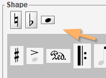
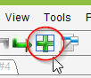
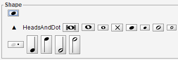

## Inter addition
{: .no_toc }

In Audiveris data model, an Inter instance represents an interpretation, that is a candidate
likely to become a musical symbol in the end.

A manually created Inter is flagged as `MANUAL` and cannot be called into question by the
OMR engine, it is considered as certain.

You can manually create an Inter instance from a selected glyph, by "assigning" this glyph the
desired shape.
If you have no suitable glyph available, you can still create an Inter from nothing, via a simple
drag n' drop from the shape palette.

In both cases, you may have to specify the target staff for the created inter if the context is not
clear enough for the engine.

---
Table of contents
{: .no_toc .text-delta }

1. TOC
{:toc}
---

### Inter from underlying Glyph

Inter creation from a glyph is the only case where a glyph is used in Audiveris manual edition.

The set of black pixels of one or several selected glyphs can be transcribed as one inter,
by specifying the target inter shape.
The precise location and bounds of the new inter is defined by the underlying set of pixels.

This method of selecting a glyph to "assign" an Inter on it, requires of course that a **suitable
glyph** be available.
In you can't find any such glyph, you'll have to drag n' drop the desired shape from
the shape palette instead.
{: .nota-bg}

Also, knowing the target location is not always sufficient to detect the Inter **target staff**.
Several heuristics are used by the software, but if they fail you will be prompted for the
target staff:

The target shape can be specified via different means, as follows.

#### Via the glyph classifier

This classifier automatically operates on the current glyph, be it the single selected glyph or
a transient glyph built on-the-fly from a multi-glyph selection.

Chances are you'll find your desired shape in this top 5. If so, press the shape button.

NOTA about the glyph classifier:
{: .nota-bg}
1. The target shape must be handled by the glyph classifier (based on a neural-network).
   This is NOT the case for the following shapes:   

   | Shape | Handled by |   
   | :---  | :--- |   
   | **Lines** (staff lines, ledgers, barlines, stems, slurs, endings) | ad-hoc methods|
   | **Beams** | image morphological closing |
   | **Note heads** | template matching |
   | **Texts** | OCR |
   {: .nota-bg}

2. The top 5 is just a raw output of the glyph classifier, which runs on the glyph in isolation,
i.e. _without taking the neighborhood into account_.    
This means that a dot (augmentation, staccato, ...) will be at best recognized as `DOT_set`,
and a half or whole rest as `HW_REST_set`.
For these 2 cases -- and only for them -- the glyph classifier is not precise enough,
you'll have to explicitly select a more specific target shape, via the glyph popup menu
or via the shape palette.
{: .nota-bg}

#### Via the glyphs popup-menu

Once a glyph has been selected, use a mouse right click to access the sheet popup menu,
and its `Glyphs` sub-menu.

Then navigate through shape families to your precise target shape.

#### Via the shape palette

The shape palette (see next section) allows to assign a shape to the selected glyph.
This is done by a double-click on the desired shape in the palette.

### The Shape Palette

The palette offers the ability to choose the desired shape for a selected glyph.

And even if no precise glyph can be selected, you can directly drag a "ghost" Inter
from the shape palette, located on the right side of the sheet view, and drop this ghost
at the desired target location.

The starting aspect of the shape palette is a catalog of all shape families.
It exhibits a dark-gray background, with one representative button for each shape family.
Nothing can be dragged from this catalog, you must first select a shape family:

#### Entering shape family
Pressing a shape family button replaces the catalog view by a specific palette dedicated to
the selected shape family.
For example, pressing on the clefs family button gives:

Within a family, a shape can be:

* Assigned (by left double-click) if a glyph has been selected,
* Or dragged and dropped to a target location.

#### Selecting target staff
While you are dragging a shape, you have the freedom to hover where you like.
The latest staff you have been hovering over is selected as your current target staff.

Before you "select" a staff, the dragged shape "ghost" is displayed isolated in dark-gray.

Once a staff has been "selected", a thin vertical red segment goes from shape center to
the target staff middle line, the shape turns into Inter selected color, additional objects
can appear -- such as intermediate ledgers or potential relations with nearby inters --,
it may get snapped according to staff lines, etc.

| before staff selection | after staff selection |
| --- | --- |
|  |  |

You can drop the shape only when a staff target has been selected.
If not, the drag n' drop action is abandoned.

#### Exiting shape family
To leave the specific family palette and go back to the catalog view, you can:

* Press the "triangle-up" sign located on the left side of the family palette,

  
* Or type the `ESC` key on the keyboard.

### Shape cache

You will notice, appearing on a line above the shape palette, the list of the most recent shape
buttons you have used so far.

These _cached_ buttons are meant for further direct access, avoiding the navigation to their
containing families.

And if you want to add many Inters of the same shape, consider using the
 "Repetitive Input" mode below.

### Repetitive input

If you have numerous Inters of the **same shape** to add in a row, a convenient way is to switch
temporarily to the "Repetitive Input" mode.

Click on the toolbar icon or select menu item `Sheet | Toggle Repetitive Input` or use shortcut
`CTRL + SHIFT + N` and this mode is now set on.

From that point on, pressing with the left-button anywhere on the sheet will add a new Inter
(with the latest shape used) at the designated location.
You can shift the inter location precisely, then release the mouse when you are satisfied.

If you press the left-button again, yet another instance will be created, and so on.
That's the rule, so mind your mouse press actions!

The latest Inter inserted is left in "Inter edition mode" with its edition handle(s) displayed.
You can press the `Enter` key to finish this edition,
or click somewhere else to create another Inter.

This repetitive mode is meant for simple shapes -- like a head, a rest, an accidental, etc --
that don't require any further resizing.

But what if you really need to resize the inserted Inter?
Simply set the repetitive mode off, so that you can press and drag the inter edition handles.
Then set the repetitive mode on again if you wish.

To exit this rather specific mode, toggle the mode (via toolbar icon or menu item or shortcut).

### Relations with other inters

Key relation(s) with the nearby inter(s), if any, will be updated automatically as you create
-- or later edit -- the inter, but only as long as the required geometrical relationships can apply
(for example, as long as an accidental is sufficiently close to a note head on its right side).

If relation constraints are not met, you will have to set the relation manually afterwards.

### Shortcuts for inter addition

In order to make long editing sessions easier, there are a few shortcuts to assign interpretations
without your hands leaving the keyboard.

They all work with a sequence of 2 strokes:
1. First stroke selects a _family_ of shapes.   
   The selected family content appears in the right column.
2. Second stroke selects a _shape_ within the current family.  
   The selected shape appears first in the shape cache.

Example: Press `h` (heads) then `b` (black) and you get the `HeadsAndDot` family content displayed
and the black head shape in the cache.

If you had a glyph selected beforehand, this glyph is assigned the selected shape.
If not, no glyph gets assigned, but the shape cache now presents your selected shape in first
position, ready for further use (via double-click, drag n' drop or repetitive input).

***

#### Shortcuts table

Only families and shapes that are used rather often are supported.

| 1st key | Family | 2nd key |
|    ---: | :---   | :---    |
|**a** |accidentals | **f** (flat), **n** (natural), **s** (sharp)
|**b** |beams       | **f** (full), **h** (half), **3** (triplet)
|**d** |dynamics    | **p** (piano), **m** (mezzoforte), **f** (forte)
|**f** |flags       | **u** (up), **d** (down)
|**h** |heads       | **w** (whole), **v** (void), **b** (black), **d** (augmentation dot), **h** (half-note), **q** (quarter-note)
|**r** |rests       | **1**, **2**, **4**, **8** (full, half, quarter, eighth)
|**p** |physicals   | **l** (lyrics), **t** (text), **a** (slur above), **b** (slur below), **s** (stem)
