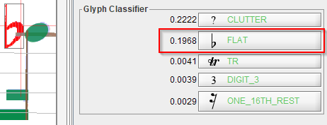
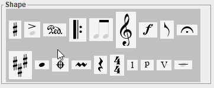
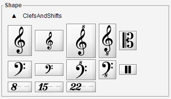
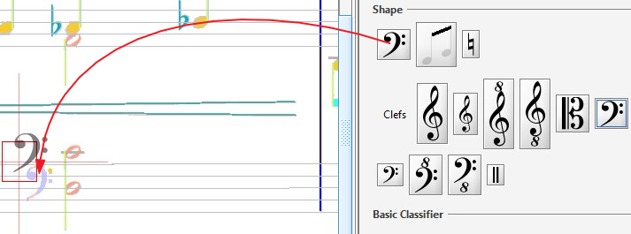
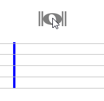
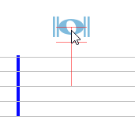
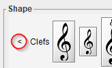

## Inter addition
{: .no_toc }

In Audiveris data model, an Inter instance represents an interpretation, that is a candidate
likely to become a musical symbol in the end.

A manually created Inter is flagged as `MANUAL` and cannot be called into question by the
OMR engine, it is considered as certain.

You can manually create an Inter instance from a selected glyph, by "assigning" this glyph the
desired shape.
If you have no suitable glyph available, you can still create an Inter from nothing, by a simple
drag n' drop from the shape palette.

In both cases, you may have to specify the target staff for the created inter.

---

## Table of contents
{: .no_toc .text-delta }

1. TOC
{:toc}

---

### Underlying Glyph

Inter creation from a glyph is the only case where a glyph is used in Audiveris manual edition.

The set of black pixels of one or several selected glyphs can be transcribed as one inter,
by specifying the target inter shape.
The precise location and bounds of the new inter is defined by the underlying set of pixels.

Knowing the target location is not always sufficient to detect the Inter target staff.
Several heuristics are used by the software, but if they fail you will be prompted for the
target staff:

The target shape can be specified via different means, as follows.

* From the **Glyph Classifier**:

This classifier automatically operates on the current glyph, be it the single selected glyph or
a transient glyph built on-the-fly from a multi-glyph selection.

Chances are you'll find your desired shape in this top 5. If so, press the shape button.

Beware: the top 5 is just the raw output of glyph classifier, running on the glyph in isolation,
i.e. without taking the neighborhood into account.
This means that a dot (augmentation, staccato, ...) will be recognized as "DOT_set",
and a half or whole rest as "HW_REST_set".
For these 2 cases, the classifier is not precise enough, you'll have to use a more specific
shape target, specified via the glyph popup menu or via the shape palette.

* From the **Glyphs sub-menu**:

Once a glyph has been selected, use a mouse right click to access the sheet popup menu,
and its `Glyphs` sub-menu.

Then navigate through shape families to your precise target shape.

* From the **Shape palette**:

The shape palette (see next section) allows to assign a shape to the selected glyph.

It also allows to drag n' drop a shape to a target location, thus without the need of any
underlying glyph.

### The Shape Palette
Even if no precise pixels can be selected, you can often directly drag a "ghost" Inter
from the shape palette, located on the right side of the sheet view, and drop this ghost
at the desired target location.

The initial view of the shape palette is a global view of all shape families.
It exhibits a dark-gray background, with one representative button for each shape family.
Nothing can be dragged from this global view:

#### Entering shape family
Pressing a shape family button replaces the global view by a specific palette dedicated to
the selected shape family.
For example, pressing on the clefs family button gives:

Within a family, a shape can be:

* Assigned (by double-click) if a glyph has been selected,
* Or dragged and dropped to a target location.

#### Selecting target staff
While you are dragging a shape, you have the freedom to hover where you like.
The latest staff you have been hovering over is selected as your current target staff.

Before you "select" a staff, the dragged shape "ghost" is displayed isolated in dark-gray.

Once a staff has been "selected", a thin vertical red segment goes from shape center to
the target staff middle line, the shape turns into Inter selected color, and additional objects
can appear, such as intermediate ledgers or potential relations with nearby inters.

| without target staff | with target staff |
| --- | --- |
|  |  |

You can drop the shape only when a staff target has been selected.
If not, the drag n' drop is abandoned.

#### Exiting shape family
To leave the specific family palette and go back to the global view, you can:

* Press the `<` sign located on the left side of the family palette,

  
* Or type the `ESC` key on the keyboard.

You will then notice, on the top line of the shape palette, the list of the most recent shape
buttons you have used so far.
These "cached" buttons are meant for further direct use.

### Related links
Key relation(s) with the nearby inter(s), if any, will be updated automatically as you create
-- or later edit -- the inter, but only as long as the geometrical relationships can apply.

If not, you will have to set the relation manually afterwards.

### Joint tasks
Adding an inter may trigger joint actions, when the inter starts a brand new ensemble:

*   Creating a Rest always jointly creates a containing Rest-Chord
*   Creating a Head jointly creates a Head-Chord, when added to a stem not yet part of a Head-Chord.
