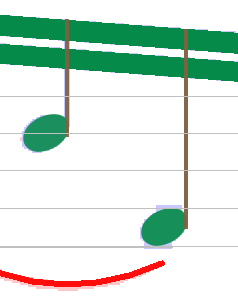
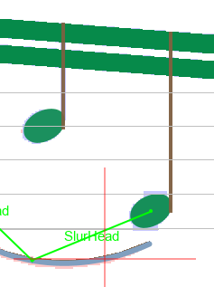

## Relation addition
{: .no_toc }

## Table of contents
{: .no_toc .text-delta }

1. TOC
{:toc}

---

Most Inter instances have relations with other Inter instances.
For example the note head below exhibits 2 relations,
a _SlurHead_ relation between the slur and the note head,
a _HeadStem_ relation between the note head and the stem.

### Mandatory vs Non-Mandatory relations

Depending on Inter class, an Inter instance may need a relation with another Inter instance.

Relations are shown when you select an Inter.
The name of each relation is also displayed, provided that current zoom is high enough (>=2).

If an Inter instance lacks a mandatory relation, it should somehow be removed before the end of
the transcription process.
This is the case when created as a candidate by the OMR engine but, if the Inter at hand was
manually added, it can't be automatically removed by the engine.
It is simply flagged as "_abnormal_" and shown in red to call user attention on it.

In the example below, a _SlurHead_ relation between slur and note head is mandatory for the slur.

| non-linked slur | linked slur |
| --- | --- |
|  |  |

A missing relation can happen when the geometry rules are not matched, perhaps because the gap
is a bit too wide between slur and note head.   
In that case, you have to either shift or resize the Inters accordingly or manually set the
needed relation.

NOTA, regarding relation automatic search:
* A **mandatory relation** is automatically searched for, only at the moment the dependent
inter is created, shifted or resized.
This is so, simply because, using the same slur example, the slur needs a head but the head does
not need a slur.
A good practice, when several Inters have to be created manually, is to create the independent
Inters first and the dependent Inters second.  
But still, when the geometry is really beyond specified limits, the needed relation may not be
automatically created and you'll have to add it manually.

* A **non-mandatory relation** is never searched for automatically.
An example of non-mandatory relation is the case of a direction sentence which doesn't always
have a chord precisely above or below.  
For such non-mandatory relations, you have to decide if you set them or not.

### Linking Inters

Assuming the slur is not linked to the note head, you need to insert the relation between them.

To do so, you can point and drag from the slur to the note head (a thin black vector will
appear as you move the mouse, see picture below)

Then release the mouse when reaching the targeted head.

Audiveris will search among all the inters grabbed at first and at last locations, find the
missing relation if any between those two collections of inters and set the proper relation.  
This commits the relation insertion.

NOTA: When linking two elements, say A and B, the direction is irrelevant:
you can either drag from A to B or drag from B to A, the result will be identical.  
