## Chords
{: .no_toc }

You should know by now that clicking on a note selects that note rather than its containing
chord (this is the rule known as "_member over ensemble_").
However, by selecting one or several notes, you can indirectly select and act on these chords.

This is made possible via the usual popup menu which can provide a specific `Chords...`
sub-menu, whose content tightly depends on the chords configuration.

---

## Table of contents
{: .no_toc .text-delta }

1. TOC
{:toc}

---

### Chords menu

Here below, we have selected two notes as indicated by the arrows: one note head and one rest,
before opening the popup/Chords menu:

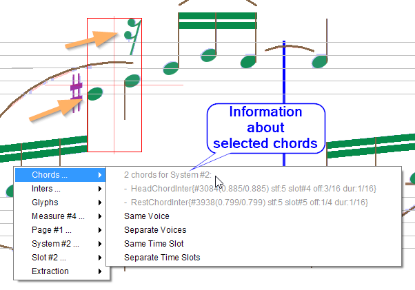

Notice that the global bounding box (red rectangle) encompasses the bounds of both chords.

Also, the menu begins with information lines about the selected chords.
And if you hover about these lines, the bounding box is dynamically updated to show just the
selected item.
This is meant to allow a visual check of the selected chords:

| all chords | first chord | second chord |
| --- | --- | --- |
| 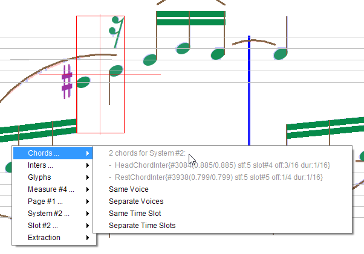 | 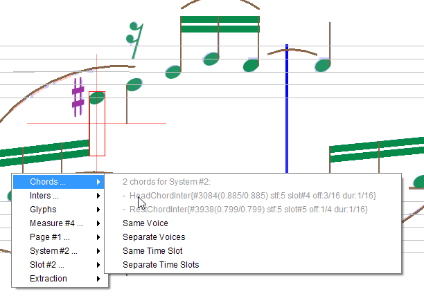 | 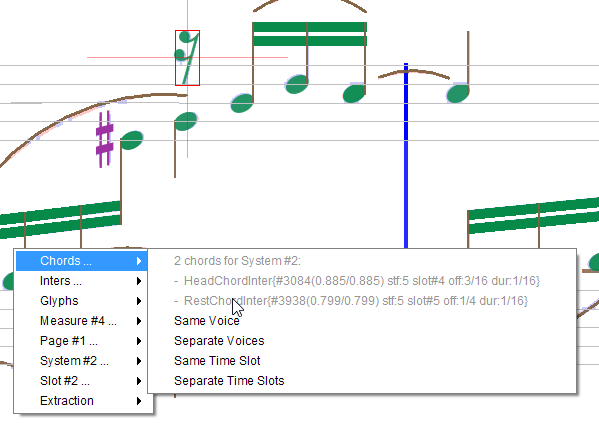 |

NOTA: The example of Chords menu above shows only a partial list of possible chords actions,
because the list depends on the current status and configuration of the selected chords.

Here after, we list all the possible items of `Chords...` menu.

### Voice

A voice is defined as a sequence of chords (head chords and rest chords) in the same music part. [^voice_sharing]

Audiveris algorithm for voice building is already very tricky.
It tries to reconcile different heuristics, but in some cases the result may not be the one the
user would expect.

Purpose of the voice actions is to guide the software in voice building, by imposing that two
given chords have the same or have different voices.

#### [cancel] Same Voice

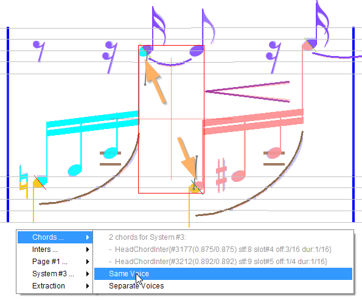

Here, by imposing the same voice between the two heads indicated by an arrow, we in fact "merge"
the 2 voices into one, as follows:

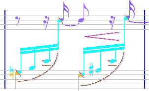

You can always undo such task.
But if you want, much later in the process, to cancel this task, you can always select the same
chords and you'll be offered to _cancel_ the task.

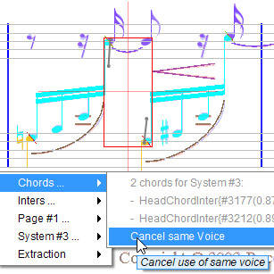

#### [cancel] Separate Voices

This command imposes the voice algorithm to assign the selected chords to separate voices.

Note this is not exactly the reverse of "_same voice_" command:
* Without any command, you let the algorithm decide with no guidance.
* With a command (whether it's _same_ or _separate_), you explicitly guide the algorithm.

### Time

Assigning a chord to proper time slot is as tricky as voice assignment.
In fact, time and voice algorithms are tightly coupled.

When two chords are rather close abscissa-wise, when should we consider them as part of the same
time slot?

#### [cancel] Same Time Slot

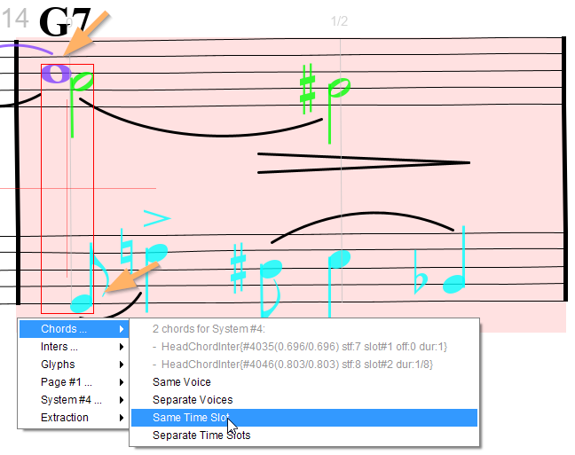

Here, we can see that time slots on second staff of the part are not correctly assigned.
This is because the whole note on upper staff and the 8th note on lower staff are toi far apart
abscissa-wise.
So, we force these two notes to share the same time slot.

#### [cancel] Separate Time Slots

As opposed to the same time slot, this command is used to force time separation between two
chords that the engine had considered as adjacent.

### Chord

Gathering note heads into chords may need some user correction.

#### Split

| one chord? | two chords? |
| --- | --- |
|  | 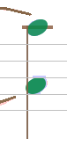 |

The OMR engine may have considered this is just one chord with a long stem, whereas we find
these are in fact two separate chords, one above the other.
In that case, select this chord and use the Split command.

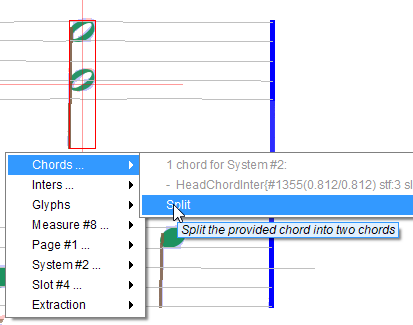

#### Merge

Or, just the opposite, we want to merge these two chords into a single one.
In that case, we select both chords and use the Merge command.

In the specific case of whole notes, the merge command is often needed.
Because there is no stem involved, the engine has no clear heuristic [^whole_chord]
to gather whole heads into one chord.

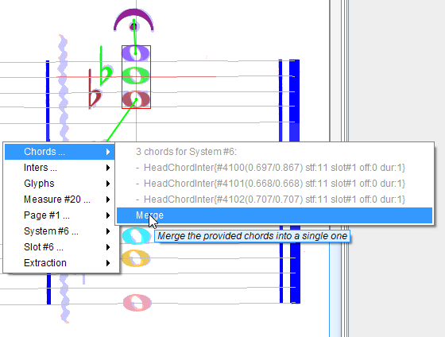

---
[^voice_sharing]: There is an on-going debate about the possibility for Audiveris to share chords between voices. But for current 5.2 release, a chord can be assigned to exactly one voice.

 [^whole_chord]: Current heuristic for whole chords is to gather whole heads if they are aligned vertically and not more than one interline apart.
