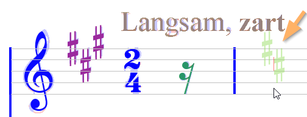
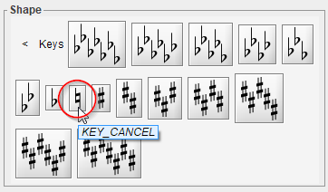
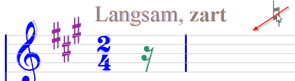
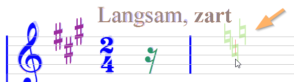

## Key signature
{: .no_toc }

A key signature cannot be built or modified incrementally by adding or removing one alteration
sign at a time.
It must be built or modified **globally**:
* Either by selecting a compound glyph and assigning the desired key shape,
* Or by dragging and dropping the desired key shape from the shape palette.

---
Table of contents
{: .no_toc .text-delta }

1. TOC
{:toc}
---

### Flats and Sharps

When dragging a "ghost" key from the shape palette, the ghost turns from dark-gray to green
when you enter a staff and as usual a thin red segment goes from ghost center to staff mid line.

Moreover, the dragged key snaps immediately to proper vertical position, according to the
effective clef at the point of insertion.

For example, let's insert a 2-sharp key:

Notice the two sharp signs are located on F and C steps respectively, and they can move only
horizontally until you release the mouse.  
Once dropped, you can still set the key into edition mode and shift again the inserted key.

### Naturals

As of this writing, Audiveris OMR engine can recognize all-sharp keys and all-flat keys but
no key with natural signs inserted
(be it a mix of naturals with sharp/flat signs, or a naturals-only key)

However, you have the ability to manually insert a _cancel key_ -- i.e. an all-natural key --.

To do so, drag the 1-natural key from the shape palette and move it to the desired insertion
point.

When you enter the target staff, the 1-natural ghost key with turn as usual from dark-gray to
green, but its configuration and position will be dynamically updated, to fit:
* The effective **clef**,
* The effective **key** to be cancelled.

If for example the effective key is a 3-sharp key, the "cancel" key will be a 3-natural key,
with each natural sign located according to the corresponding sharp sign to cancel:

| Staff-relative location| Cancel Key appearance|
| --- | --- |
| Outside: |  |
| Inside: |  |

You will notice that this works only when the ghost is located in a staff measure _different_ from
the staff measure that contains the key to be cancelled.
This is so because there can't exist two keys in the same staff measure.
