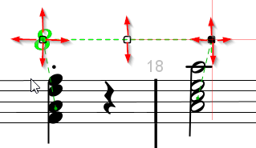

## Octave shift
{: .no_toc }
{: .d-inline-block }
New in 5.3
{: .label .label-yellow }

---
Table of contents
{: .no_toc .text-delta }

1. TOC
{:toc}
---

### Definition

An octave shift looks like this:

Its purpose is to tell a reader that there is a local shift in height between the notes
as they are written and as they must be performed.
- The _**number**_ on left side can be `8` (_Ottava_), `15` (_Quindicesima_) or
`22` (_Ventiduesima_) for a 1-, 2- or 3-octave shift respectively.
- The horizontal straight _**dotted line**_ recalls the staff abscissa range where the shift applies.
- The ending _**hook**_, when present, gives a precise end for the shift,
and generally points back to the related staff.
- The shift _**kind**_ (`alta` or `bassa`) tells whether the notes must be performed  respectively
higher or lower than written.

Unfortunately the shift *kind* is not easy to detect in a printed score:
- Some scores exhibit various glyphs, such as `8va`, `8vb`, `8va alta`, `8va bassa`, etc
to name a few ones related to ottava.
  Similar variations can be found for quindicesima and for ventiduesima.
- Sometimes the `va` suffix, when present, appears at the top or at the bottom of the `8` glyph.
- Sometimes the vertical location of the sign with respect to the related staff is used
  (above the staff to indicate `alta`, below the staff to indicate `bassa`).
- And how can the OMR engine determine the related staff of an octave shift?
  Using vertical distance to closest staff is not reliable enough.

### Multi-system octave shift

The example at the beginning of this page presented a rather short octave shift,
limited in range to a portion of the physical staff just below it.

The following example is different:

We can see an octave shift starting on upper staff in first system and stopping at the end of upper
staff in second system.
- Audiveris refers to this multi-system configuration as one _logical_ octave shift composed of
several _physical_ octave shifts.
- Notice there is no ending hook for the first physical shift, indicating its continuation
beyond the containing system.

Notice also the other shift located on the lower staff of second system, or the next example below, and how the notion of "straight horizontal line" should be taken with a grain of salt...

### Current status

As of this writing, automatic recognition of octave shifts by Audiveris engine is very limited:
- Starting glyph (`8`, `15` or `22`) could be recognized,
- Potential suffixes much less easily,
- Dotted line and hook cannot be recognized by the current engine.

Instead, we have chosen to develop friendly means to let the end user manually create and edit
even complex octave shifts.

{: .warning}
Audiveris implementation for octave shifts is made **under the following simplifications**:   
1. The end user must explicitly indicate the related staff, in one way or another.   
2. Octave shift number is limited to `8`, `15` or `22` glyph, with no suffix at all.   
3. Octave shift kind is determined by vertical location with respect to the staff,
above for `alta`, below for `bassa`.   
4. Logical octave shifts can cross system breaks but not page breaks.   
5. A hook is always present at the end of the last physical octave shift, and only there.

### Creation

The easiest way for creating an octave shift is a drag n' drop from `ClefsAndShifts`  family in
shape board:

1. Drag the desired shift symbol
2. Pay attention to hover the target staff.    
   Staff information is sticky:
   - The symbol is initially displayed in gray with no hook, then in green when hovering a staff
   - The last hovered staff becomes the current staff, and potential links to staff chord(s)
     are shown
   - The symbol changes when being moved around the staff:   

     | Above staff | Below staff |
     | :---: | :---: |
     | an `alta` downside hook appears | a `bassa` upside hook appears |
     |  | |
3. Drop symbol at the desired location (typically the center of number box) by releasing the mouse.

Another way is to select a suitable glyph, which must be limited to the number part
without any suffix:   
1. This will trigger the glyph classifier which may recognize the shape, in which case press
the proper button in classifier board.   
2. If not, manually assign the target shape via the popup menu or via a double-click in the
`ClefsAndShifts` family of shape board.   
3. Note you will be prompted for the precise target staff of the created shift.

In both ways, what you have created is just a small octave shift.
You can now proceed to its precise edition as described in the next section.

### Edition

The octave shift editor can provide 3 handles: left, middle and right:   
- All these handles can move the shift vertically between the current staff and the other staff,
  above or below, according to the shift kind alta/bassa.
- Only the left and right handles, when present, can resize the shift line horizontally within
  current staff limits.

What is specific to this editor is the ability to drag the user location (shown as a red cross),
way beyond the limits of current system, until the corresponding staff in some previous or next
system.

In the example below, the user has selected the right handle as shown and will drag the mouse from
staff #1 down to a location in staff #3:

When reaching this staff #3 (which is the succeeding staff for staff #1), the editor configuration
changes on-the-fly:

Instead of the initial simple octave shift with 3 handles, we now have 2 physical shifts
in a logical shift:
- Upper shift has been extended until the end of its staff, and its right handle removed.
- Lower shift has been created anew from the start of its staff (with no left handle)
  until current user abscissa.

The user can move further (though staying in the same page), extending the same logical shift
with additional physical shifts -- or conversely shrinking the logical shift by moving backwards.   
Similar actions are possible, starting from the upper left handle, to extend the logical shift
upwards.   
Intermediate physical shifts can also be refined vertically.

Finally, clicking outside of any handle ends the current edition.

NOTA: A logical shift, whether it is made of one or several physical shifts, is managed as one
entity. This applies for creation, edition and removal actions.

And as usual, any of these actions can be undone and redone at will.

### Removal

Manual removal of any (physical) octave shift means the removal of the whole "logical" octave shift.
