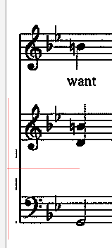
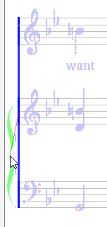

## Part
{: .no_toc }

During the GRID step, the OMR engine detects staves and assign one part per staff, unless:
* There a multi-staff brace on the left margin of the staff,
* And the staves joined by the brace are also joined by connectors
(a connector is a vertical concrete segment joining two barlines).

If these two conditions are met, the two staves (more rarely three staves) are considered to
refer to the same instrument (e.g. piano or organ) and thus to a single common part.

Some score images exhibit damaged braces, impeding the detection of common part.

This is the case of the following example, where a poorly done scan has cropped an important
portion on image left side:

So, this leads the OMR engine to detect a system with 3 parts.

To fix this, manually drag n' drop a brace inter from the shape palette to where there should be
a brace.

Pay attention to hover over a staff of the target system.
The brace ghost with turn from dark-gray to green, with a red segment going from brace center
to staff middle line:

You can now drop the brace.
The drop will commit the merge of the two embraced staves into a single part.

You can undo this operation (or remove the manual brace, which is equivalent)

NOTA: this is an _adhoc_ feature, meant fo fix a brace cropped out.
It works only by inserting a **manual** brace.

You can still slightly shift or resize the brace if you wish.
But do not try to extend the brace to a 3rd staff, this wouldn't work.
