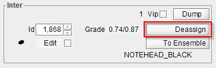
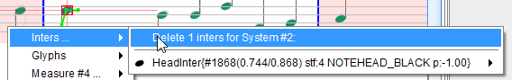

## Inter removal
{: .no_toc }

When one or several Inter instances have been selected, you can remove them as follows:

*   The Inter-board has a `Deassign` button which removes the selected inter displayed in the
  board.
  This applies only for THE displayed inter.  
  

*   The popup menu, trigerred by a right click, in its `Inters...` sub-menu, provides an item to
    remove the selected Inter entities according to their containing system.
  

*   Pressing the `DELETE` key on the keyboard removes all the selected inters.

If more than one inter is selected, you will be prompted for confirmation beforehand.

Removing a selected inter (or a set of selected inters) automatically removes the relations these
inters were involved in.

Removing the last member of an ensemble also removes that ensemble.
