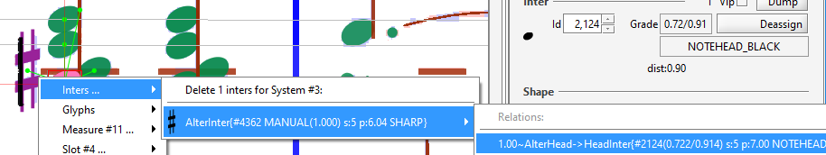
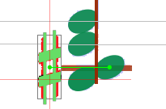

## Relation removal
{: .no_toc }

---
Table of contents
{: .no_toc .text-delta }

1. TOC
{:toc}
---

### Removing a wrong relation

There is no direct way to select Relation instances.
They can be selected only indirectly, via the selection of one of the Inter instances they link.

In the following example, a sharp sign has been linked to the wrong note head:

To select this relation, first select the involved sharp sign.
This will result in the picture above.

Then use a right-click to display the context popup menu, hover on `Inters...` submenu,
then on the sharp item to see the `Relations:` list of relation(s) this Inter is involved in.

By clicking on the _AlterHead_ relation, you will be prompted to confirm the removal of this
relation.

Without this relation, the sharp sign is now no longer linked to any head,
it thus appears in red abnormal status.

Finally, the correct relation could be manually added
(see [Add Relation](../ui_tools/add_relation.md) previous section) to result in the
configuration below:

### Implicit relation removal

In the precise case above (correcting reference of accidentals), explicit removal of the
relation was not necessary.
This is so, because an accidental can reference only one note head
(if we except the specific case of
[note head shared by two voices](../ui_cases/shared_head.md)).

So the wrong _AlterHead_ relation would be removed automatically when inserting a new one.

The same applies to note heads: they can reference only one stem
(if we except again the specific case of a single note head _shared_ between two opposite stems).
Here again, inserting a new _HeadStem_ relation would remove the former one.
