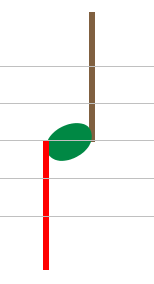
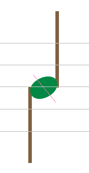
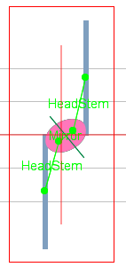
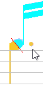

## Shared head
{: .no_toc }

---
Table of contents
{: .no_toc .text-delta }

1. TOC
{:toc}
---

### Note head shared by two voices

Generally a note head (black or void) is connected to exactly one stem, as in the following example.

If head and stem are connected, both appear with their own standard color.
If not, one or both appear in red and to fix this, you can simply drag a link from one to the other.

Then, if needed, you can insert a stem on the other side of the head, in the opposite direction.

It appears in red because it can't get automatically connected to the head
(because this head is already connected on the other side).

To actually set the  connection, you have to **manually** drag a link between the (new) stem and the
head.
The program then checks if the resulting configuration is the canonical one
(which means _a stem down on left side of the head and a stem up on the right side,
the shared head being located at the end of each stem_):

* If the check fails, the new connection is set but the old one is removed.
This is the standard behavior.
* But if the check succeeds, both connections are kept and the _'shared'_ head gets logically
duplicated into two heads, one _'half'_ for the left and one _'half'_ for the right:

By selecting all components, you can see the various links
(_HeadStemRelation_ between each head half and "its" stem, and _MirrorRelation_ between the two
half heads):

And if voices are colorized, the separation between head 'halves' gets even more visible:

### Impact on relations

Playing with relations around note heads, such as relation with an accidental or with an
augmentation dot, is still possible with shared note heads.
Simply, pay attention to point precisely to the desired _'half'_ head.

Here, the alteration sign is _'shared'_ and thus also split, each sign _'half'_ colorized
with the same color as its related head half.

Here, the augmentation dot is related only to one head _'half'_
(otherwise it would exhibit both colors as the alteration sign of the previous example)
