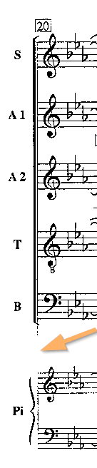
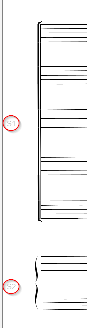
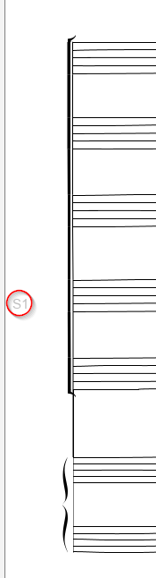
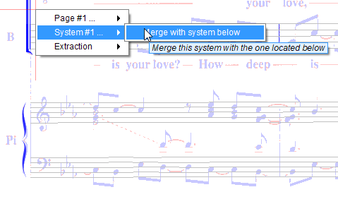
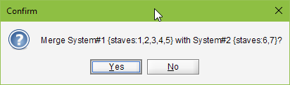

## System merge
{: .no_toc }

In Audiveris GRID step, detected staves are gathered into systems, based on barlines found on
the left side of the staves.

In a poor quality score image, many black pixels may have disappeared, sometimes leading to broken
barlines.

In the example image below, the leading left barline has been damaged, resulting in a wrong
detection of systems by the OMR engine.

| Left barline broken | Resulting grid before fix | Resulting grid after fix |
| ---| --- | --- |
|  |  |    |

Starting with 5.2 release, you can manually fix this problem.

Point at the upper system portion, and via the right-click popup menu, navigate to `System#n ...`
and click on "_Merge with system below_".

This is a key operation, so you need to confirm the detailed prompt:

And it's done: a connector was created between the two barline portions and the two system
portions merged.

You can still undo/redo the operation.
