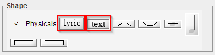
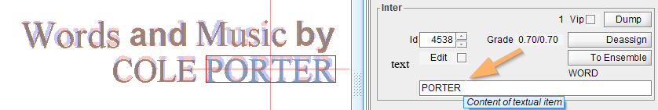
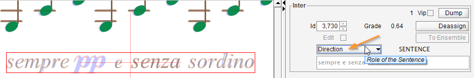
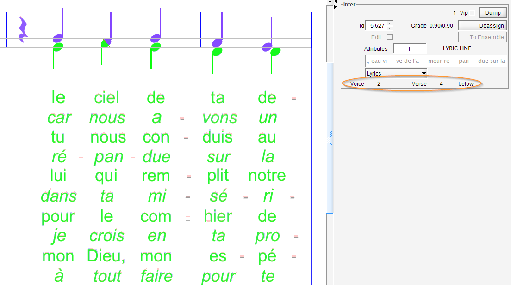

## Text
{: .no_toc }

Recognition of textual elements is delegated to Tesseract OCR library.  
This recognition is performed by the OMR engine (this is the TEXTS step).
It can also be performed manually on a provided glyph.

The resulting hierarchy of sentence and words can also be manually modified by the end-user.

---
Table of contents
{: .no_toc .text-delta }

1. TOC
{:toc}
---
### Recognition of text items

It is very difficult to automatically derive the meaning from the textual items in a musical score.

For **lyrics**, the single syllables are connected to the chords above or below.    
But it is not always obvious whether the text concerns the staff above or below
nor it's always clear which voice is concerned.

For **plain text**, Audiveris tries to detect text role, such as directions or typical header
elements like: title, composer and lyricist.
If it fails, the role can be easily corrected manually.

### TEXT step

The `TEXTS` step runs Tesseract OCR on the whole image and tries to assign to each textual item its
probable content, type and role.

This engine step is influenced by three options available in the `Book parameters` menu:
- [x] Support for chord names
- [ ] Support for lyrics (assumed to be located below the related staff)
- [x] Support for lyrics even located above staff

Chord names and Lyrics are special items, this is the reason why their recognition must be
explicitly selected to avoid collateral damages of the OMR engine when they are not desired.

### Manual OCR

Tesseract OCR can also be launched manually on a glyph(s) selection by pressing one of two
buttons provided in the `Physicals` family of the shape palette:
* The `lyric` button,
* The `text` button.

There are two separate buttons because lyric items have a behavior significantly different from
plain text items, especially the gap between words can be much wider.
By choosing one button or the other, the user clearly specifies the desired result type of the
OCR operation.

### Sentence vs Words

A Sentence inter is an ensemble of one or several Word inter(s):

* A **Word** handles its textual value and location.
  Word sub-classes (ChordName and LyricItem) handle additional data.  
  Word _value_ is modifiable by the end-user:  

  

* A **Sentence** is a sequence of words, it handles the sentence role.  
  (You can easily navigate from a selected word to its containing sentence via the `ToEnsemble` button).  
  Its textual content is defined as the concatenation of its word members.
  Sentence content is not modifiable directly, but rather via its word members.  
  Sentence _role_ is modifiable by the end-user.

  

A sentence role can be set to any value among:
UnknownRole,
_Lyrics_,
_ChordName_,
Title,
Direction,
Number,
PartName,
Creator,
CreatorArranger,
CreatorComposer,
CreatorLyricist,
Rights,
EndingNumber,
EndingText.

### Plain Sentence

A "plain" sentence is any sentence which is assigned a role different from Lyrics.

Following an OCR recognition (OMR engine or manual OCR), the role of each resulting sentence is
determined by some heuristics.
In the case of manual OCR, the `lyric` button will always result in the _lyrics_ role,
whereas the `text` button will always result in a non _lyrics_ role.

Starting with 5.2 release, in all cases, the end-user can manually modify the sentence
role afterwards, from any role to any other role.

### Chord Name

A chord name is a musical symbol which names and describes the related chord.

For example:
`C`, `D7`, `F♯`, `B♭min`, `Em♭5`, `G6/B`, `Gdim`, `F♯m7`, `Em♭5`, `D7♯5`, `Am7♭5`,
`A(9)`, `BMaj7/D♯`.

**IMPORTANT NOTICE**:
As of this writing, Audiveris engine is not yet able to recognize chord names that include true
sharp (``♯``) or flat (``♭``) characters.
Perhaps one day, we will succeed in training Tesseract OCR on this text content.  
For the time being, Audiveris is able to recognize such chord names when these characters have
been replaced (by OCR "mistake", or by manual modification) by more "usual" characters:
{: .nota-bg }
* ``'#'`` (number) as replacement for ``'♯'`` (sharp),
* ``'b'`` (lowercase b) as replacement for ``'♭'`` (flat).
{: .nota-bg }

When you OCR a chord name word, Audiveris may be able to decode it as a chord name and thus wrap
it within a chord name sentence.

If Audiveris has failed, you can still force the chord name role (at sentence level) and
type in the missing `b` or `#` characters if so needed (at word level).
The chord name will then be decoded on-the-fly with its new textual content.

Note you don't have to manually enter the true sharp or flat signs.
Entering them via their Unicode value is a bit tricky, and finally useless.    
Instead, when a text has been recognized or assigned as a chord name, its internal `b`
or `#` characters are automatically replaced by their true alteration signs.    
For example, you can type "Bb" then press `Enter` and the chord name will be translated and
displayed as "B♭".

### Lyric Line

A lyric line is a sentence composed of lyric items.

When selected, the inter board displays additional data:
* Voice number,
* Verse number,
* Location with respect to staff.

Each syllable (lyric item) is usually linked to a related chord.

If a syllable is not linked to the correct chord, you can modify this link manually by dragging
from the syllable to the suitable chord.
This will update on-the-fly the line data (voice, verse, location).
