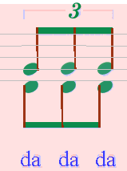
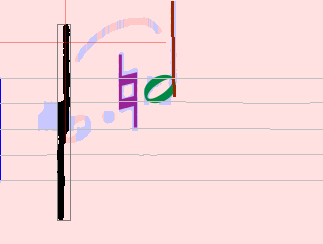

## Tips and Tricks
{: .no_toc }

This section gathers a few things based on concrete user experience.
These little tricks should save you time and efforts in your edition sessions.

---
Table of contents
{: .text-delta }

1. TOC
{:toc}
---

### Select glyphs using selection Frame

In bad scans, often elements are detected as two or more separate glyphs
-- this is rather frequent for slurs.

In such a case, use a selection frame and try to catch all parts of a suitable glyph before you
define an inter for it:

Make sure not to select parts of other elements (e.g. augmentation dots)!

### Delete wrong interpretations before defining a new one

Before assigning another interpretation to a glyph / a group of glyphs, make sure to delete
the previous one first.
Otherwise, there will be two confusing interpretations in the output file.

NOTA: Audiveris is able to detect when the *exact same* glyph has been assigned two different
interpretations, and thus remove the old one to just keep the new one.   
But glyphs that differ by one pixel or more are, by definition, different glyphs!   
So, when in doubt, don't hesitate to clean up the scene beforehand.
{: .nota-bg }

### Look for missing / wrongly defined augmentation dots

The most frequent reasons for errors in the rhythm check are missing or wrongly detected
augmentation dots.

So when all obvious reasons for wrong rhythm are solved and is still in rose, zoom into the image
and look for augmentation points in the concerned measure.

### Wrongly detected grace notes

Sometimes grace notes are considered as standard notes with just a rather small head.   
And all standard notes are involved in rhythm building, only true grace notes are not,
because they are considered as just ornamental.

In such a case just delete the note and re-define with the correct interpretation
(from "ornaments" tab in Shape palette)

### Add triplet to 2nd voice with missing "3"

Sometimes scores that contain two voices use a "common" 3 for the tuplet of both voices.

In such a case you can add the triplet element by drag-n-drop to the 2nd voice
(the fine red line shows during dragging the staff concerned):

| Lower triplet missing |     | Lower triplet added  |
|         :---:         |:---:|       :---:          |
| | ===> ||

### Perfectly opposite notes

Sometimes there are two notes of two voices with opposite stems on the same horizontal position.

In such a case Audiveris often does not detect the two stems as separate elements, but as one long
stem (on which the heads candidates will appear in abnormal positions,
and thus be ultimately discarded by the engine).

The easiest way to fix this is to directly insert two opposite *compound notes*.
In the example at hand:
* Top: a quarter note with stem up,
* Bottom: a half note with stem down.
