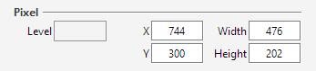

---
---
## Pixel board

The pixel board handles the location within the sheet image, as well as the pixel
gray value at the (x,y) location.

### Level
(output)  
Gray value, between 0 and 255, at the (x,y) location.

This field is active only on the initial (gray) image.
It becomes inactive on the binary (black & white) image.

### X & Y
(input/output)  
The abscissa and ordinate values for the selected location
(either a single point, or the top left corner of a rectangle).

### Width & Height
(input/output)  
The width and height values of the selected rectangle.
If both are zero, the rectangle degenerates as a single point.
